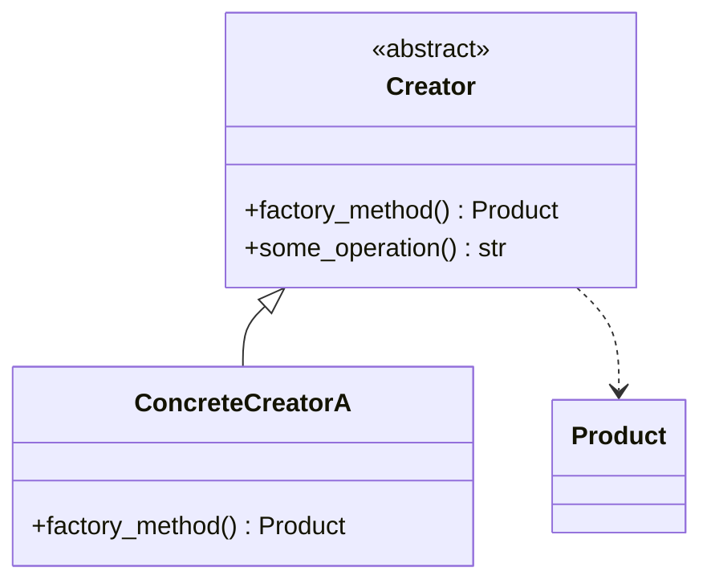

# CLAUDE.md — learn-design-pattern-2026

## Project Structure

This is a self-study curriculum for learning Design Patterns (Gang of Four and beyond).

- `README.md` — Repository overview
- `LearningPath.md` — Full topic tree with OPTIONAL markers
- `Schedule.md` — Week-by-week plan with checkboxes and "Why It Matters" context
- `weeks/week-NN/topic-name.md` — Individual lesson files (generated over time)

## How to Generate Lessons

1. **Always read `Schedule.md` first** to determine what topics to cover for the requested week.
2. Only cover topics listed in the schedule. Respect OPTIONAL markers in `LearningPath.md` — do not include OPTIONAL topics unless explicitly asked.
3. Create lesson files at `weeks/week-NN/topic-name.md` (e.g., `weeks/week-02/factory-method.md`).
4. One file per major topic grouping within a week. If a week covers multiple distinct topics, split them into separate files.
5. **Update `README.md`** after generating lessons — add or update a `## Lessons` section with links grouped by week. Use the week title from `Schedule.md`:
   ```markdown
   ## Lessons

   ### Week 1 — [Week Title from Schedule]
   - [Lesson Title](weeks/week-01/lesson-name.md)
   ```
6. **Add metadata footer** to every lesson file — see the lesson template below for the exact format.

## Lesson File Template

Every lesson file must follow this exact structure:

```markdown
# Topic Name

> One-sentence summary of what this topic is and why it matters.

## Table of Contents
- [Core Concepts](#core-concepts)
- [Code Examples](#code-examples)
- [Common Pitfalls](#common-pitfalls)
- [Key Takeaways](#key-takeaways)
- [Exercises](#exercises)

## Core Concepts

[Explanation broken into logical subsections with ### headings as needed.
For every concept, cover three layers:
1. WHAT — what is this thing?
2. HOW — how does it work / how do you use it?
3. WHY — why does it exist? Why this approach over alternatives? Why does it matter?
The "why" is the most important layer — it builds lasting intuition.
Use `####` subheadings (What / How / Why It Matters) under each `###` concept heading
to keep the three layers visually distinct and scannable.
Do NOT use inline bold labels like "**What.**" — they blend into paragraph text.
Build intuition first, then add precision. Use analogies for abstract ideas.
Keep paragraphs short (3-5 sentences max).
Use Mermaid diagrams (```mermaid blocks) when visual representation helps —
e.g., class diagrams for pattern structure, sequence diagrams for interaction flow,
relationship diagrams comparing similar patterns.]

## Code Examples

[Annotated, idiomatic, production-quality code. Show how a professional
would actually write this — proper naming, error handling where appropriate,
clean structure. Each example should be self-contained and runnable.]

## Common Pitfalls

[Bad vs good code comparisons. Each pitfall gets:
- What the mistake is
- Why it's wrong
- The correct approach with code]

## Key Takeaways

- Bullet list of 3-5 most important points
- What to remember, what to internalize

## Exercises

[3–5 exercises per lesson. Mix of:
- Concept questions: "Explain why...", "What happens when...", "What is the difference between..."
- Coding challenges: "Write a program/function that..."
Do not include solutions.]

---
up:: [Schedule](../../Schedule.md)
#type/learning #source/self-study #status/seed
```

## Writing Style

- **Audience**: Self-learner studying independently — no instructor, no classroom.
- **Tone**: Concise, expert, opinionated. Write like a senior engineer mentoring a colleague, not a textbook.
- **Structure**: Build intuition first, then add precision. Use analogies for abstract ideas.
- **Why-first**: For every concept, always explain *why* it exists, *why* this approach, and *why* it matters. The "why" is more important than the "what."
- **Paragraphs**: Keep short — 3-5 sentences max. Dense walls of text kill learning.
- **Exercises**: Include a `## Exercises` section at the end of each lesson with 3–5 exercises (concept-explanation questions or small coding challenges). Do not include solutions.
- **No external resources**: Do not include "Further Reading" sections or links to external material.

## Code Example Standards

- Write **idiomatic, production-quality code** — the kind a senior engineer would write at work.
- Show professional coding habits: meaningful names, type hints, proper error handling, clean structure.
- Every code block must be **self-contained and runnable** (include necessary imports).
- Use detailed inline comments to explain *why*, not just *what*.
- When showing a pattern or technique, show the **realistic use case**, not a toy example.

## Common Pitfalls Format

Each pitfall must include:

1. A brief description of the mistake
2. A `# BAD` code block showing the wrong way
3. An explanation of *why* it's wrong
4. A `# GOOD` code block showing the correct approach

```python
# BAD — [description of what's wrong]
[bad code]

# GOOD — [description of the fix]
[good code]
```

---

## Repo-Specific: Design Patterns (Python)

### Language & Version

- **Language**: Python (all code examples in Python)
- **Target version**: Python 3.12+ (use modern syntax and features)

### Coding Conventions (PEP 8 and beyond)

- Follow **PEP 8** strictly — `snake_case` for variables/functions, `PascalCase` for classes, `UPPER_SNAKE_CASE` for constants
- **Type hints everywhere** — every function signature must have full type annotations (parameters and return type)
- Use `str | None` syntax (PEP 604) over `Optional[str]`
- Use **f-strings** for all string formatting — never `%` or `.format()`
- Use `abc.ABC` and `@abstractmethod` for abstract base classes — patterns rely heavily on interfaces
- Use `dataclasses` or Pydantic `BaseModel` for data containers where appropriate
- Use `Protocol` (structural subtyping) where duck typing is more Pythonic than inheritance

### Design Patterns-Specific Requirements

#### Structure Before Code — Describe the Pattern First

For every pattern, **explain the structure (participants and their roles) before showing any code**:

1. **Intent** — one sentence: what problem does this pattern solve?
2. **Participants** — list each role in the pattern (e.g., Creator, ConcreteCreator, Product, ConcreteProduct) with a one-line description of its responsibility.
3. **How they interact** — describe the collaboration between participants.
4. **Then show the code** — implementation that maps directly to the participants described above.

Name classes/variables to match the participant roles so the connection between theory and code is obvious.

#### Mermaid Class Diagrams — Mandatory for Every Pattern

Every pattern lesson **must** include a Mermaid class diagram showing:

- All participants (classes/interfaces) and their relationships
- Inheritance (`<|--`), composition (`*--`), aggregation (`o--`), dependency (`..>`)
- Key methods on each class

Use Mermaid sequence diagrams when the interaction flow between participants is non-obvious (e.g., Chain of Responsibility passing requests, Observer notification flow).

Example format:



#### When NOT to Use — Anti-Pattern Awareness

For every pattern, include a subsection (within Core Concepts) on **when NOT to use it**:

- What problem it doesn't solve
- Signs that you're forcing the pattern where it doesn't fit
- What simpler alternative to use instead (e.g., "a plain function is enough here")

This is critical because the most common design pattern mistake is overuse — applying patterns where simple code would be clearer.

#### Real-World Anchoring

For every pattern, give at least one **real-world example** from well-known frameworks or systems:

- Python stdlib or popular libraries (Django, FastAPI, SQLAlchemy, etc.)
- Common systems (web servers, GUIs, game engines, operating systems)

This anchors abstract patterns to concrete recognition: "Oh, that's what `@app.route` is doing — it's a Decorator."

#### Pattern Comparison

When covering a pattern that is commonly confused with another:

- Add a brief comparison section explaining the difference
- Examples: Factory Method vs Abstract Factory, Strategy vs State, Decorator vs Proxy, Adapter vs Facade
