# Introduction to Design Patterns

> Design patterns are reusable solutions to recurring software design problems -- learning them gives you a shared vocabulary with other engineers and a toolkit of proven approaches so you stop reinventing the wheel.

## Table of Contents
- [Core Concepts](#core-concepts)
- [Code Examples](#code-examples)
- [Common Pitfalls](#common-pitfalls)
- [Key Takeaways](#key-takeaways)
- [Exercises](#exercises)

## Core Concepts

### What Are Design Patterns?

#### What

A design pattern is a general, reusable solution to a commonly occurring problem in software design. It is not a finished piece of code you can copy-paste -- it is a *template* for how to solve a problem that can be adapted to many different situations.

The concept was popularized by the "Gang of Four" (GoF) -- Erich Gamma, Richard Helm, Ralph Johnson, and John Vlissides -- in their 1994 book *Design Patterns: Elements of Reusable Object-Oriented Software*. They catalogued 23 patterns that kept showing up across different projects and codebases.

#### How

Think of design patterns like architectural blueprints. A blueprint for a "load-bearing arch" doesn't tell you the exact dimensions or materials -- it describes the structural principle. You adapt it to your specific building. Similarly, a design pattern describes the participants (classes/objects), their roles, and how they collaborate. You adapt the pattern to your specific problem domain.

#### Why It Matters

Without patterns, every developer solves the same problems from scratch, often poorly. Patterns capture *decades* of collective wisdom. When a senior engineer says "use an Observer here," the entire team instantly understands the approach without a 30-minute whiteboard session. That shared vocabulary is arguably more valuable than the patterns themselves.

### Why Learn Design Patterns?

#### What

There are three core reasons to invest time in learning design patterns:

1. **Shared vocabulary** -- Patterns give names to solutions. Saying "this is a Strategy pattern" communicates an entire architectural decision in three words.
2. **Proven solutions** -- These patterns have been battle-tested across millions of projects over three decades. They encode trade-offs that took the industry years to discover.
3. **Design thinking** -- Studying patterns trains you to think in terms of abstractions, interfaces, and decoupling -- skills that transfer to every design decision you make.

#### How

You don't memorize patterns like flashcards. You internalize them by understanding the *problem* each pattern solves, then recognizing that problem in your own code. The moment you think "I need to decouple who creates this object from who uses it," the Factory pattern should surface naturally.

#### Why It Matters

Real-world analogy: a chess player doesn't memorize every possible game. They learn *patterns* -- openings, forks, pins, skewers. When they see a board position, they recognize the pattern and know the response. Design patterns work the same way for software architecture. The goal is recognition, not memorization.

### Structure of a Design Pattern

#### What

Every GoF pattern is documented with a consistent structure. Understanding this structure helps you read any pattern description -- from the original book, from online resources, or from a colleague's explanation.

The key elements are:

| Element | Description |
|---------|-------------|
| **Intent** | A one-sentence summary of what problem the pattern solves |
| **Motivation** | A concrete scenario that illustrates the problem and how the pattern addresses it |
| **Applicability** | When to use this pattern -- what conditions or "code smells" suggest it |
| **Structure** | A UML/class diagram showing the participants and their relationships |
| **Participants** | Each class/interface in the pattern and its responsibility |
| **Collaborations** | How the participants work together at runtime |
| **Consequences** | Trade-offs -- what you gain and what you pay |

#### How

When you encounter a new pattern, read the *Intent* first to understand the one-liner. Then jump to *Applicability* to see if it matches your problem. Only then dive into *Structure* and *Participants* to understand the mechanics. Save *Consequences* for when you're deciding between multiple patterns.

#### Why It Matters

This structure exists because a pattern is more than code. Two patterns can have nearly identical class diagrams (e.g., Strategy and State) but solve fundamentally different problems. The *Intent* and *Motivation* sections are what distinguish them. If you skip these and jump straight to the UML, you'll misapply patterns constantly.

### Classification of Design Patterns

#### What

The 23 GoF patterns are divided into three categories based on *what kind of problem* they solve:

| Category | Problem Domain | Count | Examples |
|----------|---------------|-------|----------|
| **Creational** | How objects are created | 5 | Factory Method, Abstract Factory, Builder, Singleton, Prototype |
| **Structural** | How objects are composed into larger structures | 7 | Adapter, Bridge, Composite, Decorator, Facade, Proxy, Flyweight |
| **Behavioral** | How objects communicate and distribute responsibility | 11 | Observer, Strategy, Command, State, Iterator, Template Method, Chain of Responsibility, Mediator, Memento, Visitor |

#### How

When you face a design problem, first identify which category it falls into:

- **"I need to control how objects are created"** -- look at Creational patterns. You're dealing with constructors, initialization, or "which concrete class to instantiate."
- **"I need to assemble objects into larger structures"** -- look at Structural patterns. You're dealing with composition, wrapping, or adapting interfaces.
- **"I need to manage how objects interact"** -- look at Behavioral patterns. You're dealing with communication, algorithms, or responsibility distribution.

#### Why It Matters

The classification is your *index* into the pattern catalogue. Without it, you'd have to scan all 23 patterns every time you face a problem. With it, you narrow down to 5-11 candidates immediately. This mental framework is what separates engineers who "know patterns" from engineers who can actually *apply* them.

```mermaid
classDiagram
    class DesignPatterns {
        <<catalogue>>
        23 classic patterns
    }

    class Creational {
        <<category>>
        Object creation mechanisms
    }
    class Structural {
        <<category>>
        Object composition
    }
    class Behavioral {
        <<category>>
        Object interaction
    }

    DesignPatterns *-- Creational
    DesignPatterns *-- Structural
    DesignPatterns *-- Behavioral

    class FactoryMethod {
        Creational
    }
    class AbstractFactory {
        Creational
    }
    class Builder {
        Creational
    }
    class Singleton {
        Creational
    }

    class Adapter {
        Structural
    }
    class Bridge {
        Structural
    }
    class Composite {
        Structural
    }
    class Decorator {
        Structural
    }
    class Facade {
        Structural
    }
    class Proxy {
        Structural
    }

    class Observer {
        Behavioral
    }
    class Strategy {
        Behavioral
    }
    class Command {
        Behavioral
    }
    class State {
        Behavioral
    }
    class Iterator {
        Behavioral
    }
    class TemplateMethod {
        Behavioral
    }
    class ChainOfResponsibility {
        Behavioral
    }

    Creational *-- FactoryMethod
    Creational *-- AbstractFactory
    Creational *-- Builder
    Creational *-- Singleton

    Structural *-- Adapter
    Structural *-- Bridge
    Structural *-- Composite
    Structural *-- Decorator
    Structural *-- Facade
    Structural *-- Proxy

    Behavioral *-- Observer
    Behavioral *-- Strategy
    Behavioral *-- Command
    Behavioral *-- State
    Behavioral *-- Iterator
    Behavioral *-- TemplateMethod
    Behavioral *-- ChainOfResponsibility
```



### Real-World Analogies

#### What

Patterns are easier to grasp when anchored to everyday experiences:

- **Factory Method** -- A hiring agency. You tell them "I need a backend developer" (the interface), and the agency decides which specific candidate to send (the concrete product). You don't care about the recruitment process; you care about the result.
- **Adapter** -- A power plug adapter. Your US laptop charger doesn't fit a European outlet, so you use an adapter that translates between the two interfaces without modifying either.
- **Observer** -- A newsletter subscription. You subscribe to a newsletter (register as an observer), and whenever the publisher has new content (state change), all subscribers get notified automatically.
- **Decorator** -- Adding toppings to a pizza. Each topping wraps the base pizza and adds behavior (cost, description) without changing the original pizza class.
- **Strategy** -- A GPS navigation app. You choose the "algorithm" at runtime: fastest route, shortest route, avoid highways. The navigation system doesn't change -- only the routing strategy does.

#### How

When learning a new pattern, always find a real-world analogy first. It anchors the abstract concept to something concrete, making it far easier to recall under pressure (like in system design interviews or production debugging).

#### Why It Matters

Analogies build intuition. Intuition lets you *recognize* patterns in code without consciously thinking "let me check the 23 patterns." That recognition speed is what makes experienced engineers seem to "just know" the right design.

### When NOT to Use Design Patterns

#### What

The most common design pattern mistake is **overuse**. Patterns add abstraction, and every abstraction has a cost: more files, more indirection, more cognitive load for anyone reading the code. A pattern is justified only when the problem it solves is real and present -- not hypothetical.

#### How

Warning signs that you're overusing patterns:

1. **"Just in case" patterns** -- Adding a Factory when you only ever create one type of object. You're paying the complexity cost with zero benefit.
2. **Pattern-per-class** -- If every class in your project is a Strategy, Observer, or Singleton, something is wrong. Most classes are just... classes.
3. **Premature abstraction** -- Building a plugin architecture for a feature that will never have plugins. YAGNI (You Aren't Gonna Need It) applies to patterns too.
4. **Pattern vocabulary as a goal** -- Using patterns to sound smart rather than to solve real problems. If a simple `if/else` works and the logic won't grow, use the `if/else`.

The right question is never "which pattern should I use?" It's **"do I even need a pattern here?"** If the answer is no, a plain function or a simple class is the better design.

#### Why It Matters

Over-engineered code is harder to read, harder to debug, and harder to change than under-engineered code. The best engineers use patterns surgically -- applying them only where the problem genuinely calls for the abstraction. A codebase with 3 well-placed patterns beats a codebase with 30 forced ones every time.

## Code Examples

Design patterns aren't language features -- they're design-level concepts. But seeing the *shape* of a pattern in code helps build recognition. Here's a minimal example of each category to illustrate the flavor.

### Creational: A Simple Factory Function

```python
"""
Creational pattern flavor: centralize object creation decisions.

This isn't the full Factory Method pattern (that comes in Week 2),
but it shows the core idea -- the caller doesn't decide which class
to instantiate. The factory function makes that decision.
"""
from dataclasses import dataclass


@dataclass
class TextReport:
    """Plain text report format."""
    title: str
    body: str

    def render(self) -> str:
        return f"=== {self.title} ===\n{self.body}"


@dataclass
class HtmlReport:
    """HTML report format."""
    title: str
    body: str

    def render(self) -> str:
        return f"<h1>{self.title}</h1>\n<p>{self.body}</p>"


def create_report(format_type: str, title: str, body: str) -> TextReport | HtmlReport:
    """Factory function -- centralizes the creation decision.

    The caller says WHAT it wants (format_type), not HOW to build it.
    Adding a new format means changing this one function, not every caller.
    """
    match format_type:
        case "text":
            return TextReport(title=title, body=body)
        case "html":
            return HtmlReport(title=title, body=body)
        case _:
            raise ValueError(f"Unknown format: {format_type}")


# Usage -- the caller never imports TextReport or HtmlReport directly
report = create_report("html", "Q1 Sales", "Revenue increased by 15%.")
print(report.render())
```

### Structural: A Simple Decorator

```python
"""
Structural pattern flavor: compose objects to add behavior.

This shows Python's function decorator syntax, which implements
the Decorator pattern at the function level. The wrapped function
gains new behavior (timing) without being modified.
"""
import time
from collections.abc import Callable
from functools import wraps
from typing import ParamSpec, TypeVar

P = ParamSpec("P")
R = TypeVar("R")


def timed(func: Callable[P, R]) -> Callable[P, R]:
    """Decorator that measures and prints execution time.

    This wraps the original function with timing logic.
    The original function is unchanged -- we're composing
    new behavior on top of it.
    """
    @wraps(func)  # Preserves the original function's name and docstring
    def wrapper(*args: P.args, **kwargs: P.kwargs) -> R:
        start = time.perf_counter()
        result = func(*args, **kwargs)
        elapsed = time.perf_counter() - start
        print(f"{func.__name__} took {elapsed:.4f}s")
        return result
    return wrapper


@timed  # Structural composition: timed(process_data)
def process_data(records: list[dict[str, str]]) -> int:
    """Simulate processing a batch of records."""
    time.sleep(0.1)  # Simulate work
    return len(records)


count = process_data([{"id": "1"}, {"id": "2"}, {"id": "3"}])
print(f"Processed {count} records")
```

### Behavioral: A Simple Strategy

```python
"""
Behavioral pattern flavor: swap algorithms at runtime.

This shows the Strategy pattern using Python's Protocol for
structural subtyping. The sorter doesn't care which strategy
it gets -- it only cares that the strategy has a `sort` method.
"""
from typing import Protocol


class SortStrategy(Protocol):
    """Strategy interface -- any object with a sort method qualifies."""
    def sort(self, data: list[int]) -> list[int]: ...


class AscendingSort:
    """Concrete strategy: sort in ascending order."""
    def sort(self, data: list[int]) -> list[int]:
        return sorted(data)


class DescendingSort:
    """Concrete strategy: sort in descending order."""
    def sort(self, data: list[int]) -> list[int]:
        return sorted(data, reverse=True)


class DataProcessor:
    """Context class that uses a strategy for sorting.

    The processor doesn't know or care HOW sorting happens.
    It delegates to whatever strategy it's given.
    """
    def __init__(self, strategy: SortStrategy) -> None:
        self._strategy = strategy

    def process(self, data: list[int]) -> list[int]:
        # Behavioral delegation -- the strategy decides the algorithm
        return self._strategy.sort(data)


# Swap strategies at runtime without changing DataProcessor
processor = DataProcessor(AscendingSort())
print(processor.process([3, 1, 4, 1, 5]))  # [1, 1, 3, 4, 5]

processor = DataProcessor(DescendingSort())
print(processor.process([3, 1, 4, 1, 5]))  # [5, 4, 3, 1, 1]
```

## Common Pitfalls

### Pitfall 1: Using a Pattern When a Simple Function Suffices

```python
# BAD — Full Strategy pattern for a one-off sorting need
from abc import ABC, abstractmethod


class SortStrategy(ABC):
    @abstractmethod
    def sort(self, data: list[int]) -> list[int]: ...


class AscendingSortStrategy(SortStrategy):
    def sort(self, data: list[int]) -> list[int]:
        return sorted(data)


class SortContext:
    def __init__(self, strategy: SortStrategy) -> None:
        self._strategy = strategy

    def execute(self, data: list[int]) -> list[int]:
        return self._strategy.sort(data)


# 3 classes and ~20 lines for something that never changes
context = SortContext(AscendingSortStrategy())
result = context.execute([3, 1, 2])
```

```python
# GOOD — Just use the built-in when you only need one behavior
result = sorted([3, 1, 2])
```

The Strategy pattern shines when you need to swap algorithms at runtime. If you always sort ascending, you don't need a pattern -- you need `sorted()`.

### Pitfall 2: Naming Classes After Patterns Instead of Domain Concepts

```python
# BAD — Pattern-centric naming obscures what the code actually does
class AbstractFactory:
    ...

class ConcreteFactoryA:
    ...

class ProductA:
    ...
```

```python
# GOOD — Domain-centric naming makes the code self-documenting
class UIWidgetFactory:
    ...

class MacOSWidgetFactory:
    ...

class Button:
    ...
```

Pattern names belong in design discussions and documentation, not in class names. Your code should describe the *domain*, not the *pattern*.

### Pitfall 3: Learning Patterns Without Understanding the Problem They Solve

```python
# BAD — Memorizing the structure without understanding the "why"
# "Observer has a Subject with attach/detach/notify and Observer with update"
# ... but unable to recognize that an event system in your code IS an Observer

class Subject:
    def attach(self, observer): ...
    def detach(self, observer): ...
    def notify(self): ...
```

```python
# GOOD — Recognizing the pattern in real code
# "This event emitter is the Observer pattern -- I know the trade-offs"
class EventEmitter:
    """Real-world Observer: components subscribe to events."""
    def __init__(self) -> None:
        self._listeners: dict[str, list] = {}

    def on(self, event: str, callback) -> None:
        self._listeners.setdefault(event, []).append(callback)

    def emit(self, event: str, *args) -> None:
        for callback in self._listeners.get(event, []):
            callback(*args)
```

The goal is to recognize patterns in wild code, not to replicate textbook diagrams.

## Key Takeaways

- **Design patterns are reusable solutions, not copy-paste code.** They describe the structure and relationships between classes to solve a recurring problem. You adapt the pattern to your domain.
- **The three categories -- Creational, Structural, Behavioral -- are your mental index.** When facing a problem, first identify the category, then explore the patterns within it.
- **Shared vocabulary is the superpower.** Saying "Strategy pattern" communicates an entire design approach in two words. That communication efficiency compounds across a team and a career.
- **Overusing patterns is worse than not knowing them.** Every pattern adds abstraction and indirection. Apply them only when the problem genuinely calls for it. A simple function is often the best design.
- **Learn the "why" before the "how."** Understanding *what problem* a pattern solves matters more than memorizing its class diagram. The problem recognition is what lets you apply patterns correctly in new situations.

## Exercises

1. **Classification exercise**: For each of the following problems, identify which pattern *category* (Creational, Structural, Behavioral) you would look at. Explain your reasoning.
   - You need to support multiple database backends (PostgreSQL, MySQL, SQLite) without changing your application code.
   - You want to add logging to every method call in a service class without modifying the service.
   - You have a complex object with 12 optional configuration parameters and want a clean way to construct it.

2. **Pattern recognition**: Find three examples of design patterns in Python's standard library or a framework you use (Django, Flask, FastAPI, etc.). For each, name the pattern, identify the participants, and explain why the pattern was used instead of a simpler approach.

3. **Anti-pattern analysis**: You're reviewing a codebase where every class has a corresponding Factory class, even classes that are only instantiated in one place with no variation. Write a short critique explaining why this is over-engineering, what problems it causes, and what you would do instead.

4. **Analogy creation**: Pick two design patterns not covered in the real-world analogies section above (e.g., Builder, Facade, Command). Create your own real-world analogies for them. The analogy should make the pattern's intent immediately understandable to someone who has never heard of design patterns.

5. **Trade-off analysis**: A teammate proposes adding the Observer pattern to a notification system that currently has exactly two subscribers and is unlikely to grow. Write an argument for and against using the pattern in this situation. Which side do you take, and why?

---
up:: [Schedule](../../Schedule.md)
#type/learning #source/self-study #status/seed
