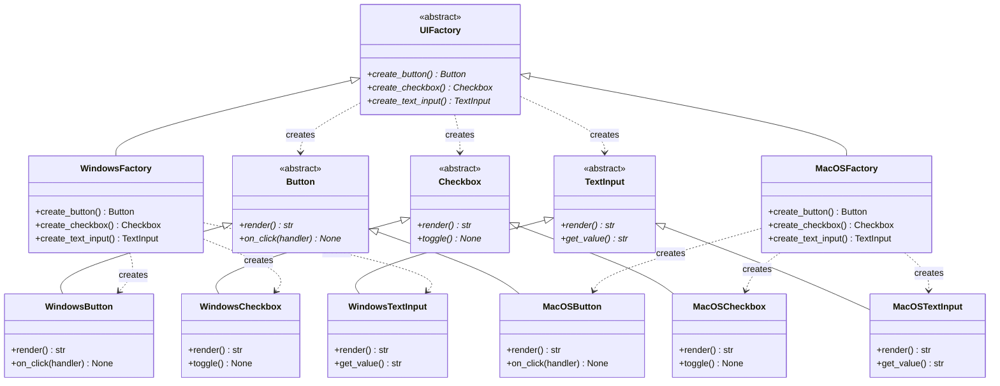

# Abstract Factory Pattern

> The Abstract Factory pattern provides an interface for creating families of related objects without specifying their concrete classes -- ensuring that products from the same family are always used together.

## Table of Contents
- [Core Concepts](#core-concepts)
- [Code Examples](#code-examples)
- [Common Pitfalls](#common-pitfalls)
- [Key Takeaways](#key-takeaways)
- [Exercises](#exercises)

## Core Concepts

### Intent

#### What

The Abstract Factory pattern lets you produce *families* of related objects (e.g., a button, a checkbox, and a menu that all share the same visual style) without coupling your code to the concrete classes of those objects. The client works with factories and products through abstract interfaces, and swapping the entire family is a single-line change: replace the factory.

#### How

You define an abstract factory interface with one `create_xxx()` method per product type. Each concrete factory implements all of those methods, producing a consistent family of products. The client code receives a factory object and calls its creation methods -- it never knows which concrete products it's working with.

#### Why It Matters

Without Abstract Factory, mixing products from different families is a constant risk. Imagine rendering a macOS checkbox next to a Windows button -- the UI would be broken and inconsistent. Abstract Factory makes this *impossible by construction*: if you're using the `MacOSFactory`, every widget it creates is macOS-styled. The constraint is enforced by the type system, not by developer discipline.

### Participants

#### What

The Abstract Factory pattern involves five participant roles:

| Participant | Role |
|-------------|------|
| **AbstractFactory** | Declares creation methods for each product type in the family (e.g., `create_button()`, `create_checkbox()`). |
| **ConcreteFactory** | Implements all creation methods to produce products from a specific family (e.g., `WindowsFactory` creates Windows widgets). |
| **AbstractProduct** | Declares the interface for each type of product (e.g., `Button` with a `render()` method). |
| **ConcreteProduct** | Implements the AbstractProduct interface for a specific family (e.g., `WindowsButton`, `MacOSButton`). |
| **Client** | Uses only the AbstractFactory and AbstractProduct interfaces. Never references concrete classes directly. |

#### How

The client receives a ConcreteFactory (typically via dependency injection or configuration). It calls `factory.create_button()` and gets back a `Button` -- not knowing whether it's a `WindowsButton` or `MacOSButton`. All products from the same factory are guaranteed to be compatible.

#### Why It Matters

Each participant has a single, clear responsibility. The ConcreteFactory knows *which* products to create. The AbstractProduct knows *what* products can do. The Client knows *how* to use products. This separation means adding a new family (e.g., Linux widgets) requires one new ConcreteFactory and one new ConcreteProduct per product type -- no existing code changes.

### Structure



### When NOT to Use Abstract Factory

#### What

Abstract Factory is one of the heavier patterns in the catalogue. It introduces multiple abstract interfaces and a parallel hierarchy of concrete classes. This weight is justified only in specific situations.

#### How

Avoid Abstract Factory when:

1. **You have only one product type** -- If you're creating buttons but not checkboxes or menus, you need Factory Method, not Abstract Factory. The "family" aspect is the defining characteristic.
2. **You have only one family** -- If you only support macOS and never plan to support Windows or Linux, the abstract factory layer adds indirection with zero benefit. Just use the concrete classes directly.
3. **The products aren't truly related** -- Abstract Factory enforces that products from the same factory belong together. If your "button" and "logger" have no reason to be paired, they shouldn't share a factory.
4. **Adding a new product type is more likely than adding a new family** -- Abstract Factory makes it easy to add new families (add one ConcreteFactory) but painful to add new product types (modify every factory). If you expect the product types to grow, consider a different approach.

#### Why It Matters

The pattern's strength -- enforcing family consistency -- is also its rigidity. Every time you add a new product type (say, `Slider`), you must add an abstract method to the AbstractFactory and implement it in *every* ConcreteFactory. If your design evolves primarily by adding new product types, Abstract Factory creates a maintenance burden.

### Abstract Factory vs Factory Method

#### What

| Aspect | Factory Method | Abstract Factory |
|--------|---------------|-----------------|
| **Creates** | A single product | A family of related products |
| **Mechanism** | Inheritance (subclass overrides a method) | Composition (client uses a factory object) |
| **Factory methods** | One | Multiple (one per product type) |
| **Adding a family** | Add a ConcreteCreator | Add a ConcreteFactory |
| **Adding a product type** | N/A (only one product) | Must update every factory |

#### How

Think of Factory Method as a *special case* of Abstract Factory with exactly one product type. When you find yourself adding a second `create_xxx()` method to a Factory Method Creator, you've evolved into Abstract Factory.

In practice, Abstract Factory is often *implemented using* Factory Methods. Each `create_xxx()` method on the AbstractFactory is itself a factory method that subclasses override.

#### Why It Matters

The distinction matters for choosing the right tool. If you start with Factory Method and later need a second product type that must be consistent with the first, you refactor to Abstract Factory. Going the other direction (simplifying Abstract Factory to Factory Method) is a sign you over-engineered.

### Real-World Anchoring

#### What

Abstract Factory appears in many real-world systems:

- **Python's `dbapi2` (PEP 249)** -- Database drivers like `sqlite3`, `psycopg2`, and `mysql-connector` each act as a ConcreteFactory that produces compatible products: `Connection`, `Cursor`, `Error` types. You can swap `sqlite3.connect()` for `psycopg2.connect()` and the rest of your code (which works with `Cursor.execute()`, `Cursor.fetchall()`) keeps working because all drivers produce the same family of interfaces.
- **GUI toolkits** -- Qt's widget system, Java's Swing look-and-feels, and cross-platform UI frameworks all use Abstract Factory to ensure visual consistency across platforms.
- **SQLAlchemy's dialect system** -- Each database dialect (PostgreSQL, MySQL, SQLite) is a factory that produces compatible SQL compilers, type objects, and execution strategies. The ORM layer works with abstract interfaces; the dialect provides the concrete family.
- **Testing with mocks** -- In test suites, you can swap a `ProductionServiceFactory` with a `MockServiceFactory` to produce fake implementations of every service in the family.

#### Why It Matters

The database example is especially instructive: PEP 249 standardized the abstract interfaces (`Connection`, `Cursor`) *specifically* so that different database drivers could act as interchangeable factories. This is Abstract Factory at the language/ecosystem level.

## Code Examples

### Cross-Platform UI Toolkit

```python
"""
Abstract Factory pattern: Cross-platform UI toolkit.

A GUI application needs to render widgets that look native on each
platform. Abstract Factory ensures that if you're on macOS, you get
macOS-styled buttons, checkboxes, and text inputs -- never a mix of
Windows and macOS widgets.
"""
from abc import ABC, abstractmethod


# --- Abstract Products ---

class Button(ABC):
    """AbstractProduct: defines the interface for all buttons."""

    @abstractmethod
    def render(self) -> str:
        """Return the platform-specific visual representation."""

    @abstractmethod
    def on_click(self, handler: str) -> str:
        """Bind a click handler, returning a confirmation string."""


class Checkbox(ABC):
    """AbstractProduct: defines the interface for all checkboxes."""

    @abstractmethod
    def render(self) -> str:
        """Return the platform-specific visual representation."""

    @abstractmethod
    def toggle(self) -> str:
        """Toggle the checkbox state, returning the new state."""


class TextInput(ABC):
    """AbstractProduct: defines the interface for all text inputs."""

    @abstractmethod
    def render(self) -> str:
        """Return the platform-specific visual representation."""

    @abstractmethod
    def get_value(self) -> str:
        """Return the current input value."""


# --- Windows Concrete Products ---

class WindowsButton(Button):
    """ConcreteProduct: Windows-styled button with flat design."""

    def render(self) -> str:
        return "[====Windows Button====]"

    def on_click(self, handler: str) -> str:
        return f"WindowsButton: bound WM_CLICK -> {handler}"


class WindowsCheckbox(Checkbox):
    """ConcreteProduct: Windows-styled checkbox."""

    def __init__(self) -> None:
        self._checked: bool = False

    def render(self) -> str:
        state = "X" if self._checked else " "
        return f"[{state}] Windows Checkbox"

    def toggle(self) -> str:
        self._checked = not self._checked
        state = "checked" if self._checked else "unchecked"
        return f"WindowsCheckbox: toggled to {state}"


class WindowsTextInput(TextInput):
    """ConcreteProduct: Windows-styled text input with border."""

    def __init__(self) -> None:
        self._value: str = ""

    def render(self) -> str:
        return f"|_{self._value}_| (Windows TextInput)"

    def get_value(self) -> str:
        return self._value


# --- macOS Concrete Products ---

class MacOSButton(Button):
    """ConcreteProduct: macOS-styled button with rounded corners."""

    def render(self) -> str:
        return "(  macOS Button  )"

    def on_click(self, handler: str) -> str:
        return f"MacOSButton: bound NSAction -> {handler}"


class MacOSCheckbox(Checkbox):
    """ConcreteProduct: macOS-styled checkbox with toggle animation."""

    def __init__(self) -> None:
        self._checked: bool = False

    def render(self) -> str:
        state = "v" if self._checked else "o"
        return f"({state}) macOS Checkbox"

    def toggle(self) -> str:
        self._checked = not self._checked
        state = "checked" if self._checked else "unchecked"
        return f"MacOSCheckbox: toggled to {state} (with animation)"


class MacOSTextInput(TextInput):
    """ConcreteProduct: macOS-styled text input with rounded border."""

    def __init__(self) -> None:
        self._value: str = ""

    def render(self) -> str:
        return f"(  {self._value}  ) macOS TextInput"

    def get_value(self) -> str:
        return self._value


# --- Abstract Factory ---

class UIFactory(ABC):
    """AbstractFactory: declares creation methods for each product type.

    Each method returns the abstract product type, not the concrete type.
    This guarantees that client code works with any family of products.
    """

    @abstractmethod
    def create_button(self) -> Button:
        """Create a platform-specific button."""

    @abstractmethod
    def create_checkbox(self) -> Checkbox:
        """Create a platform-specific checkbox."""

    @abstractmethod
    def create_text_input(self) -> TextInput:
        """Create a platform-specific text input."""


# --- Concrete Factories ---

class WindowsFactory(UIFactory):
    """ConcreteFactory: produces the Windows family of widgets.

    Every product created by this factory is Windows-styled.
    It's impossible to get a macOS checkbox from a WindowsFactory.
    """

    def create_button(self) -> Button:
        return WindowsButton()

    def create_checkbox(self) -> Checkbox:
        return WindowsCheckbox()

    def create_text_input(self) -> TextInput:
        return WindowsTextInput()


class MacOSFactory(UIFactory):
    """ConcreteFactory: produces the macOS family of widgets.

    Every product created by this factory is macOS-styled.
    Family consistency is enforced by the factory, not by the client.
    """

    def create_button(self) -> Button:
        return MacOSButton()

    def create_checkbox(self) -> Checkbox:
        return MacOSCheckbox()

    def create_text_input(self) -> TextInput:
        return MacOSTextInput()


# --- Client Code ---

def render_login_form(factory: UIFactory) -> None:
    """Client code that builds a complete UI form.

    This function works with the AbstractFactory interface only.
    It doesn't know or care whether it's building Windows or macOS widgets.
    Swapping the entire platform look-and-feel is a one-line change:
    pass a different factory.
    """
    # Create widgets -- all from the same family
    username_input = factory.create_text_input()
    password_input = factory.create_text_input()
    remember_me = factory.create_checkbox()
    login_button = factory.create_button()

    # Render the form
    print("--- Login Form ---")
    print(f"Username: {username_input.render()}")
    print(f"Password: {password_input.render()}")
    print(f"Remember: {remember_me.render()}")
    print(f"          {login_button.render()}")

    # Interact with widgets
    print(login_button.on_click("submit_login"))
    print(remember_me.toggle())
    print()


def get_factory_for_platform(platform: str) -> UIFactory:
    """Factory selection -- the ONE place where platform matters.

    In a real application, this would detect the OS automatically.
    The rest of the codebase never mentions a specific platform.
    """
    factories: dict[str, UIFactory] = {
        "windows": WindowsFactory(),
        "macos": MacOSFactory(),
    }
    factory = factories.get(platform)
    if factory is None:
        raise ValueError(f"Unsupported platform: {platform}. Choose from: {list(factories)}")
    return factory


# Render the same form on both platforms
for platform in ("windows", "macos"):
    print(f"=== {platform.upper()} ===")
    factory = get_factory_for_platform(platform)
    render_login_form(factory)
```

### Database Abstraction Layer

```python
"""
Abstract Factory pattern: Database abstraction layer.

A data access layer needs to work with multiple database engines.
Each engine requires a different connection, cursor, and query builder.
Abstract Factory ensures that all components for a given engine
are compatible with each other.
"""
from abc import ABC, abstractmethod
from dataclasses import dataclass, field


# --- Abstract Products ---

class Connection(ABC):
    """AbstractProduct: represents a database connection."""

    @abstractmethod
    def connect(self, connection_string: str) -> str:
        """Establish a connection and return a status message."""

    @abstractmethod
    def close(self) -> str:
        """Close the connection and return a status message."""


class QueryBuilder(ABC):
    """AbstractProduct: builds SQL queries in engine-specific syntax."""

    @abstractmethod
    def select(self, table: str, columns: list[str]) -> str:
        """Build a SELECT query string."""

    @abstractmethod
    def insert(self, table: str, values: dict[str, str | int]) -> str:
        """Build an INSERT query string."""


class ResultParser(ABC):
    """AbstractProduct: parses raw query results into Python objects."""

    @abstractmethod
    def parse(self, raw_result: str) -> list[dict[str, str]]:
        """Parse raw database output into a list of row dictionaries."""


# --- PostgreSQL Concrete Products ---

class PostgreSQLConnection(Connection):
    """ConcreteProduct: PostgreSQL connection via libpq."""

    def connect(self, connection_string: str) -> str:
        return f"PostgreSQL: connected via libpq to {connection_string}"

    def close(self) -> str:
        return "PostgreSQL: connection closed (returned to pool)"


class PostgreSQLQueryBuilder(QueryBuilder):
    """ConcreteProduct: builds PostgreSQL-flavored SQL."""

    def select(self, table: str, columns: list[str]) -> str:
        cols = ", ".join(columns)
        # PostgreSQL supports double-quoted identifiers
        return f'SELECT {cols} FROM "{table}";'

    def insert(self, table: str, values: dict[str, str | int]) -> str:
        cols = ", ".join(values.keys())
        vals = ", ".join(
            f"'{v}'" if isinstance(v, str) else str(v)
            for v in values.values()
        )
        # PostgreSQL uses RETURNING for insert-and-fetch
        return f'INSERT INTO "{table}" ({cols}) VALUES ({vals}) RETURNING *;'


class PostgreSQLResultParser(ResultParser):
    """ConcreteProduct: parses PostgreSQL wire protocol results."""

    def parse(self, raw_result: str) -> list[dict[str, str]]:
        # Simplified -- real parser would handle PostgreSQL binary protocol
        return [{"source": "postgresql", "data": raw_result}]


# --- SQLite Concrete Products ---

class SQLiteConnection(Connection):
    """ConcreteProduct: SQLite connection (file-based, no server)."""

    def connect(self, connection_string: str) -> str:
        return f"SQLite: opened file {connection_string}"

    def close(self) -> str:
        return "SQLite: file handle closed"


class SQLiteQueryBuilder(QueryBuilder):
    """ConcreteProduct: builds SQLite-flavored SQL."""

    def select(self, table: str, columns: list[str]) -> str:
        cols = ", ".join(columns)
        # SQLite uses backtick-quoted identifiers
        return f"SELECT {cols} FROM `{table}`;"

    def insert(self, table: str, values: dict[str, str | int]) -> str:
        cols = ", ".join(values.keys())
        vals = ", ".join(
            f"'{v}'" if isinstance(v, str) else str(v)
            for v in values.values()
        )
        # SQLite doesn't support RETURNING in older versions
        return f"INSERT INTO `{table}` ({cols}) VALUES ({vals});"


class SQLiteResultParser(ResultParser):
    """ConcreteProduct: parses SQLite's row-based results."""

    def parse(self, raw_result: str) -> list[dict[str, str]]:
        # Simplified -- real parser would handle SQLite's row objects
        return [{"source": "sqlite", "data": raw_result}]


# --- Abstract Factory ---

class DatabaseFactory(ABC):
    """AbstractFactory: produces a consistent set of database components.

    Every component created by a single factory is guaranteed to work
    together. You'll never get a PostgreSQL connection with an SQLite
    query builder -- the type system prevents it.
    """

    @abstractmethod
    def create_connection(self) -> Connection:
        """Create an engine-specific connection."""

    @abstractmethod
    def create_query_builder(self) -> QueryBuilder:
        """Create an engine-specific query builder."""

    @abstractmethod
    def create_result_parser(self) -> ResultParser:
        """Create an engine-specific result parser."""


# --- Concrete Factories ---

class PostgreSQLFactory(DatabaseFactory):
    """ConcreteFactory: produces PostgreSQL-compatible components."""

    def create_connection(self) -> Connection:
        return PostgreSQLConnection()

    def create_query_builder(self) -> QueryBuilder:
        return PostgreSQLQueryBuilder()

    def create_result_parser(self) -> ResultParser:
        return PostgreSQLResultParser()


class SQLiteFactory(DatabaseFactory):
    """ConcreteFactory: produces SQLite-compatible components."""

    def create_connection(self) -> Connection:
        return SQLiteConnection()

    def create_query_builder(self) -> QueryBuilder:
        return SQLiteQueryBuilder()

    def create_result_parser(self) -> ResultParser:
        return SQLiteResultParser()


# --- Client Code ---

@dataclass
class DataAccessLayer:
    """Client: works exclusively with abstract interfaces.

    The DAL doesn't know which database engine it's using.
    Swap the factory, and the entire persistence layer switches engines.
    This is how ORMs like SQLAlchemy support multiple databases.
    """
    factory: DatabaseFactory
    _connection: Connection = field(init=False)
    _query_builder: QueryBuilder = field(init=False)
    _result_parser: ResultParser = field(init=False)

    def __post_init__(self) -> None:
        # All components come from the same factory = guaranteed compatible
        self._connection = self.factory.create_connection()
        self._query_builder = self.factory.create_query_builder()
        self._result_parser = self.factory.create_result_parser()

    def execute_workflow(self, connection_string: str) -> None:
        """Demonstrate a full database workflow using abstract interfaces."""
        # Connect
        print(self._connection.connect(connection_string))

        # Build and display queries
        select_query = self._query_builder.select("users", ["id", "name", "email"])
        print(f"SELECT: {select_query}")

        insert_query = self._query_builder.insert(
            "users", {"name": "Alice", "email": "alice@example.com", "age": 30}
        )
        print(f"INSERT: {insert_query}")

        # Parse results
        parsed = self._result_parser.parse("raw_row_data_here")
        print(f"Parsed: {parsed}")

        # Close
        print(self._connection.close())
        print()


# Switch databases by changing one line -- the factory
for engine, factory in [("PostgreSQL", PostgreSQLFactory()), ("SQLite", SQLiteFactory())]:
    print(f"=== {engine} ===")
    dal = DataAccessLayer(factory=factory)
    dal.execute_workflow("localhost:5432/mydb" if engine == "PostgreSQL" else "data.db")
```

## Common Pitfalls

### Pitfall 1: Mixing Products from Different Families

```python
# BAD — Manually creating products without a factory allows mixing
def build_form() -> None:
    button = WindowsButton()       # Windows product
    checkbox = MacOSCheckbox()     # macOS product -- INCONSISTENT!
    text_input = WindowsTextInput()  # Windows product

    # The UI now has mixed styling. This is exactly what Abstract Factory prevents.
    print(button.render())
    print(checkbox.render())
```

```python
# GOOD — Using a factory guarantees all products are from the same family
def build_form(factory: UIFactory) -> None:
    button = factory.create_button()         # All products come
    checkbox = factory.create_checkbox()     # from the same factory,
    text_input = factory.create_text_input() # guaranteeing consistency.

    print(button.render())
    print(checkbox.render())
```

The entire point of Abstract Factory is to make cross-family mixing impossible. If you create products directly (bypassing the factory), you've defeated the pattern.

### Pitfall 2: Using Abstract Factory When You Have Only One Product Type

```python
# BAD — Abstract Factory with a single product is over-engineering
class NotificationFactory(ABC):
    @abstractmethod
    def create_notification(self) -> Notification: ...
    # Only one method? This is Factory Method, not Abstract Factory.


class EmailFactory(NotificationFactory):
    def create_notification(self) -> Notification:
        return EmailNotification()
```

```python
# GOOD — Use Factory Method for a single product type
class NotificationCreator(ABC):
    @abstractmethod
    def create_notification(self) -> Notification: ...

    def notify(self, recipient: str, message: str) -> None:
        """Business logic that justifies the class hierarchy."""
        notification = self.create_notification()
        notification.send(recipient, message)
```

Abstract Factory is for families of products. One creation method = Factory Method. Multiple creation methods that produce a consistent family = Abstract Factory.

### Pitfall 3: Making It Hard to Add New Product Types

```python
# BAD — Adding a Slider requires modifying EVERY existing factory
class UIFactory(ABC):
    @abstractmethod
    def create_button(self) -> Button: ...
    @abstractmethod
    def create_checkbox(self) -> Checkbox: ...
    @abstractmethod
    def create_text_input(self) -> TextInput: ...
    @abstractmethod
    def create_slider(self) -> "Slider": ...  # NEW -- forces changes in ALL factories!

# Now WindowsFactory AND MacOSFactory AND any other factory must add create_slider().
# If you have 10 ConcreteFactories, that's 10 files to modify.
```

```python
# GOOD — Design with extension in mind: use a registry or generic method
class UIFactory(ABC):
    """If you expect frequent new product types, consider a registry approach."""

    @abstractmethod
    def create_widget(self, widget_type: str) -> "Widget": ...
    # Adding a new widget type doesn't require modifying the ABC.
    # Trade-off: you lose compile-time type safety for each product.
```

This is a fundamental trade-off of Abstract Factory: adding new families is easy (one new class), but adding new product types is expensive (modify every factory). If your design evolves primarily by adding product types, consider whether Abstract Factory is the right pattern.

## Key Takeaways

- **Abstract Factory creates families of related objects; Factory Method creates one.** The "family" aspect is the defining characteristic. If your products must be used together consistently, Abstract Factory enforces that constraint.
- **Swapping families is a one-line change.** Replace `WindowsFactory()` with `MacOSFactory()`, and the entire UI switches platform look-and-feel. No other code changes needed.
- **Adding new families is easy; adding new product types is expensive.** This asymmetry is a deliberate trade-off. Know it before committing to the pattern.
- **Abstract Factory is often implemented using Factory Methods.** Each `create_xxx()` method on the abstract factory is itself a factory method. The two patterns compose naturally.
- **In Python, prefer dependency injection over global factory singletons.** Pass the factory as a parameter to the client code rather than having a global `get_factory()` function. This makes testing trivial -- just pass a `MockFactory`.

## Exercises

1. **Add a new family**: Add a `LinuxFactory` and corresponding `LinuxButton`, `LinuxCheckbox`, and `LinuxTextInput` classes to the cross-platform UI example. Verify that `render_login_form()` works with the new factory without any modifications to the client code.

2. **Add a new product type**: Add a `Dropdown` abstract product and concrete implementations for Windows and macOS. How many files/classes do you need to modify? Reflect on why this is more work than adding a new family, and what this tells you about Abstract Factory's trade-offs.

3. **Refactor to Abstract Factory**: You have the following code that creates database components with scattered conditionals. Refactor it to use Abstract Factory:
   ```python
   def get_connection(engine: str):
       if engine == "postgres":
           return PostgresConnection()
       elif engine == "mysql":
           return MySQLConnection()

   def get_query_builder(engine: str):
       if engine == "postgres":
           return PostgresQueryBuilder()
       elif engine == "mysql":
           return MySQLQueryBuilder()

   # Danger: nothing prevents calling get_connection("postgres")
   # with get_query_builder("mysql") -- a mix that would break at runtime.
   ```

4. **Pattern comparison**: A colleague argues that Factory Method and Abstract Factory are "basically the same pattern." Write a short explanation (3-5 sentences) that clearly distinguishes them, using a concrete example to illustrate the difference.

5. **Design decision**: You're building a reporting system that generates reports in PDF and Excel formats. Each format needs a `ReportGenerator`, a `ChartRenderer`, and a `TableFormatter` that are compatible with each other. Should you use Abstract Factory? What if the system only supports PDF today but "might" support Excel later? Argue both sides.

---
up:: [Schedule](../../Schedule.md)
#type/learning #source/self-study #status/seed
