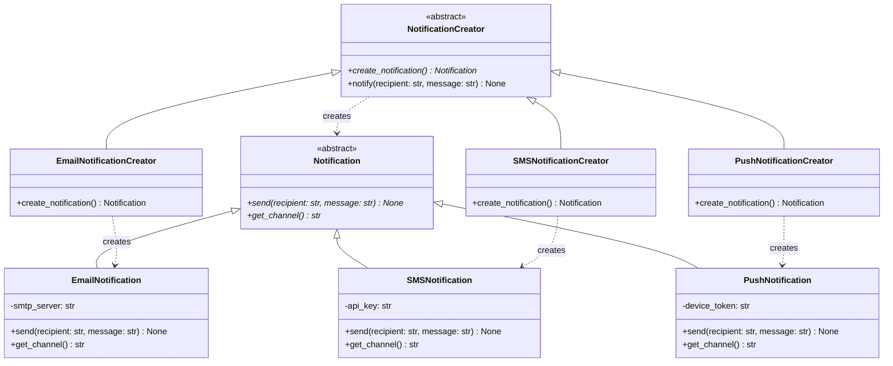

# Factory Method Pattern

> The Factory Method pattern defines an interface for creating objects but lets subclasses decide which class to instantiate -- decoupling the code that *uses* objects from the code that *creates* them.

## Table of Contents
- [Core Concepts](#core-concepts)
- [Code Examples](#code-examples)
- [Common Pitfalls](#common-pitfalls)
- [Key Takeaways](#key-takeaways)
- [Exercises](#exercises)

## Core Concepts

### Intent

#### What

The Factory Method pattern provides an interface for creating objects in a superclass, while allowing subclasses to alter the type of objects that will be created. Instead of calling a constructor directly (`EmailNotification()`), the client calls a factory method (`creator.create_notification()`), and the concrete subclass decides which product to instantiate.

#### How

The pattern works through inheritance: a base `Creator` class declares the factory method (often abstract), and each `ConcreteCreator` subclass overrides it to return a different `ConcreteProduct`. The Creator's other methods work with the product through its abstract interface, so they don't care which concrete class was actually instantiated.

#### Why It Matters

Without Factory Method, your code is littered with conditionals like `if channel == "email": notification = EmailNotification()`. Every time you add a new channel, you modify that conditional -- violating the Open/Closed Principle. With Factory Method, adding a new channel means adding a new subclass. Zero existing code changes.

### Participants

#### What

The Factory Method pattern involves four participants:

| Participant | Role |
|-------------|------|
| **Product** | The abstract interface that all created objects must implement. Defines the operations the Creator's code depends on. |
| **ConcreteProduct** | A specific implementation of the Product interface (e.g., `EmailNotification`, `SMSNotification`). |
| **Creator** | Declares the factory method that returns a Product. May provide a default implementation. Contains business logic that works with Products through the abstract interface. |
| **ConcreteCreator** | Overrides the factory method to return a specific ConcreteProduct. This is where the "decision" lives. |

#### How

The Creator doesn't know which ConcreteProduct it will work with. It calls `self.create_notification()` (the factory method), gets back a `Notification` (the Product interface), and uses it. The ConcreteCreator plugs in the specific type.

#### Why It Matters

This separation means the Creator's business logic is written once and works with *any* product type -- current or future. The ConcreteCreators are small, focused classes that each make one decision: which product to create. This is the Single Responsibility Principle in action.

### Structure



### When NOT to Use Factory Method

#### What

Factory Method adds a class hierarchy. That's a cost. Don't pay it unless you get clear value in return.

#### How

Avoid Factory Method when:

1. **You only have one product type** -- If there's only `EmailNotification` and no plans for others, a direct constructor call is simpler and clearer. Don't build an extension point nobody will use.
2. **The creation logic is trivial** -- If creating the object is just `MyClass(arg1, arg2)` with no decision-making, a factory method adds indirection for zero benefit.
3. **A simple function works** -- Python is not Java. A plain factory *function* (not a factory *method* on a class hierarchy) is often sufficient. You don't need a `ConcreteCreator` class when a function with a `match` statement does the job.
4. **You're doing it "just in case"** -- YAGNI. If the requirement for multiple product types doesn't exist today, don't pre-build the abstraction. Refactoring to Factory Method later is straightforward.

#### Why It Matters

Over-abstraction is the #1 misuse of Factory Method. In Python especially, where functions are first-class citizens, you should reach for a factory *function* first and only graduate to the full Factory Method pattern when you genuinely have a Creator class that contains business logic around the product.

### Factory Method vs Abstract Factory

#### What

These two patterns are frequently confused. The key difference:

| Aspect | Factory Method | Abstract Factory |
|--------|---------------|-----------------|
| **Scope** | Creates *one* product | Creates a *family* of related products |
| **Mechanism** | Inheritance -- subclasses override a method | Composition -- client uses a factory object |
| **Extension** | Add a new ConcreteCreator subclass | Add a new ConcreteFactory class |
| **Example** | "Create a notification" | "Create a matching set of button + checkbox + menu for a platform" |

#### How

Factory Method uses a single `create_xxx()` method. Abstract Factory has *multiple* `create_xxx()` methods on the same factory, one for each product in the family. If you find yourself adding `create_button()`, `create_checkbox()`, and `create_menu()` to the same factory, you've graduated from Factory Method to Abstract Factory.

#### Why It Matters

Choosing the wrong one leads to awkward designs. If you use Factory Method for a family of products, you end up with parallel Creator hierarchies that must stay in sync. If you use Abstract Factory for a single product, you've over-engineered it.

### Real-World Anchoring

#### What

Factory Method is everywhere in real-world Python code:

- **Python's `pathlib`** -- `Path()` acts as a factory that returns `PosixPath` or `WindowsPath` depending on the OS. Callers work with the `Path` interface; the concrete type is decided by the factory.
- **Django's form fields** -- `forms.CharField()` returns the appropriate widget based on configuration. The form class (Creator) delegates widget creation to overridable methods.
- **`logging.getLogger()`** -- Returns a Logger instance that may be configured differently based on the name. The creation logic is centralized; callers get the interface.
- **`collections.abc` / `dict.fromkeys()`** -- Class methods that act as alternative constructors are a Pythonic variant of Factory Method.

#### Why It Matters

Recognizing Factory Method in frameworks you already use makes the pattern concrete. You've been *using* it; now you can *design* with it.

## Code Examples

### Notification System with Factory Method

```python
"""
Factory Method pattern: Notification system.

A notification service needs to send messages through different channels
(email, SMS, push). Each channel has different setup, formatting, and
delivery mechanics. Factory Method lets us add new channels without
modifying the core notification logic.
"""
from abc import ABC, abstractmethod
from dataclasses import dataclass


# --- Product hierarchy ---

class Notification(ABC):
    """Product interface: all notifications must be sendable."""

    @abstractmethod
    def send(self, recipient: str, message: str) -> None:
        """Deliver the notification to the recipient."""

    @abstractmethod
    def get_channel(self) -> str:
        """Return the channel name for logging/auditing."""


@dataclass
class EmailNotification(Notification):
    """ConcreteProduct: sends notifications via email."""
    smtp_server: str = "smtp.company.com"
    from_address: str = "noreply@company.com"

    def send(self, recipient: str, message: str) -> None:
        # In production, this would use smtplib or an email service API
        print(
            f"[EMAIL] From: {self.from_address} | "
            f"To: {recipient} | "
            f"Via: {self.smtp_server} | "
            f"Body: {message}"
        )

    def get_channel(self) -> str:
        return "email"


@dataclass
class SMSNotification(Notification):
    """ConcreteProduct: sends notifications via SMS."""
    api_key: str = "twilio-api-key-xxx"
    sender_number: str = "+1234567890"

    def send(self, recipient: str, message: str) -> None:
        # In production, this would call the Twilio API or similar
        # SMS messages are typically truncated to 160 characters
        truncated = message[:160]
        print(
            f"[SMS] From: {self.sender_number} | "
            f"To: {recipient} | "
            f"Body: {truncated}"
        )

    def get_channel(self) -> str:
        return "sms"


@dataclass
class PushNotification(Notification):
    """ConcreteProduct: sends push notifications to mobile devices."""
    fcm_project_id: str = "my-firebase-project"

    def send(self, recipient: str, message: str) -> None:
        # In production, this would call Firebase Cloud Messaging or APNs
        print(
            f"[PUSH] Project: {self.fcm_project_id} | "
            f"Device: {recipient} | "
            f"Body: {message}"
        )

    def get_channel(self) -> str:
        return "push"


# --- Creator hierarchy ---

class NotificationCreator(ABC):
    """Creator: declares the factory method and contains business logic.

    The key insight: the Creator's notify() method contains business logic
    (logging, validation, formatting) that works with ANY notification type.
    The factory method is the ONLY part that varies across subclasses.
    """

    @abstractmethod
    def create_notification(self) -> Notification:
        """Factory method -- subclasses decide which Notification to create."""

    def notify(self, recipient: str, message: str) -> None:
        """Business logic that uses the product.

        This method is the reason Factory Method exists as a pattern:
        it contains logic that should NOT be duplicated across channels.
        The factory method provides the channel-specific product.
        """
        notification = self.create_notification()

        # Shared business logic -- same for all channels
        formatted_message = f"[ALERT] {message}"
        print(f"Sending {notification.get_channel()} notification to {recipient}...")
        notification.send(recipient, formatted_message)
        print(f"Notification sent via {notification.get_channel()} channel.")


class EmailNotificationCreator(NotificationCreator):
    """ConcreteCreator: creates EmailNotification products."""

    def create_notification(self) -> Notification:
        return EmailNotification()


class SMSNotificationCreator(NotificationCreator):
    """ConcreteCreator: creates SMSNotification products."""

    def create_notification(self) -> Notification:
        return SMSNotification()


class PushNotificationCreator(NotificationCreator):
    """ConcreteCreator: creates PushNotification products."""

    def create_notification(self) -> Notification:
        return PushNotification()


# --- Client code ---

def alert_user(creator: NotificationCreator, recipient: str, message: str) -> None:
    """Client code works with the Creator's abstract interface.

    This function doesn't know or care whether it's sending email, SMS,
    or push. It works with NotificationCreator, and the concrete subclass
    determines the channel. Adding a new channel requires ZERO changes here.
    """
    creator.notify(recipient, message)


# Runtime: choose the creator based on user preference or configuration
creators: dict[str, NotificationCreator] = {
    "email": EmailNotificationCreator(),
    "sms": SMSNotificationCreator(),
    "push": PushNotificationCreator(),
}

# Simulate sending through each channel
for channel, creator in creators.items():
    alert_user(creator, "user@example.com", "Your deployment succeeded!")
    print()
```

### Pythonic Variant: Factory Method with Protocol

```python
"""
Pythonic Factory Method using Protocol for structural subtyping.

In Python, you don't always need a full class hierarchy for the Creator.
If the Creator's only job is to create products (no shared business logic),
a factory function or a Protocol-based approach is cleaner.
"""
from typing import Protocol


class Serializer(Protocol):
    """Product interface via Protocol -- structural subtyping."""
    def serialize(self, data: dict[str, str | int | float]) -> str: ...


class JSONSerializer:
    """ConcreteProduct: serializes data to JSON format."""
    def serialize(self, data: dict[str, str | int | float]) -> str:
        # Simplified -- in production you'd use json.dumps()
        pairs = [f'"{k}": "{v}"' if isinstance(v, str) else f'"{k}": {v}'
                 for k, v in data.items()]
        return "{" + ", ".join(pairs) + "}"


class XMLSerializer:
    """ConcreteProduct: serializes data to XML format."""
    def serialize(self, data: dict[str, str | int | float]) -> str:
        elements = [f"  <{k}>{v}</{k}>" for k, v in data.items()]
        return "<data>\n" + "\n".join(elements) + "\n</data>"


class CSVSerializer:
    """ConcreteProduct: serializes data to CSV format."""
    def serialize(self, data: dict[str, str | int | float]) -> str:
        header = ",".join(data.keys())
        values = ",".join(str(v) for v in data.values())
        return f"{header}\n{values}"


def create_serializer(format_type: str) -> Serializer:
    """Factory function -- the Pythonic alternative to a Creator hierarchy.

    When the Creator has no business logic beyond creating the product,
    a factory function is simpler than a class hierarchy. This is idiomatic
    Python -- use classes when you need them, functions when you don't.
    """
    serializers: dict[str, Serializer] = {
        "json": JSONSerializer(),
        "xml": XMLSerializer(),
        "csv": CSVSerializer(),
    }
    serializer = serializers.get(format_type)
    if serializer is None:
        raise ValueError(f"Unknown format: {format_type}. Choose from: {list(serializers)}")
    return serializer


def export_report(data: dict[str, str | int | float], format_type: str) -> str:
    """Client code that uses the factory function.

    This function doesn't know about JSON, XML, or CSV. It works with
    the Serializer Protocol. The factory function decides the concrete type.
    """
    serializer = create_serializer(format_type)
    return serializer.serialize(data)


# Usage
report_data: dict[str, str | int | float] = {
    "name": "Q1 Sales",
    "revenue": 150000,
    "growth": 12.5,
}

for fmt in ("json", "xml", "csv"):
    print(f"--- {fmt.upper()} ---")
    print(export_report(report_data, fmt))
    print()
```

## Common Pitfalls

### Pitfall 1: Putting Business Logic in ConcreteCreators

```python
# BAD — Business logic duplicated across every ConcreteCreator
class EmailCreator:
    def create_and_send(self, recipient: str, message: str) -> None:
        notification = EmailNotification()
        formatted = f"[ALERT] {message}"  # Duplicated in every creator
        print(f"Sending to {recipient}...")  # Duplicated in every creator
        notification.send(recipient, formatted)
        print("Done.")  # Duplicated in every creator


class SMSCreator:
    def create_and_send(self, recipient: str, message: str) -> None:
        notification = SMSNotification()
        formatted = f"[ALERT] {message}"  # Same logic, copy-pasted
        print(f"Sending to {recipient}...")  # Same logic, copy-pasted
        notification.send(recipient, formatted)
        print("Done.")  # Same logic, copy-pasted
```

```python
# GOOD — Business logic lives in the Creator base class; ConcreteCreators only create
class NotificationCreator(ABC):
    @abstractmethod
    def create_notification(self) -> Notification:
        """Only this method varies across subclasses."""

    def notify(self, recipient: str, message: str) -> None:
        """Shared business logic -- written once, used by all channels."""
        notification = self.create_notification()
        formatted = f"[ALERT] {message}"
        print(f"Sending to {recipient}...")
        notification.send(recipient, formatted)
        print("Done.")


class EmailCreator(NotificationCreator):
    def create_notification(self) -> Notification:
        return EmailNotification()  # One line. That's all a ConcreteCreator does.
```

The whole point of Factory Method is that business logic lives in the base Creator. ConcreteCreators should be tiny -- they override the factory method and nothing else.

### Pitfall 2: Using Factory Method When a Factory Function Suffices

```python
# BAD — Full Creator hierarchy when there's no shared business logic
class SerializerCreator(ABC):
    @abstractmethod
    def create_serializer(self) -> Serializer: ...


class JSONSerializerCreator(SerializerCreator):
    def create_serializer(self) -> Serializer:
        return JSONSerializer()


class XMLSerializerCreator(SerializerCreator):
    def create_serializer(self) -> Serializer:
        return XMLSerializer()


# 4 classes just to create 2 objects
creator = JSONSerializerCreator()
serializer = creator.create_serializer()
```

```python
# GOOD — A factory function when the Creator has no business logic
def create_serializer(format_type: str) -> Serializer:
    match format_type:
        case "json":
            return JSONSerializer()
        case "xml":
            return XMLSerializer()
        case _:
            raise ValueError(f"Unknown format: {format_type}")


serializer = create_serializer("json")
```

In Python, the full Factory Method pattern (with a Creator class hierarchy) is justified only when the Creator contains meaningful business logic that you want to share across all concrete creators. If all you need is "create the right object," a function is enough.

### Pitfall 3: Returning Concrete Types Instead of the Abstract Interface

```python
# BAD — Factory method return type is concrete, defeating polymorphism
class EmailCreator:
    def create_notification(self) -> EmailNotification:  # Concrete return type!
        return EmailNotification()
```

```python
# GOOD — Factory method return type is the abstract Product interface
class EmailCreator(NotificationCreator):
    def create_notification(self) -> Notification:  # Abstract return type
        return EmailNotification()
```

The factory method must return the abstract `Product` type so client code can work with any product uniformly. Returning the concrete type leaks implementation details and defeats the purpose of the pattern.

## Key Takeaways

- **Factory Method decouples object creation from object use.** The Creator works with the abstract Product interface; the ConcreteCreator decides which concrete class to instantiate. Adding new product types requires zero changes to existing code.
- **The Creator's business logic is the reason the pattern exists.** If the Creator has no logic beyond calling the factory method, a plain factory function is simpler and more Pythonic.
- **Factory Method creates one product; Abstract Factory creates a family.** If you need to create matching sets of related objects (button + checkbox + menu for a platform), you need Abstract Factory, not Factory Method.
- **In Python, prefer Protocol over ABC for product interfaces** when structural subtyping (duck typing) is sufficient. Use ABC when you need to enforce that subclasses implement specific methods.
- **The most common mistake is over-applying the pattern.** If you have one product type and no plans for more, a direct constructor call is the right design. Refactoring to Factory Method later is easy.

## Exercises

1. **Extend the notification system**: Add a `SlackNotification` concrete product and its corresponding `SlackNotificationCreator`. The Slack notification should include a `webhook_url` field and format messages with a `[Slack]` prefix. Verify that your addition requires zero changes to the `alert_user()` client code.

2. **Refactor to Factory Method**: You have the following code that violates the Open/Closed Principle. Refactor it to use the Factory Method pattern:
   ```python
   def create_report(report_type: str, data: dict) -> str:
       if report_type == "pdf":
           return f"PDF: {data}"
       elif report_type == "excel":
           return f"Excel: {data}"
       elif report_type == "csv":
           return f"CSV: {data}"
       else:
           raise ValueError(f"Unknown type: {report_type}")
   ```

3. **Pattern recognition**: Python's `pathlib.Path()` returns `PosixPath` on Linux/macOS and `WindowsPath` on Windows. Explain how this is an example of Factory Method. Identify the Creator, ConcreteCreators, Product, and ConcreteProducts in this design.

4. **Design decision**: You're building a payment processing system that supports credit cards and PayPal. A product manager says "we might add Apple Pay and Google Pay next quarter." Should you use Factory Method now or wait? Argue both sides, then give your recommendation with reasoning.

5. **Factory Method vs factory function**: Write a factory function version and a full Factory Method version for a `Logger` that supports console and file output. Compare the two implementations: when would you choose each one? Under what conditions would you migrate from the function to the class-based pattern?

---
up:: [Schedule](../../Schedule.md)
#type/learning #source/self-study #status/seed
