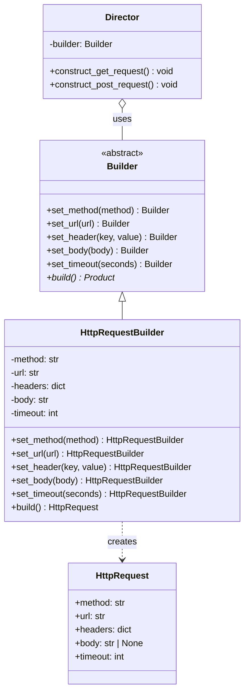

# Builder Pattern

> The Builder pattern separates the construction of a complex object from its representation, letting the same construction process create different representations -- essential when an object has many optional parts or requires multi-step assembly.

## Table of Contents
- [Core Concepts](#core-concepts)
- [Code Examples](#code-examples)
- [Common Pitfalls](#common-pitfalls)
- [Key Takeaways](#key-takeaways)
- [Exercises](#exercises)

## Core Concepts

### Intent

#### What

The Builder pattern provides a step-by-step interface for constructing complex objects. Instead of a single constructor with dozens of parameters, you call individual methods to set each piece, then finalize with a `build()` call.

#### How

A **Director** orchestrates the building steps, calling methods on a **Builder** interface. Each **ConcreteBuilder** implements those steps differently, assembling a different **Product**. The client either uses the Director for predefined recipes or drives the Builder directly.

#### Why It Matters

Without Builder, you face the "telescoping constructor" problem: `Request(url, method, headers, body, timeout, retries, auth, ...)`. Each new optional parameter doubles the confusion. Builder turns that into readable, self-documenting code: `RequestBuilder().url("...").timeout(30).build()`. The intent of each argument is encoded in the method name, not its position.

### Participants

#### What

The pattern involves four participants:

| Participant | Responsibility |
|---|---|
| **Builder** | Abstract interface declaring construction steps (`set_header()`, `set_body()`, etc.) |
| **ConcreteBuilder** | Implements each step, accumulates parts, and provides the finished Product |
| **Director** | Defines the *order* in which building steps are called -- encapsulates construction recipes |
| **Product** | The complex object being built -- has no knowledge of how it was constructed |

#### How

The Builder interface declares all possible construction steps. ConcreteBuilders implement these steps while maintaining internal state. The Director holds a reference to a Builder and calls steps in a specific sequence. The Product is retrieved from the ConcreteBuilder after construction is complete.

#### Why It Matters

Separating these roles means you can swap ConcreteBuilders to produce different Products from the same construction process. The Director encapsulates "how to build a standard GET request" or "how to build an authenticated POST request" -- reusable recipes that don't leak construction details.

### Structure



### Method Chaining and Fluent APIs

#### What

Method chaining (also called a "fluent API") is a technique where each builder method returns `self`, allowing calls to be chained: `builder.set_x().set_y().set_z().build()`.

#### How

Each setter method in the builder performs its assignment, then returns `self` instead of `None`. The final `build()` method returns the constructed Product.

```python
# Method chaining in action
request = (
    HttpRequestBuilder()
    .set_method("POST")
    .set_url("https://api.example.com/users")
    .set_header("Content-Type", "application/json")
    .set_body('{"name": "Alice"}')
    .set_timeout(30)
    .build()
)
```

#### Why It Matters

Fluent APIs make construction code read almost like a DSL (domain-specific language). Compare this to a positional constructor: `HttpRequest("POST", "https://...", {"Content-Type": "application/json"}, '{"name": "Alice"}', 30)` -- which argument is the timeout? The method names eliminate ambiguity.

### When NOT to Use

#### What

Builder adds structural complexity. It is not always the right tool.

#### How

Avoid Builder when:

- **The object is simple** -- if it has fewer than 3-4 parameters and no optional fields, a regular constructor or `dataclass` is clearer.
- **Construction is always the same** -- if every instance is built identically, there is no need for step-by-step flexibility. A factory function suffices.
- **You are just wrapping keyword arguments** -- Python's `**kwargs` and dataclasses with defaults already solve the "many optional parameters" problem without a separate Builder class.
- **Immutability is not a concern** -- if you are fine with setting attributes after construction, a plain mutable object works.

#### Why It Matters

The most common design pattern mistake is reaching for a pattern when simpler code would do. In Python specifically, `@dataclass(frozen=True)` with default values often replaces Builder entirely. Reserve Builder for when construction involves validation, multi-step sequencing, or producing different representations.

### Real-World Anchoring

#### What

Builder is everywhere in mature libraries.

#### How

- **SQLAlchemy's query builder**: `session.query(User).filter(User.age > 25).order_by(User.name).limit(10)` -- each call refines the query, and `.all()` is the `build()` step that executes it.
- **Python `requests` library**: While `requests.get()` uses a simple function API, internally it builds a `PreparedRequest` step by step -- setting method, URL, headers, auth, and body before sending.
- **`StringBuilder` in Java/C#**: The classic example -- accumulate string parts efficiently, then call `toString()` to produce the final result.
- **Django ORM QuerySet**: `Article.objects.filter(published=True).exclude(author=None).order_by('-date')` -- a fluent builder that constructs SQL lazily.

#### Why It Matters

Recognizing Builder in the wild helps you understand library design decisions. When you see a fluent API with a terminal method (`build()`, `execute()`, `all()`), you are looking at Builder.

## Code Examples

### HTTP Request Builder

```python
"""
Builder Pattern: HTTP Request Builder

Demonstrates a realistic Builder for constructing HTTP requests with
method chaining. The Director provides predefined construction recipes.
"""

from __future__ import annotations

from abc import ABC, abstractmethod
from dataclasses import dataclass, field


# --- Product ---
@dataclass(frozen=True)
class HttpRequest:
    """The complex object being built. Immutable once constructed."""
    method: str
    url: str
    headers: dict[str, str] = field(default_factory=dict)
    body: str | None = None
    timeout: int = 30
    retries: int = 0

    def __str__(self) -> str:
        header_str = "\n".join(f"  {k}: {v}" for k, v in self.headers.items())
        return (
            f"{self.method} {self.url}\n"
            f"Headers:\n{header_str}\n"
            f"Body: {self.body or '(empty)'}\n"
            f"Timeout: {self.timeout}s | Retries: {self.retries}"
        )


# --- Builder (abstract interface) ---
class RequestBuilder(ABC):
    """Declares all construction steps. Returns self for method chaining."""

    @abstractmethod
    def set_method(self, method: str) -> RequestBuilder:
        ...

    @abstractmethod
    def set_url(self, url: str) -> RequestBuilder:
        ...

    @abstractmethod
    def set_header(self, key: str, value: str) -> RequestBuilder:
        ...

    @abstractmethod
    def set_body(self, body: str) -> RequestBuilder:
        ...

    @abstractmethod
    def set_timeout(self, seconds: int) -> RequestBuilder:
        ...

    @abstractmethod
    def set_retries(self, count: int) -> RequestBuilder:
        ...

    @abstractmethod
    def build(self) -> HttpRequest:
        ...


# --- ConcreteBuilder ---
class HttpRequestBuilder(RequestBuilder):
    """Accumulates parts and produces an HttpRequest Product."""

    def __init__(self) -> None:
        self._reset()

    def _reset(self) -> None:
        """Reset internal state so the builder can be reused."""
        self._method: str = "GET"
        self._url: str = ""
        self._headers: dict[str, str] = {}
        self._body: str | None = None
        self._timeout: int = 30
        self._retries: int = 0

    def set_method(self, method: str) -> HttpRequestBuilder:
        self._method = method.upper()
        return self  # Enable method chaining

    def set_url(self, url: str) -> HttpRequestBuilder:
        if not url.startswith(("http://", "https://")):
            raise ValueError(f"Invalid URL scheme: {url}")
        self._url = url
        return self

    def set_header(self, key: str, value: str) -> HttpRequestBuilder:
        self._headers[key] = value
        return self

    def set_body(self, body: str) -> HttpRequestBuilder:
        self._body = body
        return self

    def set_timeout(self, seconds: int) -> HttpRequestBuilder:
        if seconds <= 0:
            raise ValueError("Timeout must be positive")
        self._timeout = seconds
        return self

    def set_retries(self, count: int) -> HttpRequestBuilder:
        if count < 0:
            raise ValueError("Retries must be non-negative")
        self._retries = count
        return self

    def build(self) -> HttpRequest:
        """Finalize and return the constructed HttpRequest."""
        if not self._url:
            raise ValueError("URL is required")

        # Produce the immutable Product
        request = HttpRequest(
            method=self._method,
            url=self._url,
            headers=dict(self._headers),  # Defensive copy
            body=self._body,
            timeout=self._timeout,
            retries=self._retries,
        )

        # Reset so the builder can construct another object
        self._reset()
        return request


# --- Director ---
class RequestDirector:
    """Encapsulates construction recipes for common request types."""

    def __init__(self, builder: RequestBuilder) -> None:
        self._builder = builder

    def construct_simple_get(self, url: str) -> HttpRequest:
        """Recipe: a minimal GET request with standard headers."""
        return (
            self._builder
            .set_method("GET")
            .set_url(url)
            .set_header("Accept", "application/json")
            .set_header("User-Agent", "MyApp/1.0")
            .set_timeout(10)
            .build()
        )

    def construct_authenticated_post(
        self, url: str, body: str, token: str
    ) -> HttpRequest:
        """Recipe: an authenticated POST with JSON body."""
        return (
            self._builder
            .set_method("POST")
            .set_url(url)
            .set_header("Content-Type", "application/json")
            .set_header("Authorization", f"Bearer {token}")
            .set_body(body)
            .set_timeout(30)
            .set_retries(3)
            .build()
        )


# --- Client code ---
def main() -> None:
    builder = HttpRequestBuilder()

    # Option 1: Use the Director for predefined recipes
    director = RequestDirector(builder)
    get_request = director.construct_simple_get("https://api.example.com/users")
    print("=== GET Request (via Director) ===")
    print(get_request)
    print()

    post_request = director.construct_authenticated_post(
        url="https://api.example.com/users",
        body='{"name": "Alice", "role": "engineer"}',
        token="eyJhbGciOiJIUzI1NiIs...",
    )
    print("=== POST Request (via Director) ===")
    print(post_request)
    print()

    # Option 2: Drive the builder directly for custom requests
    custom_request = (
        builder
        .set_method("PATCH")
        .set_url("https://api.example.com/users/42")
        .set_header("Content-Type", "application/json")
        .set_header("If-Match", '"abc123"')
        .set_body('{"role": "senior-engineer"}')
        .set_timeout(15)
        .build()
    )
    print("=== PATCH Request (direct builder) ===")
    print(custom_request)


if __name__ == "__main__":
    main()
```

### SQL Query Builder (Simplified)

```python
"""
Builder Pattern: SQL Query Builder

A second example showing Builder applied to SQL query construction.
Demonstrates how Builder prevents SQL injection through parameterized queries.
"""

from __future__ import annotations

from dataclasses import dataclass, field


@dataclass(frozen=True)
class Query:
    """The Product: a parameterized SQL query."""
    sql: str
    params: tuple[object, ...] = ()

    def __str__(self) -> str:
        return f"SQL: {self.sql}\nParams: {self.params}"


class SelectBuilder:
    """Builds SELECT queries with a fluent API."""

    def __init__(self, table: str) -> None:
        self._table = table
        self._columns: list[str] = []
        self._conditions: list[str] = []
        self._params: list[object] = []
        self._order_by: str | None = None
        self._limit: int | None = None

    def columns(self, *cols: str) -> SelectBuilder:
        """Specify which columns to select."""
        self._columns.extend(cols)
        return self

    def where(self, condition: str, value: object) -> SelectBuilder:
        """Add a WHERE condition with a parameterized value."""
        self._conditions.append(condition)
        self._params.append(value)
        return self

    def order_by(self, column: str, descending: bool = False) -> SelectBuilder:
        direction = "DESC" if descending else "ASC"
        self._order_by = f"{column} {direction}"
        return self

    def limit(self, count: int) -> SelectBuilder:
        self._limit = count
        return self

    def build(self) -> Query:
        """Assemble the final SQL query."""
        cols = ", ".join(self._columns) if self._columns else "*"
        sql = f"SELECT {cols} FROM {self._table}"

        if self._conditions:
            where_clause = " AND ".join(self._conditions)
            sql += f" WHERE {where_clause}"

        if self._order_by:
            sql += f" ORDER BY {self._order_by}"

        if self._limit is not None:
            sql += f" LIMIT {self._limit}"

        return Query(sql=sql, params=tuple(self._params))


def main() -> None:
    # Build a complex query step by step
    query = (
        SelectBuilder("employees")
        .columns("name", "department", "salary")
        .where("department = ?", "Engineering")
        .where("salary > ?", 100_000)
        .order_by("salary", descending=True)
        .limit(20)
        .build()
    )

    print(query)
    # SQL: SELECT name, department, salary FROM employees
    #      WHERE department = ? AND salary > ?
    #      ORDER BY salary DESC LIMIT 20
    # Params: ('Engineering', 100000)


if __name__ == "__main__":
    main()
```

## Common Pitfalls

### Pitfall 1: Mutable Product leaking builder state

```python
# BAD — Product shares mutable references with the Builder
class BadBuilder:
    def __init__(self) -> None:
        self._headers: dict[str, str] = {}

    def set_header(self, key: str, value: str) -> BadBuilder:
        self._headers[key] = value
        return self

    def build(self) -> dict[str, str]:
        return self._headers  # Shared reference! Mutating the dict later corrupts the Product

# GOOD — Defensive copy ensures Product independence
class GoodBuilder:
    def __init__(self) -> None:
        self._headers: dict[str, str] = {}

    def set_header(self, key: str, value: str) -> GoodBuilder:
        self._headers[key] = value
        return self

    def build(self) -> dict[str, str]:
        return dict(self._headers)  # Copy -- Product is independent of Builder state
```

### Pitfall 2: No validation in build()

```python
# BAD — build() blindly constructs an invalid Product
class BadRequestBuilder:
    def __init__(self) -> None:
        self._url: str = ""
        self._method: str = ""

    def build(self) -> dict[str, str]:
        return {"url": self._url, "method": self._method}  # URL could be empty

# GOOD — build() validates before constructing
class GoodRequestBuilder:
    def __init__(self) -> None:
        self._url: str = ""
        self._method: str = "GET"

    def set_url(self, url: str) -> GoodRequestBuilder:
        self._url = url
        return self

    def build(self) -> dict[str, str]:
        if not self._url:
            raise ValueError("URL is required -- call set_url() before build()")
        return {"url": self._url, "method": self._method}
```

### Pitfall 3: Using Builder when a dataclass suffices

```python
# BAD — Over-engineering: Builder for a simple object
class PointBuilder:
    def __init__(self) -> None:
        self._x: float = 0.0
        self._y: float = 0.0

    def set_x(self, x: float) -> PointBuilder:
        self._x = x
        return self

    def set_y(self, y: float) -> PointBuilder:
        self._y = y
        return self

    def build(self) -> tuple[float, float]:
        return (self._x, self._y)

point = PointBuilder().set_x(3.0).set_y(4.0).build()

# GOOD — Simple dataclass: cleaner, less code, same result
from dataclasses import dataclass

@dataclass
class Point:
    x: float = 0.0
    y: float = 0.0

point = Point(x=3.0, y=4.0)
```

## Key Takeaways

- **Builder solves the telescoping constructor problem** -- when an object has many optional parameters, Builder makes construction readable and self-documenting through named method calls.
- **Method chaining creates fluent APIs** -- returning `self` from each setter enables `builder.a().b().c().build()`, which reads almost like prose.
- **The Director encapsulates recipes** -- predefined construction sequences that can be reused without duplicating step-by-step code.
- **Always validate in `build()`** -- the builder should ensure the Product is in a valid state before returning it. This is the centralized validation checkpoint.
- **In Python, consider `@dataclass` first** -- if all you need is optional parameters with defaults, a frozen dataclass is simpler. Reach for Builder when construction involves sequencing, validation, or producing different representations.

## Exercises

1. **Concept: Director vs direct builder usage** -- Explain when you would use a Director versus driving the Builder directly. Give a scenario where each approach is preferable.

2. **Coding: Email builder** -- Implement a `EmailBuilder` that constructs an `Email` dataclass with fields: `sender`, `recipients` (list), `subject`, `body`, `cc` (optional list), `bcc` (optional list), `attachments` (optional list of file paths). The `build()` method should validate that `sender`, at least one recipient, and `subject` are set. Use method chaining.

3. **Coding: Configuration builder with presets** -- Create a `DatabaseConfigBuilder` with methods for `host`, `port`, `username`, `password`, `database_name`, `pool_size`, `ssl_enabled`. Add a Director with preset recipes: `construct_development()` (localhost, no SSL, pool size 2) and `construct_production()` (SSL enabled, pool size 20, retries). Include validation in `build()`.

4. **Concept: Builder vs Factory** -- A teammate suggests using a Factory Method instead of a Builder for constructing report objects that have 12 optional sections. Argue for or against this suggestion, explaining which pattern fits better and why.

5. **Coding: Immutability guarantee** -- Modify the HTTP Request Builder example so that calling any setter *after* `build()` has been called raises a `RuntimeError("Builder has been finalized")`. Then add a `reset()` method to allow reuse. Discuss the trade-offs of this approach versus auto-reset.

---
up:: [Schedule](../../Schedule.md)
#type/learning #source/self-study #status/seed
