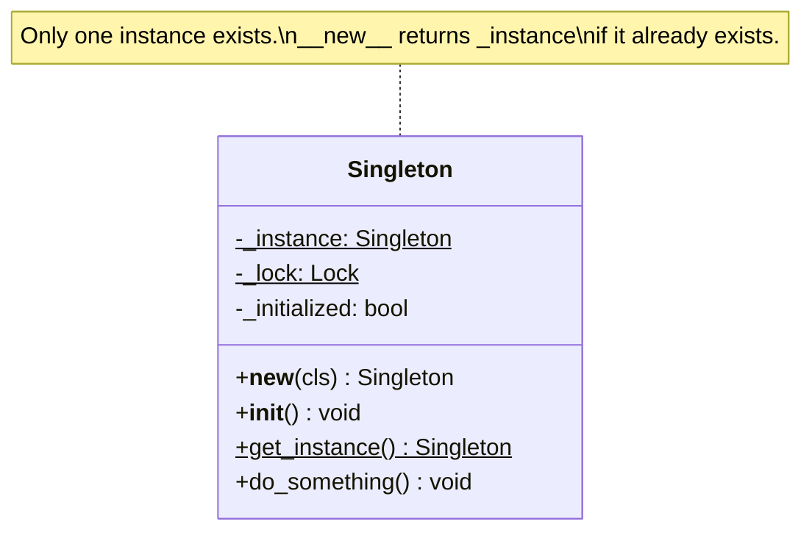

# Singleton Pattern

> The Singleton pattern ensures a class has exactly one instance and provides a global access point to it -- useful for shared resources like loggers and configuration, but easily misused as a glorified global variable.

## Table of Contents
- [Core Concepts](#core-concepts)
- [Code Examples](#code-examples)
- [Common Pitfalls](#common-pitfalls)
- [Key Takeaways](#key-takeaways)
- [Exercises](#exercises)

## Core Concepts

### Intent

#### What

Singleton restricts a class to a single instance. Every call to the constructor returns the same object. It also provides a well-known access point so any part of the codebase can reach that instance.

#### How

The class controls its own instantiation. On the first call to the constructor (or a `get_instance()` class method), the instance is created. On subsequent calls, the existing instance is returned. The constructor is effectively intercepted.

#### Why It Matters

Some resources are inherently singular: there is one application configuration, one connection pool, one logger root. Creating multiple instances would either waste resources (duplicate connection pools) or cause bugs (conflicting configuration states). Singleton ensures you cannot accidentally create a second instance.

### Participants

#### What

| Participant | Responsibility |
|---|---|
| **Singleton** | The class itself -- stores the single instance as a class-level attribute and overrides `__new__` (or uses a metaclass) to enforce uniqueness |

Unlike most patterns, Singleton has a single participant. The complexity is not in the number of roles but in the implementation details (thread safety, lazy initialization, testability).

#### How

In Python, Singleton is typically implemented by overriding `__new__` to check whether an instance already exists. If it does, `__new__` returns the existing one. If not, it creates and stores a new one.

#### Why It Matters

The simplicity of the participant list is deceptive. Singleton's real complexity lives in its side effects: it introduces global state, complicates testing, and can cause subtle concurrency bugs. Understanding the participant is easy -- understanding the consequences is the challenge.

### Structure



### Implementation Approaches in Python

#### What

Python offers multiple ways to implement Singleton, each with different trade-offs.

#### How

There are three main approaches:

1. **`__new__` override** -- the classic OOP approach, intercepting object creation
2. **Metaclass** -- using a custom metaclass to control instantiation
3. **Module-level singleton** -- the most Pythonic approach, leveraging Python's module system

#### Why It Matters

Choosing the right implementation depends on your constraints. The module-level approach is simplest and most Pythonic. The `__new__` approach is more explicit about intent. The metaclass approach is cleanest for inheritance but more complex. In practice, most Python code uses the module-level approach -- the other techniques exist mainly for cases where you need a class-based singleton (e.g., for type hinting or when the singleton must be lazily initialized).

### Thread-Safe Singleton

#### What

In multithreaded programs, two threads can simultaneously check "does the instance exist?" both see "no," and both create instances -- violating the Singleton guarantee.

#### How

A `threading.Lock` serializes access to the critical section. The double-checked locking pattern avoids acquiring the lock on every call (only on the first creation):

1. Check if instance exists (fast path, no lock)
2. If not, acquire the lock
3. Check again inside the lock (another thread may have created it)
4. Create the instance

#### Why It Matters

Thread safety is not optional in production code. A Singleton that is not thread-safe creates intermittent, hard-to-reproduce bugs -- two instances with diverging state, race conditions on initialization. Double-checked locking balances safety with performance.

### Module-Level Singleton (The Pythonic Way)

#### What

Python modules are themselves singletons. When you `import config`, Python loads the module once, caches it in `sys.modules`, and returns the cached version on subsequent imports.

#### How

Instead of a Singleton class, you create a module (`config.py`) with module-level variables and functions. Any file that imports it gets the same object. No metaclass, no `__new__`, no lock needed.

```python
# config.py -- this IS the singleton
DATABASE_URL = "postgresql://localhost/myapp"
DEBUG = False

def reload_from_env() -> None:
    global DATABASE_URL, DEBUG
    import os
    DATABASE_URL = os.getenv("DATABASE_URL", DATABASE_URL)
    DEBUG = os.getenv("DEBUG", "false").lower() == "true"
```

#### Why It Matters

This is the approach most Python professionals use. It is simple, thread-safe (module imports are lock-protected by the interpreter), and requires no special patterns. The `logging` module in Python's standard library works this way -- `logging.getLogger("name")` returns the same logger instance every time.

### When NOT to Use

#### What

Singleton is the most criticized of the GoF patterns. Its drawbacks often outweigh its benefits.

#### How

Avoid Singleton when:

- **Testing is a priority** -- Singletons carry state across tests, causing test pollution. Mocking a Singleton requires monkey-patching or dependency injection workarounds.
- **You are hiding dependencies** -- when a function calls `Config.get_instance()` internally, the dependency on Config is invisible from the function signature. This makes code harder to reason about and refactor.
- **Concurrency is complex** -- Singleton centralizes state, creating a potential bottleneck. If multiple threads write to the Singleton, you need synchronization throughout its interface, not just in `__new__`.
- **You just want a global variable** -- if you do not need to enforce "exactly one instance," a module-level variable or a passed-in dependency is simpler and more testable.
- **You might need multiple instances later** -- "we'll only ever need one" is a prediction that frequently ages poorly (e.g., one database connection... until you need a read replica).

#### Why It Matters

The Singleton pattern's biggest danger is that it *feels* convenient. It removes the need to pass dependencies through constructors, which seems simpler -- until you try to test, refactor, or scale. Dependency injection (passing the dependency as a constructor parameter) is almost always a better alternative. Use Singleton only when the instance is truly, inherently singular and the testing trade-off is acceptable.

### Real-World Anchoring

#### What

Despite the criticism, Singleton appears in major frameworks -- usually disguised.

#### How

- **Python's `logging` module**: `logging.getLogger("app.auth")` returns the same logger every time. The logging module maintains a dictionary of logger instances keyed by name -- each name maps to exactly one logger.
- **Django's `settings`**: `django.conf.settings` is a module-level singleton. There is one settings object for the entire application. It is lazily initialized on first access.
- **Python's `None`, `True`, `False`**: These are singleton objects at the language level. `None is None` is always `True` because there is exactly one `None` instance.
- **Database connection pools**: SQLAlchemy's `engine` is typically created once and shared. While not enforced by a Singleton class, it follows the singleton *concept*.

#### Why It Matters

Notice that most real-world "singletons" in Python are module-level instances, not Singleton classes. This reinforces the Pythonic approach: use the module system rather than the class-based pattern.

### Differentiating Creational Patterns

#### What

With all four creational patterns covered (Factory Method, Abstract Factory, Builder, Singleton), it is essential to understand when to reach for each.

#### How

| Pattern | Problem It Solves | Key Participants | When to Use |
|---|---|---|---|
| **Factory Method** | Decouple *which* class to instantiate from the code that uses it | Creator, ConcreteCreator, Product | When a class cannot anticipate the type of objects it creates; when subclasses should decide the concrete type |
| **Abstract Factory** | Create *families* of related objects without specifying concrete classes | AbstractFactory, ConcreteFactory, AbstractProduct, ConcreteProduct | When the system must work with multiple families of related products (e.g., cross-platform UI kits) |
| **Builder** | Construct complex objects *step by step* with many optional parts | Builder, ConcreteBuilder, Director, Product | When an object has many optional parameters, requires multi-step construction, or the same process must produce different representations |
| **Singleton** | Ensure *exactly one instance* of a class exists globally | Singleton | When a resource is inherently singular (logger, config, connection pool) and multiple instances would cause bugs or waste |

#### Why It Matters

These patterns are not interchangeable -- they solve fundamentally different problems:

- **Need to choose a type at runtime?** --> Factory Method
- **Need to choose a *family* of types at runtime?** --> Abstract Factory
- **Need to assemble a complex object piece by piece?** --> Builder
- **Need exactly one instance?** --> Singleton

The key discriminator is the *problem*, not the *structure*. Factory Method and Abstract Factory both create objects, but Factory Method creates *one* product while Abstract Factory creates *families*. Builder also creates objects, but the focus is on *construction complexity*, not *type selection*.

## Code Examples

### Thread-Safe Singleton with `__new__`

```python
"""
Singleton Pattern: Thread-safe implementation using __new__ and double-checked locking.

This is the classic class-based approach. For most Python code, prefer the
module-level approach instead (see the second example).
"""

from __future__ import annotations

import threading


class AppConfig:
    """
    Application configuration singleton.

    Thread-safe via double-checked locking: the lock is only acquired
    during the first instantiation, not on every access.
    """

    _instance: AppConfig | None = None
    _lock: threading.Lock = threading.Lock()
    _initialized: bool = False

    def __new__(cls) -> AppConfig:
        # Fast path: instance already exists, no lock needed
        if cls._instance is None:
            with cls._lock:
                # Double-check: another thread may have created it while we waited
                if cls._instance is None:
                    cls._instance = super().__new__(cls)
        return cls._instance

    def __init__(self) -> None:
        # __init__ is called every time AppConfig() is invoked,
        # even when __new__ returns the existing instance.
        # Guard against re-initialization.
        if AppConfig._initialized:
            return
        AppConfig._initialized = True

        # Actual initialization -- happens only once
        self.database_url: str = "postgresql://localhost/myapp"
        self.debug: bool = False
        self.max_connections: int = 10
        self.secret_key: str = "change-me-in-production"

    def __repr__(self) -> str:
        return (
            f"AppConfig(db={self.database_url!r}, "
            f"debug={self.debug}, "
            f"max_conn={self.max_connections})"
        )


def main() -> None:
    # Both variables point to the exact same object
    config_a = AppConfig()
    config_b = AppConfig()

    print(f"config_a is config_b: {config_a is config_b}")  # True
    print(f"config_a id: {id(config_a)}")
    print(f"config_b id: {id(config_b)}")

    # Modifying through one reference is visible through the other
    config_a.debug = True
    print(f"config_b.debug: {config_b.debug}")  # True -- same object

    print(config_a)

    # Thread-safety demonstration
    results: list[int] = []

    def get_config_id() -> None:
        config = AppConfig()
        results.append(id(config))

    threads = [threading.Thread(target=get_config_id) for _ in range(50)]
    for t in threads:
        t.start()
    for t in threads:
        t.join()

    # All threads got the same instance
    print(f"All same instance: {len(set(results)) == 1}")  # True
    print(f"Thread count: {len(results)}")  # 50


if __name__ == "__main__":
    main()
```

### Module-Level Singleton (Pythonic Approach)

```python
"""
Singleton Pattern: Module-level approach (the Pythonic way).

This file IS the singleton. Import it from anywhere and you get the same state.
Python's import system guarantees a module is loaded only once.

Usage from other modules:
    from app_logger import logger
    logger.info("This uses the singleton logger")
"""

from __future__ import annotations

import logging
import sys


def _create_logger() -> logging.Logger:
    """Configure and return the application logger. Called once at module load."""
    logger = logging.getLogger("myapp")
    logger.setLevel(logging.DEBUG)

    # Console handler with formatted output
    handler = logging.StreamHandler(sys.stdout)
    handler.setLevel(logging.DEBUG)
    formatter = logging.Formatter(
        "%(asctime)s | %(name)s | %(levelname)-8s | %(message)s",
        datefmt="%Y-%m-%d %H:%M:%S",
    )
    handler.setFormatter(formatter)
    logger.addHandler(handler)

    return logger


# Module-level singleton: created once when the module is first imported
logger: logging.Logger = _create_logger()


# --- Demonstration ---
def main() -> None:
    # Direct usage
    logger.info("Application started")
    logger.debug("Debug mode enabled")
    logger.warning("This is a warning")

    # Proof that re-importing returns the same object
    import importlib
    this_module = importlib.import_module(__name__)
    print(f"Same logger: {this_module.logger is logger}")  # True


if __name__ == "__main__":
    main()
```

### Singleton with Metaclass (Advanced)

```python
"""
Singleton Pattern: Metaclass approach.

The metaclass intercepts class instantiation, making the Singleton
behavior transparent and inheritable. This is the cleanest OOP
approach but requires understanding metaclasses.
"""

from __future__ import annotations

import threading
from typing import Any


class SingletonMeta(type):
    """
    Thread-safe Singleton metaclass.

    Any class using this as its metaclass will automatically be a Singleton.
    The metaclass intercepts __call__ (which is triggered by ClassName()),
    not __new__ -- so the logic lives in one place.
    """

    _instances: dict[type, Any] = {}
    _lock: threading.Lock = threading.Lock()

    def __call__(cls, *args: Any, **kwargs: Any) -> Any:
        if cls not in cls._instances:
            with cls._lock:
                if cls not in cls._instances:
                    instance = super().__call__(*args, **kwargs)
                    cls._instances[cls] = instance
        return cls._instances[cls]


class DatabaseConnectionPool(metaclass=SingletonMeta):
    """A connection pool that must be a singleton to avoid resource waste."""

    def __init__(self, max_connections: int = 10) -> None:
        self.max_connections = max_connections
        self._connections: list[str] = []
        print(f"Pool created with max_connections={max_connections}")

    def get_connection(self) -> str:
        if len(self._connections) >= self.max_connections:
            raise RuntimeError("Connection pool exhausted")
        conn = f"conn-{len(self._connections) + 1}"
        self._connections.append(conn)
        return conn

    def release_connection(self, conn: str) -> None:
        self._connections.remove(conn)

    @property
    def active_connections(self) -> int:
        return len(self._connections)


def main() -> None:
    # First call creates the pool
    pool_a = DatabaseConnectionPool(max_connections=5)

    # Second call returns the SAME pool -- the max_connections=20 arg is ignored
    pool_b = DatabaseConnectionPool(max_connections=20)

    print(f"Same instance: {pool_a is pool_b}")  # True
    print(f"Max connections: {pool_b.max_connections}")  # 5, not 20

    conn = pool_a.get_connection()
    print(f"Active via pool_b: {pool_b.active_connections}")  # 1 -- same object
    pool_a.release_connection(conn)


if __name__ == "__main__":
    main()
```

## Common Pitfalls

### Pitfall 1: Forgetting __init__ runs every time

```python
# BAD — __init__ resets state on every call to ClassName()
class BadSingleton:
    _instance = None

    def __new__(cls) -> BadSingleton:
        if cls._instance is None:
            cls._instance = super().__new__(cls)
        return cls._instance

    def __init__(self) -> None:
        self.data: list[str] = []  # Resets the list every time BadSingleton() is called!

s1 = BadSingleton()
s1.data.append("important")
s2 = BadSingleton()  # __init__ runs again, data is reset to []
print(s2.data)  # [] -- data lost!

# GOOD — Guard __init__ with an initialization flag
class GoodSingleton:
    _instance = None
    _initialized = False

    def __new__(cls) -> GoodSingleton:
        if cls._instance is None:
            cls._instance = super().__new__(cls)
        return cls._instance

    def __init__(self) -> None:
        if GoodSingleton._initialized:
            return  # Skip re-initialization
        GoodSingleton._initialized = True
        self.data: list[str] = []

s1 = GoodSingleton()
s1.data.append("important")
s2 = GoodSingleton()
print(s2.data)  # ['important'] -- preserved
```

### Pitfall 2: Not handling thread safety

```python
# BAD — Race condition: two threads can create two instances
class UnsafeSingleton:
    _instance = None

    def __new__(cls) -> UnsafeSingleton:
        if cls._instance is None:
            # Thread A checks, sees None, gets paused here
            # Thread B checks, sees None, creates instance
            # Thread A resumes, creates a SECOND instance
            cls._instance = super().__new__(cls)
        return cls._instance

# GOOD — Double-checked locking with threading.Lock
import threading

class SafeSingleton:
    _instance = None
    _lock = threading.Lock()

    def __new__(cls) -> SafeSingleton:
        if cls._instance is None:  # First check (fast path)
            with cls._lock:
                if cls._instance is None:  # Second check (inside lock)
                    cls._instance = super().__new__(cls)
        return cls._instance
```

### Pitfall 3: Using Singleton when dependency injection works better

```python
# BAD — Hidden dependency via Singleton makes testing painful
class BadService:
    def process(self, data: str) -> str:
        config = AppConfig()  # Hidden dependency -- how do you test with different configs?
        if config.debug:
            print(f"Processing: {data}")
        return data.upper()

# GOOD — Explicit dependency injection, no Singleton needed
class GoodService:
    def __init__(self, config: AppConfig) -> None:
        self._config = config  # Dependency is visible and replaceable

    def process(self, data: str) -> str:
        if self._config.debug:
            print(f"Processing: {data}")
        return data.upper()

# In tests, you can pass a mock config:
# service = GoodService(config=MockConfig(debug=False))
```

## Key Takeaways

- **Singleton ensures exactly one instance** -- useful for inherently singular resources (loggers, config, connection pools), but this is a narrower use case than most developers think.
- **In Python, prefer the module-level approach** -- Python modules are natural singletons. A module with functions and variables is simpler and more testable than a Singleton class.
- **Thread safety requires explicit locking** -- double-checked locking with `threading.Lock` prevents race conditions during first initialization.
- **Singleton's biggest risk is hidden dependencies** -- calling `Config.get_instance()` inside a function hides the dependency from the function signature, making code harder to test and reason about. Prefer dependency injection.
- **Guard `__init__` against re-execution** -- Python calls `__init__` every time you write `ClassName()`, even when `__new__` returns an existing instance. Use an `_initialized` flag to prevent state reset.

## Exercises

1. **Concept: Module singleton vs class singleton** -- Explain why Python's module-level singleton approach does not need a `threading.Lock`, while the `__new__`-based approach does. What mechanism in CPython provides the thread safety for module imports?

2. **Coding: Resettable singleton for testing** -- Implement a `CacheManager` singleton that stores key-value pairs. Add a `_reset()` class method that destroys the current instance (sets `_instance = None` and `_initialized = False`), allowing tests to start with a fresh singleton. Demonstrate usage in a simulated test scenario.

3. **Concept: Singleton vs dependency injection** -- A colleague argues that replacing all singletons with dependency injection adds unnecessary complexity. Write a counterargument with a concrete example where the Singleton approach causes a testing problem that dependency injection solves.

4. **Coding: Singleton registry** -- Implement a `SingletonRegistry` that manages named singletons. It should support `register(name, instance)`, `get(name)`, and `has(name)` methods. The registry itself should be a module-level singleton. Write code that registers a logger and a config object, then retrieves them by name.

5. **Concept: Creational pattern selection** -- Given these scenarios, identify which creational pattern fits best and explain why: (a) a report generator that must produce PDF, HTML, and CSV formats from the same data; (b) a database connection that should exist only once per application; (c) a UI toolkit that must create buttons, menus, and dialogs that match either a "dark" or "light" theme; (d) a notification that can have a title, body, icon, sound, priority, and expiration -- all optional.

---
up:: [Schedule](../../Schedule.md)
#type/learning #source/self-study #status/seed
