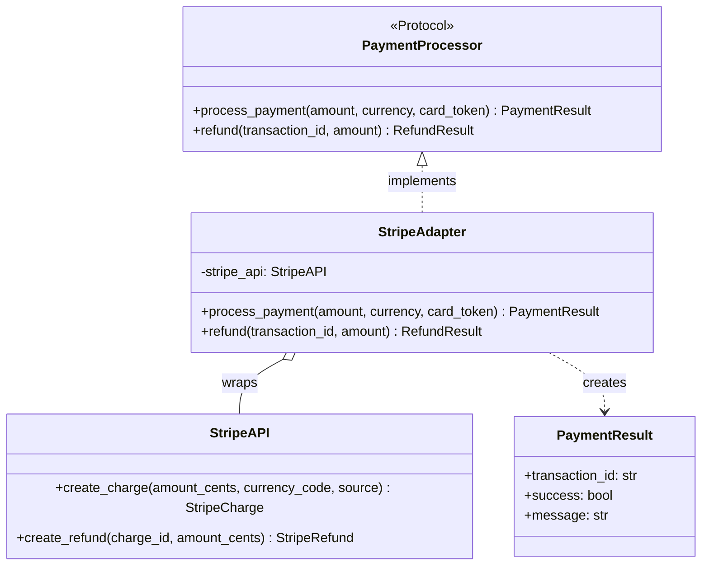

# Adapter Pattern

> The Adapter pattern converts the interface of a class into another interface that clients expect, letting classes work together that otherwise could not because of incompatible interfaces -- the duct tape of software design.

## Table of Contents
- [Core Concepts](#core-concepts)
- [Code Examples](#code-examples)
- [Common Pitfalls](#common-pitfalls)
- [Key Takeaways](#key-takeaways)
- [Exercises](#exercises)

## Core Concepts

### Intent

#### What

Adapter wraps an existing class with an incompatible interface and presents a new interface that the client expects. The wrapped class (the "adaptee") does not change -- the adapter translates calls between the client and the adaptee.

#### How

The client programs against a **Target** interface. The **Adaptee** has the functionality the client needs but with a different method signature. The **Adapter** implements the Target interface and internally delegates to the Adaptee, translating arguments and return values as needed.

#### Why It Matters

In real projects, you constantly integrate third-party libraries, legacy systems, and external APIs whose interfaces do not match your internal contracts. You cannot modify the external code (you do not own it) and should not pollute your codebase with their interface (that creates coupling). Adapter isolates the translation in one place, keeping the rest of your code clean and decoupled.

### Participants

#### What

| Participant | Responsibility |
|---|---|
| **Target** | The interface the client expects (often a `Protocol` or `ABC` in Python) |
| **Adaptee** | The existing class with useful functionality but an incompatible interface |
| **Adapter** | Implements the Target interface and wraps the Adaptee, translating calls |
| **Client** | Works exclusively with the Target interface, unaware of the Adapter or Adaptee |

#### How

The Client calls methods on the Target interface. The Adapter receives those calls, transforms them (renaming methods, restructuring arguments, converting data formats), and forwards them to the Adaptee. The Adaptee does the real work.

#### Why It Matters

This separation means you can swap adaptees without changing client code. If you replace your payment provider from Stripe to Square, only the adapter changes. The client still calls `process_payment()` the same way.

### Structure

#### Class Adapter vs Object Adapter

There are two structural variants:

**Object Adapter** (composition -- preferred in Python):
- The Adapter *has* an Adaptee (stores a reference)
- More flexible: can adapt any subclass of the Adaptee
- This is the standard approach in Python because Python favors composition over inheritance

**Class Adapter** (multiple inheritance):
- The Adapter *is* both a Target and an Adaptee (inherits from both)
- Tighter coupling but can override Adaptee behavior
- Less common in Python; more natural in C++ where multiple inheritance is idiomatic



### When NOT to Use

#### What

Adapter has a narrow purpose. Using it outside that scope creates unnecessary indirection.

#### How

Avoid Adapter when:

- **You control both interfaces** -- if you can change the interface of the class you are integrating, just change it. Adapter is for when you *cannot* modify the adaptee.
- **The translation is trivial** -- if adapting means renaming one method, a simple wrapper function is clearer than a full Adapter class.
- **You need to add new behavior** -- Adapter *translates*, it does not *extend*. If you need to add functionality (caching, logging, access control), use Decorator instead.
- **The interfaces will keep diverging** -- if the adaptee's interface changes frequently, maintaining the adapter becomes a burden. Consider whether a Facade (simplifying a complex subsystem) or an Anti-Corruption Layer (a broader translation boundary) is more appropriate.

#### Why It Matters

An unnecessary adapter is a layer of indirection with no benefit. Every method call goes through an extra hop, every stack trace is one frame deeper, and every developer must understand one more class. Use Adapter only when interface incompatibility is the actual problem.

### Real-World Anchoring

#### What

Adapter appears throughout Python's ecosystem, often without being named explicitly.

#### How

- **`csv.DictReader`**: Adapts a raw CSV file (rows as lists of strings) into an interface that returns rows as dictionaries with column-name keys. The underlying file object is the adaptee; `DictReader` is the adapter.
- **Django database backends**: Django's ORM expects a uniform database interface. Each backend (PostgreSQL, MySQL, SQLite) is an adapter that translates Django's internal query API into database-specific SQL and wire protocols.
- **`io.TextIOWrapper`**: Wraps a binary stream (`io.BytesIO`) and adapts it to a text interface, handling encoding/decoding transparently.
- **`xmlrpc.client.ServerProxy`**: Adapts a remote XML-RPC service into an object with regular Python method calls.

#### Why It Matters

Recognizing adapters in the wild helps you understand library architecture. When you see a class that wraps another and changes its interface without adding behavior, you are looking at an Adapter.

## Code Examples

### Payment Gateway Adapter

```python
"""
Adapter Pattern: Payment Gateway Integration

Demonstrates adapting a third-party payment API (Stripe-like) to match
an internal PaymentProcessor protocol. The client code works against
the protocol and is completely decoupled from the specific payment provider.
"""

from __future__ import annotations

from dataclasses import dataclass
from typing import Protocol


# --- Internal domain models (what our system uses) ---
@dataclass(frozen=True)
class PaymentResult:
    transaction_id: str
    success: bool
    message: str


@dataclass(frozen=True)
class RefundResult:
    refund_id: str
    success: bool
    amount_refunded: float


# --- Target: the interface our system expects ---
class PaymentProcessor(Protocol):
    """Protocol defining how our system interacts with any payment provider."""

    def process_payment(
        self, amount: float, currency: str, card_token: str
    ) -> PaymentResult: ...

    def refund(
        self, transaction_id: str, amount: float
    ) -> RefundResult: ...


# --- Adaptee: third-party Stripe-like API (we don't control this) ---
@dataclass(frozen=True)
class StripeCharge:
    """Stripe's charge response -- their naming, their structure."""
    id: str
    status: str
    failure_message: str | None = None


@dataclass(frozen=True)
class StripeRefund:
    """Stripe's refund response."""
    id: str
    amount: int  # Stripe uses cents
    status: str


class StripeAPI:
    """
    Simulates Stripe's SDK. Note the incompatible interface:
    - Amount in cents (int), not dollars (float)
    - 'source' instead of 'card_token'
    - 'currency_code' instead of 'currency'
    - Returns Stripe-specific objects, not our domain models
    """

    def create_charge(
        self, amount_cents: int, currency_code: str, source: str
    ) -> StripeCharge:
        print(f"  [Stripe] Charging {amount_cents} {currency_code} from {source}")
        return StripeCharge(id=f"ch_{source[:8]}", status="succeeded")

    def create_refund(self, charge_id: str, amount_cents: int) -> StripeRefund:
        print(f"  [Stripe] Refunding {amount_cents} cents on {charge_id}")
        return StripeRefund(id=f"re_{charge_id}", amount=amount_cents, status="succeeded")


# --- Adapter: translates our interface to Stripe's interface ---
class StripeAdapter:
    """
    Adapts StripeAPI to the PaymentProcessor protocol.

    Handles all translations:
    - dollars -> cents
    - 'card_token' -> 'source'
    - StripeCharge -> PaymentResult
    - StripeRefund -> RefundResult
    """

    def __init__(self, stripe_api: StripeAPI) -> None:
        self._stripe = stripe_api  # Composition: Adapter HAS-A Adaptee

    def process_payment(
        self, amount: float, currency: str, card_token: str
    ) -> PaymentResult:
        # Translation: dollars to cents, rename parameters
        amount_cents = int(amount * 100)

        charge = self._stripe.create_charge(
            amount_cents=amount_cents,
            currency_code=currency.lower(),
            source=card_token,
        )

        # Translation: Stripe's response to our domain model
        return PaymentResult(
            transaction_id=charge.id,
            success=charge.status == "succeeded",
            message=charge.failure_message or "Payment processed successfully",
        )

    def refund(self, transaction_id: str, amount: float) -> RefundResult:
        amount_cents = int(amount * 100)

        stripe_refund = self._stripe.create_refund(
            charge_id=transaction_id,
            amount_cents=amount_cents,
        )

        return RefundResult(
            refund_id=stripe_refund.id,
            success=stripe_refund.status == "succeeded",
            amount_refunded=stripe_refund.amount / 100,
        )


# --- Adaptee 2: a different payment provider with a different interface ---
class PayPalSDK:
    """Another payment provider with a completely different interface."""

    def send_payment(
        self, usd_amount: str, payer_email: str, idempotency_key: str
    ) -> dict[str, str]:
        print(f"  [PayPal] Sending ${usd_amount} from {payer_email}")
        return {"payment_id": f"PP-{idempotency_key[:8]}", "state": "approved"}

    def reverse_payment(self, payment_id: str) -> dict[str, str]:
        print(f"  [PayPal] Reversing {payment_id}")
        return {"refund_id": f"PPR-{payment_id}", "state": "completed"}


class PayPalAdapter:
    """Adapts PayPalSDK to the PaymentProcessor protocol."""

    def __init__(self, paypal_sdk: PayPalSDK) -> None:
        self._paypal = paypal_sdk

    def process_payment(
        self, amount: float, currency: str, card_token: str
    ) -> PaymentResult:
        # PayPal uses string amounts and requires an idempotency key
        result = self._paypal.send_payment(
            usd_amount=f"{amount:.2f}",
            payer_email=card_token,  # Map card_token to payer_email
            idempotency_key=card_token,
        )
        return PaymentResult(
            transaction_id=result["payment_id"],
            success=result["state"] == "approved",
            message="Payment approved" if result["state"] == "approved" else "Failed",
        )

    def refund(self, transaction_id: str, amount: float) -> RefundResult:
        result = self._paypal.reverse_payment(payment_id=transaction_id)
        return RefundResult(
            refund_id=result["refund_id"],
            success=result["state"] == "completed",
            amount_refunded=amount,
        )


# --- Client code: works with any PaymentProcessor ---
def checkout(processor: PaymentProcessor, total: float) -> None:
    """Client function that is completely decoupled from payment providers."""
    print(f"Processing ${total:.2f} checkout...")
    result = processor.process_payment(
        amount=total,
        currency="USD",
        card_token="tok_visa_4242",
    )
    print(f"  Result: {result}")

    if result.success:
        # Simulate a partial refund
        refund = processor.refund(result.transaction_id, amount=total * 0.1)
        print(f"  Refund: {refund}")
    print()


def main() -> None:
    # Same client code, different adapters -- swap payment providers freely
    print("=== Stripe ===")
    stripe_adapter = StripeAdapter(StripeAPI())
    checkout(stripe_adapter, total=99.99)

    print("=== PayPal ===")
    paypal_adapter = PayPalAdapter(PayPalSDK())
    checkout(paypal_adapter, total=49.99)


if __name__ == "__main__":
    main()
```

### Class Adapter (Multiple Inheritance Variant)

```python
"""
Adapter Pattern: Class Adapter using multiple inheritance.

Less common in Python, but useful to understand the structural difference.
The adapter IS-A Target and IS-A Adaptee simultaneously.
"""

from __future__ import annotations

from abc import ABC, abstractmethod


# --- Target ---
class TemperatureSensor(ABC):
    """Our system expects temperatures in Celsius."""

    @abstractmethod
    def read_celsius(self) -> float:
        ...

    @abstractmethod
    def sensor_id(self) -> str:
        ...


# --- Adaptee: legacy sensor that reports in Fahrenheit ---
class LegacyFahrenheitSensor:
    """Third-party sensor with a Fahrenheit-only interface."""

    def __init__(self, device_id: str) -> None:
        self._device_id = device_id
        self._reading_f: float = 72.0  # Simulated reading

    def get_temperature_f(self) -> float:
        return self._reading_f

    def get_device_id(self) -> str:
        return self._device_id

    def set_simulated_reading(self, fahrenheit: float) -> None:
        self._reading_f = fahrenheit


# --- Class Adapter: inherits from both Target and Adaptee ---
class FahrenheitToCelsiusAdapter(TemperatureSensor, LegacyFahrenheitSensor):
    """
    Class adapter: inherits from both the Target (TemperatureSensor)
    and the Adaptee (LegacyFahrenheitSensor).

    This gives direct access to the Adaptee's internals, which can be
    useful for overriding behavior, but creates tighter coupling.
    """

    def __init__(self, device_id: str) -> None:
        # Initialize the Adaptee
        LegacyFahrenheitSensor.__init__(self, device_id)

    def read_celsius(self) -> float:
        # Access Adaptee's method directly (no delegation object needed)
        fahrenheit = self.get_temperature_f()
        return (fahrenheit - 32) * 5 / 9

    def sensor_id(self) -> str:
        return self.get_device_id()


def display_temperature(sensor: TemperatureSensor) -> None:
    """Client function expecting Celsius interface."""
    temp = sensor.read_celsius()
    print(f"Sensor {sensor.sensor_id()}: {temp:.1f} C")


def main() -> None:
    adapter = FahrenheitToCelsiusAdapter("SENSOR-001")
    adapter.set_simulated_reading(98.6)  # Body temperature in F

    display_temperature(adapter)  # Sensor SENSOR-001: 37.0 C


if __name__ == "__main__":
    main()
```

## Common Pitfalls

### Pitfall 1: Adapter that adds business logic

```python
# BAD — Adapter does more than translate; it adds caching behavior
class BadAdapter:
    def __init__(self, api: ExternalAPI) -> None:
        self._api = api
        self._cache: dict[str, str] = {}  # Business logic in the adapter!

    def get_data(self, key: str) -> str:
        if key in self._cache:
            return self._cache[key]
        result = self._api.fetch(key)
        self._cache[key] = result  # Caching is NOT translation
        return result

# GOOD — Adapter only translates; use Decorator for caching
class GoodAdapter:
    def __init__(self, api: ExternalAPI) -> None:
        self._api = api

    def get_data(self, key: str) -> str:
        # Pure translation: rename method, convert format
        raw = self._api.fetch(key)
        return raw.strip()  # Only format conversion, no business logic
```

### Pitfall 2: Adapter exposing adaptee-specific details

```python
# BAD — Leaking Stripe-specific types through the adapter
class BadStripeAdapter:
    def process_payment(self, amount: float) -> StripeCharge:
        # Returns a Stripe-specific type -- client is now coupled to Stripe
        return self._stripe.create_charge(int(amount * 100), "usd", "src")

# GOOD — Return domain types that hide the adaptee
class GoodStripeAdapter:
    def process_payment(self, amount: float) -> PaymentResult:
        charge = self._stripe.create_charge(int(amount * 100), "usd", "src")
        # Translate to our domain model -- client has no idea about Stripe
        return PaymentResult(
            transaction_id=charge.id,
            success=charge.status == "succeeded",
            message="OK",
        )
```

### Pitfall 3: Creating an adapter when you own both sides

```python
# BAD — Unnecessary adapter between two classes you control
class InternalService:
    def fetch_user(self, user_id: int) -> dict[str, str]:
        return {"id": str(user_id), "name": "Alice"}

class UnnecessaryAdapter:
    def __init__(self, service: InternalService) -> None:
        self._service = service

    def get_user(self, uid: int) -> dict[str, str]:
        return self._service.fetch_user(uid)  # Just renaming a method!

# GOOD — Just rename the method on the original class
class InternalService:
    def get_user(self, user_id: int) -> dict[str, str]:
        return {"id": str(user_id), "name": "Alice"}
```

## Key Takeaways

- **Adapter translates, it does not extend** -- its sole job is to bridge two incompatible interfaces. If you are adding behavior (caching, logging, auth), use Decorator instead.
- **Prefer Object Adapter (composition) over Class Adapter (inheritance)** -- composition is more flexible, more Pythonic, and avoids the pitfalls of multiple inheritance.
- **Use `Protocol` for the Target interface** -- Python's structural subtyping lets adapters satisfy an interface without explicit inheritance, which keeps the code flexible and testable.
- **Adapter is for boundaries you do not control** -- if you own both sides of the interface, just change one to match the other. Adapter exists because you *cannot* change the adaptee.
- **Real-world adapters are everywhere** -- `csv.DictReader`, Django database backends, `io.TextIOWrapper`. Once you recognize the pattern, you see it in every integration layer.

## Exercises

1. **Concept: Adapter vs Facade** -- Both Adapter and Facade wrap existing code. Explain the key difference in their intent. Give a scenario where each is the correct choice.

2. **Coding: Weather API adapter** -- You have a legacy `WeatherStation` class with methods `get_temp_fahrenheit() -> float` and `get_humidity_pct() -> int`. Your application expects a `WeatherProvider` protocol with `temperature_celsius() -> float` and `humidity_ratio() -> float` (0.0-1.0, not percentage). Write an Object Adapter that bridges the gap. Include proper type hints and validation.

3. **Coding: Multi-adapter registry** -- Extend the payment example: create a `PaymentRouter` that maintains a dictionary of `{provider_name: PaymentProcessor}`. It should expose a `route_payment(provider: str, amount: float, ...) -> PaymentResult` method that selects the correct adapter at runtime. Handle unknown providers with a clear error.

4. **Concept: Class Adapter trade-offs** -- Explain why Class Adapter (multiple inheritance) is less common in Python than Object Adapter. What specific advantage does Class Adapter have that Object Adapter does not?

5. **Coding: Two-way adapter** -- Write an adapter that works in both directions: it adapts `MetricMeasurement` (meters, kilograms, Celsius) to `ImperialMeasurement` (feet, pounds, Fahrenheit) *and* vice versa. Both interfaces should be defined as Protocols. Discuss whether a two-way adapter is a good idea in practice.

---
up:: [Schedule](../../Schedule.md)
#type/learning #source/self-study #status/seed
