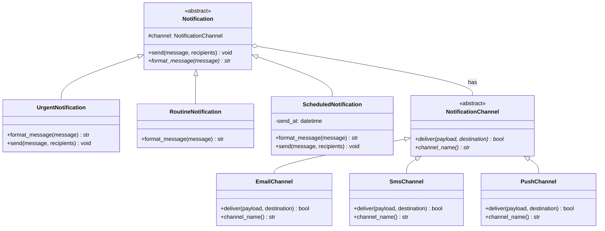

# Bridge Pattern

> The Bridge pattern decouples an abstraction from its implementation so both can vary independently -- essential when you have two orthogonal dimensions of variation that would otherwise cause a class explosion.

## Table of Contents
- [Core Concepts](#core-concepts)
- [Code Examples](#code-examples)
- [Common Pitfalls](#common-pitfalls)
- [Key Takeaways](#key-takeaways)
- [Exercises](#exercises)

## Core Concepts

### Intent

#### What

Bridge separates a concept into two independent hierarchies -- an **abstraction** (what something does) and an **implementation** (how it does it) -- and connects them via composition rather than inheritance. This prevents the combinatorial explosion of subclasses that occurs when two dimensions vary independently.

#### How

Instead of creating every combination as a subclass (e.g., `UrgentEmailNotification`, `UrgentSmsNotification`, `RoutineEmailNotification`, `RoutineSmsNotification`), you split into two hierarchies: the abstraction hierarchy (urgency levels) holds a reference to the implementation hierarchy (delivery channels). Each side can be extended independently.

#### Why It Matters

Without Bridge, adding a new urgency level means creating N new classes (one per channel). Adding a new channel means creating M new classes (one per urgency level). The number of classes grows as M x N. With Bridge, adding an urgency level is one class, adding a channel is one class. The growth is M + N -- dramatically simpler.

### Participants

#### What

| Participant | Responsibility |
|---|---|
| **Abstraction** | Defines the high-level interface and holds a reference to an Implementor. Delegates implementation details. |
| **RefinedAbstraction** | Extends the Abstraction with additional behavior or specialization |
| **Implementor** | Declares the interface for implementation classes. Does not need to match the Abstraction's interface. |
| **ConcreteImplementor** | Provides a specific implementation of the Implementor interface |

#### How

The Abstraction receives an Implementor via its constructor (composition). When the Abstraction's methods are called, they delegate the "how" to the Implementor. The client works with the Abstraction's interface and can inject any ConcreteImplementor.

#### Why It Matters

The key insight is that the Abstraction and Implementor interfaces are *different*. The Abstraction's interface is high-level (e.g., `send_notification(message, recipients)`) while the Implementor's interface is low-level (e.g., `deliver(payload, destination)`). This asymmetry is what distinguishes Bridge from simple Strategy.

### Structure



Without Bridge, you would need 3 urgency levels x 3 channels = 9 classes. With Bridge, you need 3 + 3 = 6 classes. Add a fourth channel? Without Bridge: 12 classes. With Bridge: 7. The savings compound quickly.

### Bridge vs Adapter

#### What

Bridge and Adapter look similar (both involve composition with an interface), but they solve different problems and are applied at different stages of design.

#### How

| Aspect | Adapter | Bridge |
|---|---|---|
| **When applied** | After the fact -- you already have incompatible interfaces | Up front -- you design for independent variation from the start |
| **Purpose** | Make incompatible interfaces work together | Prevent class explosion from orthogonal dimensions |
| **Direction** | One-way: adapts Adaptee to Target | Bidirectional: both hierarchies evolve independently |
| **Number of hierarchies** | Adaptee exists; you create the Adapter | Two parallel hierarchies designed together |

#### Why It Matters

If you are integrating an existing library with an incompatible interface, use Adapter. If you are designing a new system and foresee two independent dimensions of variation, use Bridge. Choosing the wrong one leads to either over-engineering (Bridge for a simple integration) or under-engineering (Adapter for a fundamental architectural split).

### When NOT to Use

#### What

Bridge adds structural complexity. It pays for itself only when the M x N class explosion is a real risk.

#### How

Avoid Bridge when:

- **Only one dimension varies** -- if you only have different channels but one notification type, Strategy (or simple polymorphism) is sufficient. Bridge requires *two* independent hierarchies.
- **The dimensions do not actually vary independently** -- if every urgency level always uses a specific channel, there is no combinatorial problem to solve. A simple class hierarchy works.
- **The system is small and stable** -- if you have 2 abstraction variants and 2 implementations and do not expect growth, the "explosion" is 4 classes, which is manageable. Bridge's indirection adds more complexity than it saves.
- **You are prematurely abstracting** -- do not introduce Bridge because you *think* a second dimension *might* appear someday. Wait until the need is clear.

#### Why It Matters

Bridge is one of the most over-applied patterns. Its class diagram looks elegant in theory, but in practice, the abstraction-implementation split must be justified by real variation. If the two hierarchies do not evolve independently, you have added complexity without benefit.

### Real-World Anchoring

#### What

Bridge appears in systems where "what to do" and "how to do it" are cleanly separated.

#### How

- **Python `logging` (Handler + Formatter)**: The `Handler` (where to send logs: file, console, network) and `Formatter` (how to format the message) are two independent hierarchies. You can combine any handler with any formatter. This is Bridge.
- **Database drivers (DBAPI 2.0)**: Python's DB-API 2.0 spec defines an abstraction interface (`connect()`, `cursor()`, `execute()`). Each database (PostgreSQL via `psycopg2`, MySQL via `mysql-connector`, SQLite via `sqlite3`) provides a ConcreteImplementor. Your SQL code (the Abstraction) works with any driver.
- **GUI toolkits**: A `Window` abstraction can be rendered by a `LinuxRenderer`, `WindowsRenderer`, or `MacRenderer`. The window's behavior (minimize, maximize, drag) is independent of the rendering platform.
- **Remote communication**: An `RPC` abstraction can use `HTTP`, `gRPC`, or `MessageQueue` as the transport. The business logic does not know which transport is underneath.

#### Why It Matters

The logging example is the most instructive: when you write `handler.setFormatter(formatter)`, you are wiring up a Bridge. Adding a new handler (e.g., `SlackHandler`) requires zero changes to existing formatters. Adding a new formatter (e.g., `JsonFormatter`) requires zero changes to existing handlers. That is the power of Bridge.

## Code Examples

### Notification System with Bridge

```python
"""
Bridge Pattern: Notification System

Demonstrates Bridge with a notification system where urgency levels
(abstraction) and delivery channels (implementation) vary independently.

Without Bridge: UrgentEmail, UrgentSMS, UrgentPush, RoutineEmail, RoutineSMS,
RoutinePush, ScheduledEmail, ScheduledSMS, ScheduledPush = 9 classes.
With Bridge: 3 abstractions + 3 implementations = 6 classes.
"""

from __future__ import annotations

from abc import ABC, abstractmethod
from dataclasses import dataclass
from datetime import datetime


# --- Implementor: delivery channel interface ---
class NotificationChannel(ABC):
    """
    The Implementor hierarchy. Defines how notifications are delivered.
    This interface is intentionally low-level: deliver a payload to a destination.
    """

    @abstractmethod
    def deliver(self, payload: str, destination: str) -> bool:
        """Send the formatted payload to the destination. Returns success status."""
        ...

    @abstractmethod
    def channel_name(self) -> str:
        """Human-readable channel name for logging."""
        ...


# --- ConcreteImplementors ---
class EmailChannel(NotificationChannel):
    """Delivers notifications via email."""

    def __init__(self, smtp_server: str = "smtp.example.com") -> None:
        self._smtp_server = smtp_server

    def deliver(self, payload: str, destination: str) -> bool:
        # In production, this would use smtplib
        print(f"    [Email via {self._smtp_server}] To: {destination}")
        print(f"    Body: {payload}")
        return True

    def channel_name(self) -> str:
        return "Email"


class SmsChannel(NotificationChannel):
    """Delivers notifications via SMS."""

    def __init__(self, api_key: str = "sms-api-key") -> None:
        self._api_key = api_key

    def deliver(self, payload: str, destination: str) -> bool:
        # Truncate to SMS limit
        truncated = payload[:160]
        print(f"    [SMS] To: {destination}")
        print(f"    Message: {truncated}")
        return True

    def channel_name(self) -> str:
        return "SMS"


class PushChannel(NotificationChannel):
    """Delivers notifications via push notification."""

    def deliver(self, payload: str, destination: str) -> bool:
        print(f"    [Push] Device: {destination}")
        print(f"    Alert: {payload}")
        return True

    def channel_name(self) -> str:
        return "Push"


# --- Abstraction: notification urgency level ---
class Notification(ABC):
    """
    The Abstraction hierarchy. Defines what the notification looks like
    and how it behaves (formatting, retry logic, etc.).

    Holds a reference to a NotificationChannel (the Implementor)
    and delegates the actual delivery.
    """

    def __init__(self, channel: NotificationChannel) -> None:
        # The Bridge: Abstraction holds a reference to Implementor
        self._channel = channel

    @abstractmethod
    def format_message(self, message: str) -> str:
        """Format the message according to urgency level."""
        ...

    def send(self, message: str, recipients: list[str]) -> None:
        """Format and deliver to all recipients."""
        payload = self.format_message(message)
        print(f"  Sending via {self._channel.channel_name()}:")
        for recipient in recipients:
            success = self._channel.deliver(payload, recipient)
            status = "OK" if success else "FAILED"
            print(f"    -> {recipient}: {status}")


# --- RefinedAbstractions ---
class UrgentNotification(Notification):
    """High-priority notification with emphasis formatting and immediate delivery."""

    def format_message(self, message: str) -> str:
        return f"[URGENT] {message.upper()} -- Immediate attention required"

    def send(self, message: str, recipients: list[str]) -> None:
        # Urgent notifications add retry logic
        print(f"  URGENT notification via {self._channel.channel_name()} (with retry):")
        payload = self.format_message(message)
        for recipient in recipients:
            # Simulate retry: try up to 3 times
            for attempt in range(1, 4):
                success = self._channel.deliver(payload, recipient)
                if success:
                    break
                print(f"    Retry {attempt}/3 for {recipient}")


class RoutineNotification(Notification):
    """Standard notification with plain formatting."""

    def format_message(self, message: str) -> str:
        timestamp = datetime.now().strftime("%Y-%m-%d %H:%M")
        return f"[{timestamp}] {message}"


class ScheduledNotification(Notification):
    """Notification scheduled for future delivery."""

    def __init__(self, channel: NotificationChannel, send_at: datetime) -> None:
        super().__init__(channel)
        self._send_at = send_at

    def format_message(self, message: str) -> str:
        return f"[Scheduled for {self._send_at.strftime('%H:%M')}] {message}"

    def send(self, message: str, recipients: list[str]) -> None:
        now = datetime.now()
        if now < self._send_at:
            print(f"  Queued for delivery at {self._send_at.strftime('%H:%M')}")
            return
        # If the scheduled time has passed, deliver immediately
        super().send(message, recipients)


# --- Client code ---
def main() -> None:
    # Create channels (Implementors)
    email = EmailChannel(smtp_server="smtp.company.com")
    sms = SmsChannel()
    push = PushChannel()

    recipients = ["alice@example.com", "bob@example.com"]

    # Mix and match: any urgency level with any channel
    print("=== Urgent + Email ===")
    urgent_email = UrgentNotification(email)
    urgent_email.send("Server CPU at 98%", recipients)
    print()

    print("=== Urgent + SMS ===")
    urgent_sms = UrgentNotification(sms)
    urgent_sms.send("Server CPU at 98%", ["+1-555-0100"])
    print()

    print("=== Routine + Push ===")
    routine_push = RoutineNotification(push)
    routine_push.send("Weekly report is ready", ["device-token-abc"])
    print()

    print("=== Routine + Email ===")
    routine_email = RoutineNotification(email)
    routine_email.send("Your export is complete", recipients)
    print()

    print("=== Scheduled + SMS ===")
    from datetime import timedelta
    future = datetime.now() + timedelta(hours=1)
    scheduled = ScheduledNotification(sms, send_at=future)
    scheduled.send("Meeting reminder", ["+1-555-0200"])
    print()

    # Adding a new channel? Just create a new ConcreteImplementor.
    # No changes needed to UrgentNotification, RoutineNotification, etc.
    # Adding a new urgency level? Just create a new RefinedAbstraction.
    # No changes needed to EmailChannel, SmsChannel, etc.


if __name__ == "__main__":
    main()
```

### Bridge in a Drawing System

```python
"""
Bridge Pattern: Shape rendering with independent rendering backends.

The Shape hierarchy (what to draw) is decoupled from the Renderer
hierarchy (how to draw). Adding a new shape or a new renderer
requires changes to only one side.
"""

from __future__ import annotations

from abc import ABC, abstractmethod


# --- Implementor ---
class Renderer(ABC):
    """Low-level rendering interface."""

    @abstractmethod
    def render_circle(self, x: float, y: float, radius: float) -> None:
        ...

    @abstractmethod
    def render_rectangle(self, x: float, y: float, width: float, height: float) -> None:
        ...


# --- ConcreteImplementors ---
class SvgRenderer(Renderer):
    """Renders shapes as SVG XML elements."""

    def render_circle(self, x: float, y: float, radius: float) -> None:
        print(f'<circle cx="{x}" cy="{y}" r="{radius}" />')

    def render_rectangle(self, x: float, y: float, width: float, height: float) -> None:
        print(f'<rect x="{x}" y="{y}" width="{width}" height="{height}" />')


class CanvasRenderer(Renderer):
    """Renders shapes as HTML5 Canvas API calls."""

    def render_circle(self, x: float, y: float, radius: float) -> None:
        print(f"ctx.beginPath(); ctx.arc({x}, {y}, {radius}, 0, 2*Math.PI); ctx.fill();")

    def render_rectangle(self, x: float, y: float, width: float, height: float) -> None:
        print(f"ctx.fillRect({x}, {y}, {width}, {height});")


# --- Abstraction ---
class Shape(ABC):
    """High-level shape interface. Delegates rendering to the Renderer."""

    def __init__(self, renderer: Renderer) -> None:
        self._renderer = renderer  # Bridge

    @abstractmethod
    def draw(self) -> None:
        ...

    @abstractmethod
    def resize(self, factor: float) -> None:
        ...


# --- RefinedAbstractions ---
class Circle(Shape):
    def __init__(self, renderer: Renderer, x: float, y: float, radius: float) -> None:
        super().__init__(renderer)
        self._x = x
        self._y = y
        self._radius = radius

    def draw(self) -> None:
        self._renderer.render_circle(self._x, self._y, self._radius)

    def resize(self, factor: float) -> None:
        self._radius *= factor


class Rectangle(Shape):
    def __init__(
        self, renderer: Renderer, x: float, y: float, width: float, height: float
    ) -> None:
        super().__init__(renderer)
        self._x = x
        self._y = y
        self._width = width
        self._height = height

    def draw(self) -> None:
        self._renderer.render_rectangle(self._x, self._y, self._width, self._height)

    def resize(self, factor: float) -> None:
        self._width *= factor
        self._height *= factor


def main() -> None:
    svg = SvgRenderer()
    canvas = CanvasRenderer()

    # Same shapes, different renderers
    print("=== SVG Output ===")
    circle = Circle(svg, x=100, y=100, radius=50)
    rect = Rectangle(svg, x=10, y=10, width=200, height=100)
    circle.draw()
    rect.draw()

    print("\n=== Canvas Output ===")
    circle_canvas = Circle(canvas, x=100, y=100, radius=50)
    rect_canvas = Rectangle(canvas, x=10, y=10, width=200, height=100)
    circle_canvas.draw()
    rect_canvas.draw()

    # Resize and redraw
    print("\n=== SVG After Resize ===")
    circle.resize(2.0)
    circle.draw()  # Radius doubled


if __name__ == "__main__":
    main()
```

## Common Pitfalls

### Pitfall 1: Using inheritance instead of Bridge

```python
# BAD — Class explosion from combining two dimensions via inheritance
class EmailNotification: ...
class SmsNotification: ...
class UrgentEmailNotification(EmailNotification): ...   # urgency x channel
class UrgentSmsNotification(SmsNotification): ...       # urgency x channel
class RoutineEmailNotification(EmailNotification): ...  # urgency x channel
class RoutineSmsNotification(SmsNotification): ...      # urgency x channel
# Adding PushChannel means 2 more classes. Adding a third urgency level means 3 more.

# GOOD — Bridge separates the two dimensions
class UrgentNotification(Notification):
    def __init__(self, channel: NotificationChannel) -> None:
        super().__init__(channel)  # Any channel works with any urgency
# Adding PushChannel: 1 new class. Adding a third urgency level: 1 new class.
```

### Pitfall 2: Confusing Bridge with Strategy

```python
# This looks like Strategy -- and it might be! The difference is intent.

# Strategy: ONE dimension varies (algorithm selection)
class Sorter:
    def __init__(self, strategy: SortStrategy) -> None:
        self._strategy = strategy  # Swappable algorithm

# Bridge: TWO dimensions vary independently
class Notification:                            # Abstraction hierarchy can grow
    def __init__(self, channel: NotificationChannel) -> None:
        self._channel = channel                # Implementation hierarchy can grow
# Both Notification AND NotificationChannel have subclasses that evolve independently.
# If only the "channel" varies but Notification has no subclasses, it's Strategy, not Bridge.
```

### Pitfall 3: Mismatched abstraction levels

```python
# BAD — Abstraction interface mirrors Implementation interface too closely
class BadNotification(ABC):
    def __init__(self, channel: NotificationChannel) -> None:
        self._channel = channel

    def deliver(self, payload: str, destination: str) -> bool:
        # Just forwarding -- no real abstraction, just an unnecessary wrapper
        return self._channel.deliver(payload, destination)

# GOOD — Abstraction operates at a higher level than Implementation
class GoodNotification(ABC):
    def __init__(self, channel: NotificationChannel) -> None:
        self._channel = channel

    def send(self, message: str, recipients: list[str]) -> None:
        # High-level: format, iterate recipients, handle errors
        payload = self.format_message(message)
        for recipient in recipients:
            self._channel.deliver(payload, recipient)  # Low-level delegation
```

## Key Takeaways

- **Bridge prevents M x N class explosion** -- when two dimensions (abstraction and implementation) vary independently, Bridge reduces the class count from M x N to M + N.
- **Bridge is a design-time pattern** -- you apply it when designing a system, not when integrating existing code (that is Adapter). The two hierarchies are designed together from the start.
- **The Abstraction and Implementor interfaces operate at different levels** -- the Abstraction is high-level (what), the Implementor is low-level (how). If they mirror each other, the Bridge is adding no value.
- **Bridge is not just composition** -- many patterns use composition. Bridge specifically requires *two parallel hierarchies* that both have subclasses and evolve independently. If only one side has subclasses, it is likely Strategy.
- **Python's logging module is the canonical real-world Bridge** -- `Handler` (where) and `Formatter` (how) are two independent hierarchies connected via composition. Study it.

## Exercises

1. **Concept: Bridge vs Strategy** -- Both Bridge and Strategy use composition to delegate behavior. Explain the structural difference with a concrete example. When does a Strategy become a Bridge?

2. **Coding: Document export system** -- Design a Bridge where the Abstraction is `Document` (with subclasses `Report`, `Invoice`, `Letter`) and the Implementor is `ExportFormat` (with `PdfExport`, `HtmlExport`, `PlainTextExport`). Each document type should format content differently (e.g., Report has sections, Invoice has line items), and each export format renders differently. Show that adding a new export format requires zero changes to the Document hierarchy.

3. **Concept: Class count analysis** -- You have 4 message priority levels and 5 delivery channels. Calculate the number of classes needed with inheritance vs Bridge. Now add 2 more channels and 1 more priority level. Recalculate. At what point does the inheritance approach become clearly unmanageable?

4. **Coding: Pluggable persistence** -- Create a Bridge where the Abstraction is `Repository` (with `UserRepository` and `ProductRepository`) and the Implementor is `StorageBackend` (with `SqliteBackend`, `JsonFileBackend`, `InMemoryBackend`). Each repository defines what data to persist; each backend defines how to persist it. Demonstrate switching backends at runtime.

5. **Concept: Real-world identification** -- Examine Python's `logging` module. Identify which classes correspond to Abstraction, RefinedAbstraction, Implementor, and ConcreteImplementor. Explain how `handler.setFormatter(formatter)` implements the Bridge.

---
up:: [Schedule](../../Schedule.md)
#type/learning #source/self-study #status/seed
