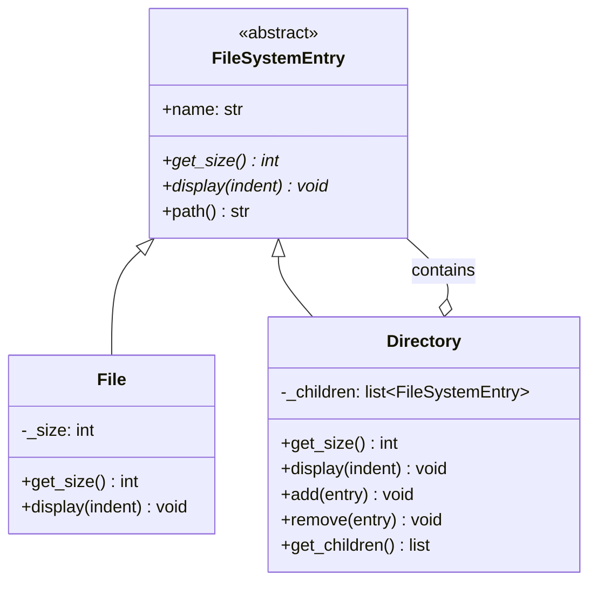

# Composite Pattern

> The Composite pattern composes objects into tree structures and lets clients treat individual objects and compositions uniformly -- the pattern behind every file system, DOM tree, and menu hierarchy.

## Table of Contents
- [Core Concepts](#core-concepts)
- [Code Examples](#code-examples)
- [Common Pitfalls](#common-pitfalls)
- [Key Takeaways](#key-takeaways)
- [Exercises](#exercises)

## Core Concepts

### Intent

#### What

Composite lets you build tree structures where every node -- whether it is a single item (leaf) or a group of items (composite) -- implements the same interface. The client does not need to know whether it is working with a single element or an entire subtree.

#### How

You define a **Component** interface with operations like `get_size()` or `render()`. **Leaf** nodes implement these operations directly (e.g., a file reports its own size). **Composite** nodes implement them by delegating to their children (e.g., a directory sums its children's sizes). Because both implement the same interface, the client can treat them interchangeably.

#### Why It Matters

Without Composite, client code is riddled with type checks: `if isinstance(node, File): ... elif isinstance(node, Directory): ...`. This violates the Open-Closed Principle -- adding a new node type requires modifying every client. With Composite, the client calls `node.get_size()` and the polymorphism handles the rest, whether `node` is a 5KB file or a directory containing 10,000 files.

### Participants

#### What

| Participant | Responsibility |
|---|---|
| **Component** | Declares the interface shared by leaves and composites. May include default implementations for child management methods. |
| **Leaf** | Represents terminal objects with no children. Implements Component operations directly. |
| **Composite** | Stores child Components and implements operations by delegating to children. Provides child management methods (`add`, `remove`). |

#### How

The Component interface declares the operations the client uses. Leaf implements those operations for individual items. Composite implements them by iterating over its children and aggregating results. Composite also exposes `add()` and `remove()` methods for building the tree structure.

#### Why It Matters

The power of Composite is *recursive composition*. A Composite can contain other Composites, which can contain Composites, to arbitrary depth. The client code remains the same whether the tree is 1 level deep or 100 levels deep. This is exactly how file systems, HTML DOMs, and organizational charts work.

### Structure



The self-referential relationship (`Directory o-- FileSystemEntry`) is what enables the recursive tree structure. A Directory contains FileSystemEntries, which can themselves be Directories.

### Recursive Composition

#### What

The defining feature of Composite is that a Composite can contain other Composites. This creates a recursive tree structure of arbitrary depth.

#### How

When you call `get_size()` on a Directory, it calls `get_size()` on each child. If a child is a File, it returns its own size. If a child is a Directory, it calls `get_size()` on *its* children, and so on. The recursion bottoms out at Leaf nodes.

```
root/                       get_size() = 1500
  src/                      get_size() = 1200
    main.py     (500)       get_size() = 500
    utils/                  get_size() = 700
      helpers.py (300)      get_size() = 300
      io.py      (400)      get_size() = 400
  README.md     (300)       get_size() = 300
```

#### Why It Matters

Recursive composition maps naturally to hierarchical real-world structures. You do not need special handling for "depth 1" vs "depth 5" -- the same algorithm works at every level. This is why `du -sh` (disk usage) can sum an entire filesystem with one recursive walk.

### When NOT to Use

#### What

Composite works best for tree-structured data. Forcing it onto non-hierarchical problems adds complexity without benefit.

#### How

Avoid Composite when:

- **Your data is flat** -- if there is no parent-child relationship (e.g., a list of users), Composite adds unnecessary abstraction. A simple list or dictionary is clearer.
- **Leaf and Composite have fundamentally different interfaces** -- Composite works because Leaf and Composite share the *same* operations. If a File has `read_content()` but a Directory does not, the uniform interface breaks down and you end up with `NotImplementedError` or type checks.
- **You need strict type safety for children** -- Composite allows any Component to be added to any Composite, which can be too permissive. If only certain types of nodes are valid children (e.g., a `Table` can only contain `Row`, not `Paragraph`), you need additional validation that Composite does not provide natively.
- **Performance is critical at scale** -- recursive tree traversal can be slow for very deep or wide trees. If you need constant-time operations, consider caching aggregated values (trading memory for speed).

#### Why It Matters

The most common misuse of Composite is applying it to data that is not hierarchical. If you catch yourself creating Composite nodes with only one child, or Leaf nodes that never appear inside Composites, the pattern is not the right fit.

### Real-World Anchoring

#### What

Composite is one of the most widely implemented patterns in software, often without being explicitly named.

#### How

- **DOM tree (HTML/XML)**: Every DOM element is a Component. A `<div>` is a Composite that contains other elements. A text node is a Leaf. Calling `element.textContent` recursively aggregates text from all descendants -- classic Composite behavior.
- **Python's `ast` module**: The Abstract Syntax Tree represents Python code as a tree. `ast.Module` is a Composite containing `ast.FunctionDef` nodes, which contain `ast.Assign` nodes, and so on. `ast.NodeVisitor` traverses the tree uniformly because every node implements the same interface.
- **Django template nodes**: Django's template engine parses templates into a tree of `Node` objects. `BlockNode` is a Composite (containing other nodes), `TextNode` is a Leaf. Rendering calls `render()` on the root, which recursively renders children.
- **File systems**: The Unix file system is the canonical Composite. Files are Leaves, directories are Composites. `ls -R`, `du`, `find`, and `chmod -R` all operate uniformly on both.
- **GUI widget trees**: In Tkinter, Qt, or any GUI framework, a `Frame` (Composite) contains `Button` and `Label` (Leaf) widgets. Layout calculations recursively traverse the widget tree.

#### Why It Matters

Once you see Composite in the DOM, ASTs, and file systems, you recognize it as one of the most fundamental structural patterns. It is the pattern for *any* tree.

## Code Examples

### File System Implementation

```python
"""
Composite Pattern: File System

A realistic implementation of a file system using Composite. Files are
Leaves, Directories are Composites. Both implement the same interface
(get_size, display, search), demonstrating uniform treatment.
"""

from __future__ import annotations

from abc import ABC, abstractmethod
from datetime import datetime


# --- Component: common interface for files and directories ---
class FileSystemEntry(ABC):
    """
    The Component interface. Both File (Leaf) and Directory (Composite)
    implement this, allowing clients to treat them uniformly.
    """

    def __init__(self, name: str) -> None:
        self._name = name
        self._created_at: datetime = datetime.now()
        self._parent: Directory | None = None

    @property
    def name(self) -> str:
        return self._name

    @property
    def path(self) -> str:
        """Build full path by walking up the tree."""
        if self._parent is None:
            return self._name
        return f"{self._parent.path}/{self._name}"

    @abstractmethod
    def get_size(self) -> int:
        """Return total size in bytes."""
        ...

    @abstractmethod
    def display(self, indent: int = 0) -> None:
        """Print a tree representation."""
        ...

    @abstractmethod
    def search(self, keyword: str) -> list[FileSystemEntry]:
        """Find entries whose name contains the keyword."""
        ...

    @abstractmethod
    def count_files(self) -> int:
        """Count total number of files (not directories)."""
        ...


# --- Leaf: File ---
class File(FileSystemEntry):
    """
    A Leaf node. Has no children. Operations return direct values.
    """

    def __init__(self, name: str, size: int, content: str = "") -> None:
        super().__init__(name)
        self._size = size
        self._content = content

    def get_size(self) -> int:
        return self._size

    def display(self, indent: int = 0) -> None:
        prefix = "  " * indent
        size_kb = self._size / 1024
        print(f"{prefix}{self._name} ({size_kb:.1f} KB)")

    def search(self, keyword: str) -> list[FileSystemEntry]:
        if keyword.lower() in self._name.lower():
            return [self]
        return []

    def count_files(self) -> int:
        return 1  # A file counts as 1 file


# --- Composite: Directory ---
class Directory(FileSystemEntry):
    """
    A Composite node. Contains children (Files and/or other Directories).
    Operations delegate to children and aggregate results.
    """

    def __init__(self, name: str) -> None:
        super().__init__(name)
        self._children: list[FileSystemEntry] = []

    def add(self, entry: FileSystemEntry) -> None:
        """Add a child entry (file or directory)."""
        entry._parent = self
        self._children.append(entry)

    def remove(self, entry: FileSystemEntry) -> None:
        """Remove a child entry."""
        entry._parent = None
        self._children.remove(entry)

    def get_children(self) -> list[FileSystemEntry]:
        """Return a copy of the children list."""
        return list(self._children)

    def get_size(self) -> int:
        """Recursively sum the size of all children."""
        return sum(child.get_size() for child in self._children)

    def display(self, indent: int = 0) -> None:
        """Recursively display the tree structure."""
        prefix = "  " * indent
        total_kb = self.get_size() / 1024
        print(f"{prefix}{self._name}/ ({total_kb:.1f} KB total)")
        for child in self._children:
            child.display(indent + 1)

    def search(self, keyword: str) -> list[FileSystemEntry]:
        """Recursively search for matching entries."""
        results: list[FileSystemEntry] = []
        # Check this directory's own name
        if keyword.lower() in self._name.lower():
            results.append(self)
        # Recursively search children
        for child in self._children:
            results.extend(child.search(keyword))
        return results

    def count_files(self) -> int:
        """Recursively count files (directories are not counted)."""
        return sum(child.count_files() for child in self._children)


# --- Client code ---
def calculate_statistics(entry: FileSystemEntry) -> None:
    """
    Client function that works uniformly with any FileSystemEntry.
    It does not know or care whether it received a File or a Directory.
    """
    print(f"Entry: {entry.path}")
    print(f"  Total size: {entry.get_size() / 1024:.1f} KB")
    print(f"  File count: {entry.count_files()}")
    print()


def main() -> None:
    # Build a tree structure
    root = Directory("project")

    # Source directory with nested subdirectories
    src = Directory("src")
    src.add(File("main.py", size=2048, content="# entry point"))
    src.add(File("config.py", size=1024, content="# settings"))

    utils = Directory("utils")
    utils.add(File("helpers.py", size=3072, content="# helper functions"))
    utils.add(File("io_utils.py", size=1536, content="# I/O utilities"))
    src.add(utils)

    # Tests directory
    tests = Directory("tests")
    tests.add(File("test_main.py", size=4096))
    tests.add(File("test_helpers.py", size=2560))

    # Root-level files
    root.add(src)
    root.add(tests)
    root.add(File("README.md", size=512))
    root.add(File(".gitignore", size=128))

    # Display the tree -- recursive traversal handles any depth
    print("=== File Tree ===")
    root.display()
    print()

    # Uniform treatment: same function works on File or Directory
    print("=== Statistics (whole project) ===")
    calculate_statistics(root)

    print("=== Statistics (just src/) ===")
    calculate_statistics(src)

    print("=== Statistics (single file) ===")
    calculate_statistics(File("standalone.txt", size=256))

    # Search -- works recursively through the tree
    print("=== Search for 'test' ===")
    results = root.search("test")
    for entry in results:
        print(f"  Found: {entry.path} ({entry.get_size()} bytes)")
    print()

    # Demonstrating uniform treatment:
    # We can pass ANY FileSystemEntry to search, and it works.
    print("=== Search within utils/ for 'help' ===")
    for entry in utils.search("help"):
        print(f"  Found: {entry.path}")


if __name__ == "__main__":
    main()
```

### Organization Chart with Salary Aggregation

```python
"""
Composite Pattern: Organization Chart

Demonstrates Composite for modeling organizational hierarchy.
Employees are Leaves, Departments are Composites. Operations like
total_salary() and headcount() aggregate recursively.
"""

from __future__ import annotations

from abc import ABC, abstractmethod
from dataclasses import dataclass


# --- Component ---
class OrgUnit(ABC):
    """Component interface for both individual employees and departments."""

    @property
    @abstractmethod
    def name(self) -> str:
        ...

    @abstractmethod
    def total_salary(self) -> float:
        ...

    @abstractmethod
    def headcount(self) -> int:
        ...

    @abstractmethod
    def display(self, indent: int = 0) -> None:
        ...


# --- Leaf ---
@dataclass
class Employee(OrgUnit):
    """A leaf node: an individual employee."""
    _name: str
    title: str
    salary: float

    @property
    def name(self) -> str:
        return self._name

    def total_salary(self) -> float:
        return self.salary

    def headcount(self) -> int:
        return 1

    def display(self, indent: int = 0) -> None:
        prefix = "  " * indent
        print(f"{prefix}- {self._name} ({self.title}) ${self.salary:,.0f}")


# --- Composite ---
class Department(OrgUnit):
    """A composite node: contains employees and/or sub-departments."""

    def __init__(self, name: str) -> None:
        self._name = name
        self._members: list[OrgUnit] = []

    @property
    def name(self) -> str:
        return self._name

    def add(self, unit: OrgUnit) -> None:
        self._members.append(unit)

    def remove(self, unit: OrgUnit) -> None:
        self._members.remove(unit)

    def total_salary(self) -> float:
        """Recursively sum salaries of all members."""
        return sum(member.total_salary() for member in self._members)

    def headcount(self) -> int:
        """Recursively count all employees."""
        return sum(member.headcount() for member in self._members)

    def display(self, indent: int = 0) -> None:
        prefix = "  " * indent
        print(
            f"{prefix}[{self._name}] "
            f"({self.headcount()} people, ${self.total_salary():,.0f})"
        )
        for member in self._members:
            member.display(indent + 1)


def main() -> None:
    # Build organization tree
    company = Department("Acme Corp")

    engineering = Department("Engineering")
    backend = Department("Backend Team")
    backend.add(Employee("Alice", "Senior Engineer", 150_000))
    backend.add(Employee("Bob", "Engineer", 120_000))
    frontend = Department("Frontend Team")
    frontend.add(Employee("Carol", "Lead Engineer", 160_000))
    frontend.add(Employee("Dave", "Engineer", 115_000))
    engineering.add(backend)
    engineering.add(frontend)

    marketing = Department("Marketing")
    marketing.add(Employee("Eve", "Marketing Director", 140_000))
    marketing.add(Employee("Frank", "Content Writer", 80_000))

    company.add(engineering)
    company.add(marketing)
    company.add(Employee("Grace", "CEO", 250_000))

    # Display and aggregate -- same interface at every level
    print("=== Organization Chart ===")
    company.display()
    print()

    # Uniform treatment: these calls work on any OrgUnit
    print(f"Company headcount: {company.headcount()}")
    print(f"Company total salary: ${company.total_salary():,.0f}")
    print(f"Engineering headcount: {engineering.headcount()}")
    print(f"Engineering salary: ${engineering.total_salary():,.0f}")
    print(f"Alice headcount: {Employee('Alice', 'Senior Engineer', 150_000).headcount()}")


if __name__ == "__main__":
    main()
```

## Common Pitfalls

### Pitfall 1: Putting child management in the Component interface

```python
# BAD — Leaf nodes have add/remove methods that make no sense
class BadComponent(ABC):
    @abstractmethod
    def add(self, child: BadComponent) -> None: ...

    @abstractmethod
    def remove(self, child: BadComponent) -> None: ...

class BadLeaf(BadComponent):
    def add(self, child: BadComponent) -> None:
        raise NotImplementedError("Leaf cannot have children")  # Forced to implement

    def remove(self, child: BadComponent) -> None:
        raise NotImplementedError("Leaf cannot have children")

# GOOD — Only Composite has child management methods
class GoodComponent(ABC):
    @abstractmethod
    def get_size(self) -> int: ...  # Only shared operations in Component

class GoodLeaf(GoodComponent):
    def get_size(self) -> int:
        return self._size  # No add/remove -- Leaf has only relevant methods

class GoodComposite(GoodComponent):
    def add(self, child: GoodComponent) -> None:
        self._children.append(child)  # Child management only where it makes sense
```

### Pitfall 2: Not handling the recursive base case

```python
# BAD — Infinite recursion if a directory is accidentally added to itself
class BadDirectory:
    def add(self, entry: FileSystemEntry) -> None:
        self._children.append(entry)  # No cycle check!

    def get_size(self) -> int:
        return sum(child.get_size() for child in self._children)  # Infinite loop

# GOOD — Check for cycles before adding
class GoodDirectory:
    def add(self, entry: FileSystemEntry) -> None:
        if entry is self:
            raise ValueError("Cannot add a directory to itself")
        # Walk up the parent chain to detect indirect cycles
        parent = self._parent
        while parent is not None:
            if parent is entry:
                raise ValueError("Cannot create circular reference")
            parent = parent._parent
        entry._parent = self
        self._children.append(entry)
```

### Pitfall 3: Exposing children from Leaf nodes

```python
# BAD — Leaf returns an empty list for get_children, pretending to be a Composite
class BadFile(FileSystemEntry):
    def get_children(self) -> list[FileSystemEntry]:
        return []  # Misleading: implies Files COULD have children

# GOOD — Leaf does not have get_children at all
class GoodFile(FileSystemEntry):
    # No get_children method -- the client checks isinstance(entry, Directory)
    # only when it specifically needs to traverse children.
    def get_size(self) -> int:
        return self._size
```

## Key Takeaways

- **Composite enables uniform treatment of individual and composite objects** -- the client calls `node.get_size()` without knowing or caring whether it is a file or a directory containing thousands of files.
- **Recursive composition creates tree structures of arbitrary depth** -- a Composite can contain other Composites, enabling hierarchies like file systems, DOMs, and org charts.
- **Keep child management out of the Component interface** -- `add()` and `remove()` belong on Composite only. Putting them on Component forces Leaf to implement meaningless methods.
- **Guard against cycles** -- since Composites can contain other Composites, adding a node to its own descendant creates infinite recursion. Validate before adding.
- **Composite maps to real-world hierarchies** -- file systems, DOM trees, ASTs, org charts, menu systems. If your data is naturally hierarchical with uniform operations, Composite is the pattern.

## Exercises

1. **Concept: Composite vs simple recursion** -- You could implement `get_size()` for a file system using a plain recursive function without the Composite pattern. Explain what advantage Composite provides over a standalone recursive function. When is the plain function sufficient?

2. **Coding: Menu system** -- Implement a menu system where `MenuItem` (Leaf) has a `label` and an `action` (a callable), and `SubMenu` (Composite) has a `label` and contains `MenuItem` or `SubMenu` children. Implement `display()` to show the full menu tree with proper indentation, and `find_item(label)` to search for a menu item by label recursively.

3. **Coding: Expression tree** -- Build a Composite for arithmetic expressions. `NumberNode` (Leaf) holds a numeric value. `OperationNode` (Composite) holds an operator (`+`, `-`, `*`, `/`) and two children. Implement `evaluate() -> float` that recursively computes the result, and `to_string() -> str` that produces infix notation with parentheses.

4. **Concept: Transparency vs safety** -- The GoF book discusses "transparency" (putting add/remove in Component so clients do not need type checks) vs "safety" (putting add/remove only in Composite so Leaf cannot be misused). Argue which approach is better for Python and why.

5. **Coding: Cached size** -- The file system example recomputes `get_size()` from scratch on every call, which is O(n) for the entire tree. Modify the implementation to cache the computed size in each Directory and invalidate the cache when a child is added or removed. Ensure the invalidation propagates up to all ancestor directories.

---
up:: [Schedule](../../Schedule.md)
#type/learning #source/self-study #status/seed
