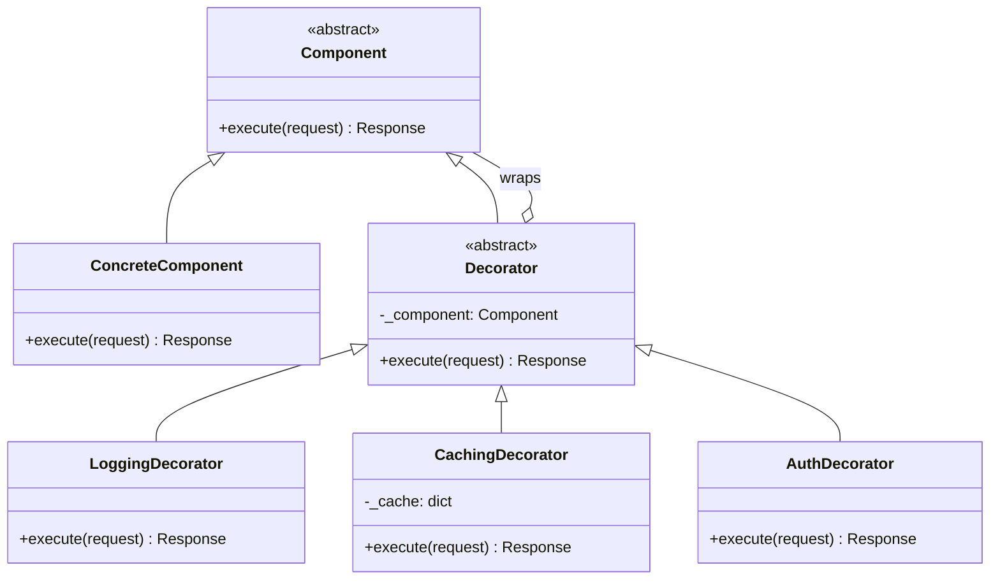

# Decorator Pattern

> Attach additional responsibilities to an object dynamically without modifying its source code, providing a flexible alternative to subclassing.

## Table of Contents
- [Core Concepts](#core-concepts)
- [Code Examples](#code-examples)
- [Common Pitfalls](#common-pitfalls)
- [Key Takeaways](#key-takeaways)
- [Exercises](#exercises)

## Core Concepts

### Intent

#### What
The Decorator pattern wraps an object inside another object that adds new behavior. The wrapper implements the same interface as the wrapped object, so clients can't tell the difference. You can stack multiple decorators to compose behaviors at runtime.

#### How
A decorator holds a reference to a component and delegates the core work to it, adding its own behavior before or after delegation. Because the decorator conforms to the same interface, you can nest decorators indefinitely: `LoggingDecorator(CachingDecorator(AuthDecorator(service)))`.

#### Why It Matters
Inheritance is static -- you pick a class at compile time and you're stuck with it. With decorators, you compose behaviors at runtime. Need logging on Tuesday but not Monday? Wrap it or don't. Need caching only for certain endpoints? Wrap only those. This is the Open/Closed Principle in action: you extend behavior without modifying existing code.

### Participants

#### What

- **Component** -- the abstract interface that both the core object and decorators implement. This is the contract that makes wrapping transparent to clients.
- **ConcreteComponent** -- the real object that does the actual work. It has no knowledge of decorators.
- **Decorator** -- an abstract class that holds a reference to a Component and delegates calls to it. This is the base for all concrete decorators.
- **ConcreteDecorator** -- adds specific behavior (logging, caching, auth, etc.) before or after delegating to the wrapped component.

#### How
The client programs to the Component interface. It never knows whether it's talking to a ConcreteComponent or a stack of decorators wrapping one. Each decorator calls `self._component.operation()` and layers its own logic around that call.

#### Why It Matters
This separation lets you add, remove, or reorder behaviors without touching the component or the client. Each decorator has a single responsibility, making the system easier to test and reason about.

### Structure



### Python's `@decorator` Syntax and the GoF Decorator

#### What
Python's `@decorator` syntax is a language-level feature for wrapping functions. It looks similar to the GoF Decorator pattern but operates at the function level rather than the object level.

#### How
When you write `@log` above a function, Python replaces that function with whatever `log(original_func)` returns. The GoF Decorator wraps *objects* that share an interface. Python's `@decorator` wraps *callables*. They share the same core idea -- transparently adding behavior via wrapping -- but they differ in scope and mechanics.

#### Why It Matters
Recognizing the connection helps you choose the right tool. For adding behavior to a single function, Python's `@decorator` is simpler and more idiomatic. For adding behavior to objects with multiple methods or complex state, the GoF Decorator pattern (class-based) is the right choice. Don't force one where the other fits better.

### When NOT to Use

- **The component has very few variants** -- if you only ever need one combination of behaviors, a simple subclass or a composed function is clearer than a decorator stack.
- **Order of decorators matters and is confusing** -- deeply nested decorators can be hard to debug. If order-sensitivity causes bugs, consider a pipeline pattern (like Chain of Responsibility) where ordering is explicit.
- **You need to access the concrete component's specific methods** -- decorators hide the concrete type behind the abstract interface. If clients need type-specific methods, decorators get in the way.
- **A simple function wrapper suffices** -- Python's `@decorator` syntax handles most function-level wrapping. Don't build a class hierarchy when `functools.wraps` does the job.

### Real-World Examples

- **`functools.wraps`** -- preserves the original function's metadata when writing Python decorators. Without it, `help(my_func)` shows the wrapper's docstring instead of the original's.
- **Django middleware** -- each middleware class wraps the next handler, adding behavior like CSRF protection, session management, or GZip compression.
- **Flask route decorators** -- `@app.route("/")` decorates a view function, registering it with the URL router while preserving the function itself.
- **Python I/O** -- `io.BufferedReader(io.FileIO("file.txt"))` wraps raw I/O with buffering, exactly matching the GoF Decorator structure.

## Code Examples

### Middleware Pipeline Wrapping a Service

```python
"""Decorator Pattern: middleware pipeline for an HTTP-like service.

Demonstrates logging, caching, and authentication decorators
stacked around a core data service.
"""

from abc import ABC, abstractmethod
from dataclasses import dataclass, field
from typing import Any
import hashlib
import time


@dataclass
class Request:
    """Simplified HTTP-like request."""
    path: str
    method: str = "GET"
    headers: dict[str, str] = field(default_factory=dict)
    body: str = ""


@dataclass
class Response:
    """Simplified HTTP-like response."""
    status: int
    body: str


# --- Component interface ---

class Service(ABC):
    """Abstract component: the interface all services and decorators share."""

    @abstractmethod
    def handle(self, request: Request) -> Response:
        """Process a request and return a response."""
        ...


# --- ConcreteComponent ---

class UserService(Service):
    """The real service that does actual work -- fetches user data."""

    def __init__(self) -> None:
        self._users: dict[str, dict[str, Any]] = {
            "/users/1": {"id": 1, "name": "Alice", "role": "admin"},
            "/users/2": {"id": 2, "name": "Bob", "role": "viewer"},
        }

    def handle(self, request: Request) -> Response:
        user = self._users.get(request.path)
        if user is None:
            return Response(status=404, body=f"User not found: {request.path}")
        return Response(status=200, body=f"User: {user}")


# --- Decorator base class ---

class ServiceDecorator(Service):
    """Base decorator: delegates to the wrapped component.

    Subclasses override handle() to add behavior before/after delegation.
    """

    def __init__(self, component: Service) -> None:
        self._component = component

    def handle(self, request: Request) -> Response:
        # Default: pure delegation. Subclasses add their own logic.
        return self._component.handle(request)


# --- ConcreteDecorators ---

class LoggingDecorator(ServiceDecorator):
    """Logs every request and response with timing information."""

    def handle(self, request: Request) -> Response:
        start = time.perf_counter()
        print(f"[LOG] --> {request.method} {request.path}")

        # Delegate to the next component in the chain
        response = self._component.handle(request)

        elapsed_ms = (time.perf_counter() - start) * 1000
        print(f"[LOG] <-- {response.status} ({elapsed_ms:.1f}ms)")
        return response


class CachingDecorator(ServiceDecorator):
    """Caches GET responses to avoid repeated computation."""

    def __init__(self, component: Service) -> None:
        super().__init__(component)
        self._cache: dict[str, Response] = {}

    def handle(self, request: Request) -> Response:
        # Only cache GET requests -- mutations should always go through
        if request.method != "GET":
            return self._component.handle(request)

        cache_key = self._make_key(request)
        if cache_key in self._cache:
            print(f"[CACHE] HIT for {request.path}")
            return self._cache[cache_key]

        print(f"[CACHE] MISS for {request.path}")
        response = self._component.handle(request)

        # Only cache successful responses
        if response.status == 200:
            self._cache[cache_key] = response
        return response

    @staticmethod
    def _make_key(request: Request) -> str:
        """Create a deterministic cache key from the request."""
        raw = f"{request.method}:{request.path}:{request.body}"
        return hashlib.sha256(raw.encode()).hexdigest()[:16]


class AuthDecorator(ServiceDecorator):
    """Rejects requests without a valid auth token."""

    def __init__(self, component: Service, valid_tokens: set[str]) -> None:
        super().__init__(component)
        self._valid_tokens = valid_tokens

    def handle(self, request: Request) -> Response:
        token = request.headers.get("Authorization", "")
        if token not in self._valid_tokens:
            # Short-circuit: don't even call the next component
            return Response(status=401, body="Unauthorized: invalid or missing token")
        return self._component.handle(request)


# --- Usage: composing decorators at runtime ---

def main() -> None:
    # Build the service with decorators stacked in order:
    # AuthDecorator -> CachingDecorator -> LoggingDecorator -> UserService
    # Request flows: auth check -> cache lookup -> logging -> actual service
    service: Service = UserService()
    service = LoggingDecorator(service)       # innermost: logs around the real call
    service = CachingDecorator(service)       # caches responses from logged service
    service = AuthDecorator(service, valid_tokens={"token-abc", "token-xyz"})

    # Authenticated request -- goes through the full pipeline
    req = Request(path="/users/1", headers={"Authorization": "token-abc"})
    resp = service.handle(req)
    print(f"Response: {resp.status} - {resp.body}\n")

    # Same request again -- cache hit, skips inner layers
    resp = service.handle(req)
    print(f"Response: {resp.status} - {resp.body}\n")

    # Unauthenticated request -- rejected at the outer layer
    bad_req = Request(path="/users/1")
    resp = service.handle(bad_req)
    print(f"Response: {resp.status} - {resp.body}\n")


if __name__ == "__main__":
    main()
```

### Function-Level Decorator (Python Idiomatic Style)

```python
"""Comparing GoF Decorator (class-based) with Python's @decorator (function-based).

Both achieve the same goal -- transparently adding behavior -- but at different levels.
"""

import functools
import time
from typing import Callable, ParamSpec, TypeVar

P = ParamSpec("P")
R = TypeVar("R")


def timed(func: Callable[P, R]) -> Callable[P, R]:
    """Function-level decorator: measures execution time.

    This is Python's idiomatic way to add cross-cutting behavior to functions.
    functools.wraps preserves the original function's name, docstring, and signature.
    """
    @functools.wraps(func)
    def wrapper(*args: P.args, **kwargs: P.kwargs) -> R:
        start = time.perf_counter()
        result = func(*args, **kwargs)
        elapsed = time.perf_counter() - start
        print(f"[TIMER] {func.__name__} took {elapsed:.4f}s")
        return result
    return wrapper


def retry(max_attempts: int = 3) -> Callable[[Callable[P, R]], Callable[P, R]]:
    """Parameterized decorator: retries a function on failure.

    This is a decorator factory -- it returns a decorator. The double nesting
    is needed because @retry(max_attempts=3) calls retry() first, then applies
    the returned decorator to the function.
    """
    def decorator(func: Callable[P, R]) -> Callable[P, R]:
        @functools.wraps(func)
        def wrapper(*args: P.args, **kwargs: P.kwargs) -> R:
            last_error: Exception | None = None
            for attempt in range(1, max_attempts + 1):
                try:
                    return func(*args, **kwargs)
                except Exception as e:
                    last_error = e
                    print(f"[RETRY] {func.__name__} attempt {attempt} failed: {e}")
            raise RuntimeError(
                f"{func.__name__} failed after {max_attempts} attempts"
            ) from last_error
        return wrapper
    return decorator


# Stack decorators -- @timed runs first (outermost), then @retry wraps the call
@timed
@retry(max_attempts=3)
def fetch_data(url: str) -> str:
    """Simulate fetching data that sometimes fails."""
    import random
    if random.random() < 0.5:
        raise ConnectionError(f"Failed to connect to {url}")
    return f"Data from {url}"


if __name__ == "__main__":
    try:
        result = fetch_data("https://api.example.com/data")
        print(f"Result: {result}")
    except RuntimeError as e:
        print(f"Final error: {e}")
```

## Common Pitfalls

### Forgetting to Delegate

```python
# BAD — decorator replaces behavior instead of extending it
class BadLoggingDecorator(ServiceDecorator):
    def handle(self, request: Request) -> Response:
        print(f"Logging: {request.path}")
        # Forgot to call self._component.handle(request)!
        # The actual service never runs.
        return Response(status=200, body="logged")

# GOOD — decorator adds behavior and delegates to the wrapped component
class GoodLoggingDecorator(ServiceDecorator):
    def handle(self, request: Request) -> Response:
        print(f"Logging: {request.path}")
        return self._component.handle(request)  # Delegate!
```

### Breaking the Interface Contract

```python
# BAD — decorator adds methods not in the Component interface
class BadCachingDecorator(ServiceDecorator):
    def handle(self, request: Request) -> Response:
        return self._component.handle(request)

    def clear_cache(self) -> None:
        """This method breaks transparency -- clients can't call it
        through the Service interface, so they must know the concrete type."""
        self._cache.clear()

# GOOD — expose cache control through the shared interface or a separate mechanism
class GoodCachingDecorator(ServiceDecorator):
    def __init__(self, component: Service) -> None:
        super().__init__(component)
        self._cache: dict[str, Response] = {}

    def handle(self, request: Request) -> Response:
        # Use a special header to signal cache invalidation
        if request.headers.get("Cache-Control") == "no-cache":
            self._cache.clear()
        return self._component.handle(request)
```

### Not Using `functools.wraps` on Function Decorators

```python
import functools
from typing import Callable

# BAD — wrapper loses the original function's identity
def bad_timer(func: Callable) -> Callable:
    def wrapper(*args, **kwargs):
        import time
        start = time.perf_counter()
        result = func(*args, **kwargs)
        print(f"Took {time.perf_counter() - start:.4f}s")
        return result
    return wrapper  # wrapper.__name__ is 'wrapper', not func's name

# GOOD — functools.wraps preserves name, docstring, and signature
def good_timer(func: Callable) -> Callable:
    @functools.wraps(func)
    def wrapper(*args, **kwargs):
        import time
        start = time.perf_counter()
        result = func(*args, **kwargs)
        print(f"Took {time.perf_counter() - start:.4f}s")
        return result
    return wrapper  # wrapper.__name__ == func.__name__
```

## Key Takeaways

- **Decorator adds behavior, not identity** -- the client sees the same interface regardless of how many decorators are stacked. This is the Open/Closed Principle: extend behavior without modifying existing code.
- **Composition over inheritance** -- instead of creating `LoggingCachingAuthService` via multiple inheritance, you compose `LoggingDecorator(CachingDecorator(AuthDecorator(service)))`. Each piece is independently testable and reusable.
- **Order matters** -- `Auth(Cache(Log(service)))` behaves differently from `Log(Cache(Auth(service)))`. Think carefully about which decorator should run first.
- **Python's `@decorator` is related but distinct** -- it wraps functions, not objects. For function-level concerns (timing, retrying, logging), use `@decorator`. For object-level concerns (adding capabilities to a service), use the GoF pattern.
- **Don't over-decorate** -- if you find yourself stacking 5+ decorators, consider whether a different pattern (like Chain of Responsibility or a pipeline) would be clearer.

## Exercises

1. **Implement a RateLimitingDecorator** -- create a decorator that limits a service to N requests per minute. If the limit is exceeded, return a 429 status response without calling the wrapped service. Test it with a loop of rapid requests.

2. **Decorator ordering analysis** -- given `AuthDecorator(CachingDecorator(service))` vs `CachingDecorator(AuthDecorator(service))`, explain which ordering is more secure and why. What happens when an unauthenticated user makes the same request as a cached authenticated request?

3. **Convert class-based to function-based** -- take the `LoggingDecorator` class from the code examples and rewrite the same behavior using Python's `@decorator` syntax with `functools.wraps`. What limitations do you hit? When does the class-based approach become necessary?

4. **Write a CompressionDecorator** -- create a decorator that compresses the response body (use `zlib.compress`) before returning it. The decorator should add a `Content-Encoding: gzip` header concept to the Response. How would you handle a client that doesn't support compression?

5. **Decorator vs Inheritance explosion** -- you have a `Notifier` service that can send via email, SMS, or Slack, with optional encryption and logging. Calculate how many subclasses you'd need with inheritance vs how many decorator classes. Implement the decorator version.

---
up:: [Schedule](../../Schedule.md)
#type/learning #source/self-study #status/seed
