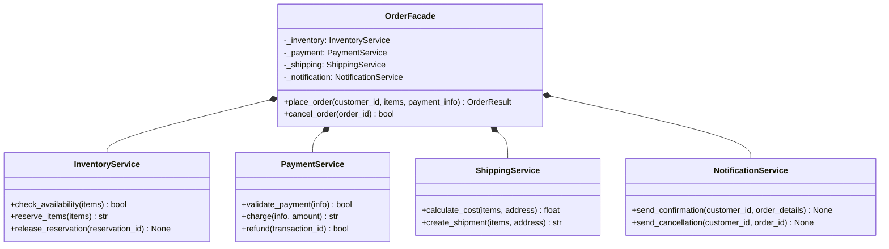

# Facade Pattern

> Provide a unified, simplified interface to a complex subsystem, shielding clients from the internal wiring and reducing coupling.

## Table of Contents
- [Core Concepts](#core-concepts)
- [Code Examples](#code-examples)
- [Common Pitfalls](#common-pitfalls)
- [Key Takeaways](#key-takeaways)
- [Exercises](#exercises)

## Core Concepts

### Intent

#### What
The Facade pattern provides a single, simplified interface that hides the complexity of one or more subsystems. Instead of forcing clients to interact with dozens of classes, you give them one entry point that orchestrates everything behind the scenes.

#### How
A Facade class knows which subsystem classes to delegate to. It doesn't add new functionality -- it simply coordinates existing subsystem objects into a streamlined workflow. Clients call a few high-level methods on the facade instead of wiring together subsystem objects themselves.

#### Why It Matters
Complex systems have complex internals. Without a facade, every client must understand the subsystem's class structure, initialization order, and interdependencies. A facade reduces this cognitive load to a single, well-documented API. This is why libraries like `requests` exist -- nobody wants to manually configure `urllib.request.Request`, set headers, handle redirects, parse responses, and manage cookies every time they make an HTTP call.

### Participants

#### What

- **Facade** -- the simplified interface. It delegates to subsystem classes but presents a clean, high-level API. It doesn't own the subsystem's logic; it orchestrates it.
- **Subsystem classes** -- the existing classes that do the real work. They have no knowledge of the facade. They can be used directly by clients who need fine-grained control.

#### How
The facade creates or receives subsystem instances and calls their methods in the correct order. The subsystem classes are independent -- they don't reference the facade. This means you can always bypass the facade when you need low-level access.

#### Why It Matters
The facade doesn't lock you in. Advanced users can still use subsystem classes directly. The facade just provides a "happy path" for the 80% case, reducing the API surface that most clients need to learn.

### Structure



### Facade vs Adapter

#### What
Facade and Adapter both wrap other code, but they solve fundamentally different problems.

#### How

| Aspect | Facade | Adapter |
|--------|--------|---------|
| **Goal** | Simplification | Translation |
| **Scope** | Wraps an entire subsystem (many classes) | Wraps a single class or interface |
| **Interface** | Defines a new, simpler interface | Conforms to an existing target interface |
| **Motivation** | Reduce complexity for clients | Make incompatible interfaces work together |

#### Why It Matters
If you're integrating a third-party library with a different interface, that's an Adapter. If you're wrapping your own complex subsystem to make it easier to use, that's a Facade. Misidentifying the problem leads to the wrong solution -- an Adapter where you need a Facade leaves the complexity exposed; a Facade where you need an Adapter doesn't solve the interface mismatch.

### When NOT to Use

- **The subsystem is already simple** -- wrapping three straightforward function calls in a facade class adds indirection without reducing complexity. If the subsystem's API is already clean, a facade is just an unnecessary layer.
- **Clients need full subsystem access** -- if every client uses different combinations of subsystem features, a facade either becomes bloated (exposing everything) or limiting (hiding needed functionality). Let clients use the subsystem directly.
- **You're hiding bad design** -- a facade over a poorly designed subsystem masks the problem. Refactor the subsystem's API instead of papering over it.
- **It becomes a god object** -- if your facade grows to have 30+ methods, it's no longer simplifying anything. Split it into multiple focused facades or rethink the subsystem boundaries.

### Real-World Examples

- **Django ORM** -- `Model.objects.filter(name="Alice").order_by("id")` is a facade over SQL query building, connection management, cursor handling, and result mapping. You never write `cursor.execute("SELECT ...")` unless you need to.
- **`requests` library** -- `requests.get(url)` is a facade over `urllib.request`, SSL context setup, cookie jars, redirect handling, and response parsing. The entire library exists because `urllib`'s API is too complex for common use cases.
- **`pathlib.Path`** -- facades over `os.path`, `os.stat`, `open()`, and `glob.glob`. Instead of combining four modules, you use one object: `Path("file.txt").read_text()`.

## Code Examples

### Order Processing Facade

```python
"""Facade Pattern: simplified order processing over complex subsystems.

The OrderFacade orchestrates inventory, payment, shipping, and notification
subsystems into two simple methods: place_order() and cancel_order().
"""

from dataclasses import dataclass, field
from enum import Enum


# --- Data models ---

class OrderStatus(Enum):
    CONFIRMED = "confirmed"
    CANCELLED = "cancelled"
    FAILED = "failed"


@dataclass
class OrderItem:
    sku: str
    name: str
    quantity: int
    price_cents: int  # Price in cents to avoid float precision issues


@dataclass
class PaymentInfo:
    card_number: str
    expiry: str
    cvv: str


@dataclass
class Address:
    street: str
    city: str
    zip_code: str
    country: str = "US"


@dataclass
class OrderResult:
    status: OrderStatus
    order_id: str | None = None
    tracking_number: str | None = None
    error: str | None = None


# --- Subsystem classes (complex, independent, no knowledge of facade) ---

class InventoryService:
    """Manages stock levels and reservations."""

    def __init__(self) -> None:
        # Simulate a stock database
        self._stock: dict[str, int] = {
            "SKU-001": 50,
            "SKU-002": 3,
            "SKU-003": 0,
        }
        self._reservations: dict[str, list[OrderItem]] = {}
        self._next_id = 1

    def check_availability(self, items: list[OrderItem]) -> bool:
        """Check if all items are in stock."""
        for item in items:
            available = self._stock.get(item.sku, 0)
            if available < item.quantity:
                print(f"  [Inventory] {item.sku}: need {item.quantity}, have {available}")
                return False
        return True

    def reserve_items(self, items: list[OrderItem]) -> str:
        """Reserve items, decrementing available stock."""
        reservation_id = f"RES-{self._next_id:04d}"
        self._next_id += 1
        for item in items:
            self._stock[item.sku] -= item.quantity
        self._reservations[reservation_id] = items
        print(f"  [Inventory] Reserved items: {reservation_id}")
        return reservation_id

    def release_reservation(self, reservation_id: str) -> None:
        """Release a reservation, restoring stock."""
        items = self._reservations.pop(reservation_id, [])
        for item in items:
            self._stock[item.sku] = self._stock.get(item.sku, 0) + item.quantity
        print(f"  [Inventory] Released reservation: {reservation_id}")


class PaymentService:
    """Handles payment validation and charging."""

    def __init__(self) -> None:
        self._transactions: dict[str, int] = {}
        self._next_id = 1

    def validate_payment(self, info: PaymentInfo) -> bool:
        """Validate payment information (card number, expiry, etc.)."""
        # Simplified validation -- real systems call payment processors
        is_valid = len(info.card_number) == 16 and len(info.cvv) == 3
        print(f"  [Payment] Validation: {'passed' if is_valid else 'failed'}")
        return is_valid

    def charge(self, info: PaymentInfo, amount_cents: int) -> str:
        """Charge the payment method and return a transaction ID."""
        txn_id = f"TXN-{self._next_id:04d}"
        self._next_id += 1
        self._transactions[txn_id] = amount_cents
        print(f"  [Payment] Charged ${amount_cents / 100:.2f} -> {txn_id}")
        return txn_id

    def refund(self, transaction_id: str) -> bool:
        """Refund a previous transaction."""
        if transaction_id in self._transactions:
            amount = self._transactions.pop(transaction_id)
            print(f"  [Payment] Refunded ${amount / 100:.2f} for {transaction_id}")
            return True
        return False


class ShippingService:
    """Calculates shipping costs and creates shipments."""

    def calculate_cost(self, items: list[OrderItem], address: Address) -> int:
        """Calculate shipping cost in cents based on items and destination."""
        # Simplified: flat rate per item + international surcharge
        base = sum(500 * item.quantity for item in items)
        surcharge = 1500 if address.country != "US" else 0
        total = base + surcharge
        print(f"  [Shipping] Cost: ${total / 100:.2f}")
        return total

    def create_shipment(self, items: list[OrderItem], address: Address) -> str:
        """Create a shipment and return a tracking number."""
        tracking = f"TRACK-{abs(hash(address.street)) % 10000:04d}"
        print(f"  [Shipping] Created shipment: {tracking}")
        return tracking


class NotificationService:
    """Sends order notifications to customers."""

    def send_confirmation(self, customer_id: str, order_id: str, tracking: str) -> None:
        print(f"  [Notify] Sent confirmation to {customer_id}: "
              f"order={order_id}, tracking={tracking}")

    def send_cancellation(self, customer_id: str, order_id: str) -> None:
        print(f"  [Notify] Sent cancellation to {customer_id}: order={order_id}")


# --- Facade: the simplified interface ---

class OrderFacade:
    """Simplified interface for order processing.

    Orchestrates inventory, payment, shipping, and notification subsystems
    into two clean methods. Handles the complex ordering of operations
    and rollback on failure.
    """

    def __init__(
        self,
        inventory: InventoryService,
        payment: PaymentService,
        shipping: ShippingService,
        notification: NotificationService,
    ) -> None:
        self._inventory = inventory
        self._payment = payment
        self._shipping = shipping
        self._notification = notification
        self._next_order_id = 1
        # Track order details for cancellation
        self._orders: dict[str, dict] = {}

    def place_order(
        self,
        customer_id: str,
        items: list[OrderItem],
        payment_info: PaymentInfo,
        shipping_address: Address,
    ) -> OrderResult:
        """Place an order: check stock, charge payment, ship, notify.

        This single method replaces what would be 15+ lines of subsystem
        calls that every client would have to write and get right.
        """
        print(f"\n--- Placing order for {customer_id} ---")

        # Step 1: Check inventory
        if not self._inventory.check_availability(items):
            return OrderResult(status=OrderStatus.FAILED, error="Items out of stock")

        # Step 2: Reserve items (rollback point 1)
        reservation_id = self._inventory.reserve_items(items)

        # Step 3: Validate and charge payment
        if not self._payment.validate_payment(payment_info):
            self._inventory.release_reservation(reservation_id)
            return OrderResult(status=OrderStatus.FAILED, error="Invalid payment info")

        item_total = sum(item.price_cents * item.quantity for item in items)
        shipping_cost = self._shipping.calculate_cost(items, shipping_address)
        total = item_total + shipping_cost

        txn_id = self._payment.charge(payment_info, total)

        # Step 4: Create shipment
        tracking = self._shipping.create_shipment(items, shipping_address)

        # Step 5: Record order and notify
        order_id = f"ORD-{self._next_order_id:04d}"
        self._next_order_id += 1
        self._orders[order_id] = {
            "reservation_id": reservation_id,
            "transaction_id": txn_id,
            "customer_id": customer_id,
        }

        self._notification.send_confirmation(customer_id, order_id, tracking)

        return OrderResult(
            status=OrderStatus.CONFIRMED,
            order_id=order_id,
            tracking_number=tracking,
        )

    def cancel_order(self, order_id: str) -> OrderResult:
        """Cancel an order: refund payment, release inventory, notify."""
        print(f"\n--- Cancelling order {order_id} ---")

        order = self._orders.get(order_id)
        if order is None:
            return OrderResult(status=OrderStatus.FAILED, error="Order not found")

        self._payment.refund(order["transaction_id"])
        self._inventory.release_reservation(order["reservation_id"])
        self._notification.send_cancellation(order["customer_id"], order_id)

        del self._orders[order_id]
        return OrderResult(status=OrderStatus.CANCELLED, order_id=order_id)


# --- Client code: clean and simple thanks to the facade ---

def main() -> None:
    # Wire up subsystems (typically done by a DI container in production)
    facade = OrderFacade(
        inventory=InventoryService(),
        payment=PaymentService(),
        shipping=ShippingService(),
        notification=NotificationService(),
    )

    # Client only interacts with two simple methods
    items = [
        OrderItem(sku="SKU-001", name="Keyboard", quantity=1, price_cents=7999),
        OrderItem(sku="SKU-002", name="Mouse", quantity=2, price_cents=2999),
    ]
    payment = PaymentInfo(card_number="4111111111111111", expiry="12/27", cvv="123")
    address = Address(street="123 Main St", city="Springfield", zip_code="62704")

    # Place order -- one method call instead of 15+ lines of subsystem wiring
    result = facade.place_order("CUST-42", items, payment, address)
    print(f"\nResult: {result}")

    # Cancel order -- one method call handles refund, inventory, notification
    if result.order_id:
        cancel_result = facade.cancel_order(result.order_id)
        print(f"\nCancel result: {cancel_result}")


if __name__ == "__main__":
    main()
```

## Common Pitfalls

### Facade Becomes a God Object

```python
# BAD — facade grows to handle everything, becoming the thing it was meant to simplify
class BadOrderFacade:
    def place_order(self, ...) -> OrderResult: ...
    def cancel_order(self, ...) -> OrderResult: ...
    def update_inventory(self, sku: str, qty: int) -> None: ...
    def generate_report(self, month: int) -> str: ...
    def send_marketing_email(self, customer_id: str) -> None: ...
    def update_shipping_rates(self, rates: dict) -> None: ...
    # 30 more methods -- this is no longer a "simplified interface"

# GOOD — keep facades focused; create separate facades for separate concerns
class OrderFacade:
    """Handles order lifecycle only."""
    def place_order(self, ...) -> OrderResult: ...
    def cancel_order(self, ...) -> OrderResult: ...

class ReportingFacade:
    """Handles report generation only."""
    def generate_sales_report(self, month: int) -> str: ...

class MarketingFacade:
    """Handles marketing workflows only."""
    def send_campaign(self, customer_ids: list[str]) -> None: ...
```

### Hiding the Subsystem Entirely

```python
# BAD — making subsystem classes private/inaccessible
class BadFacade:
    def __init__(self) -> None:
        # Creating subsystem objects internally means nobody can
        # access them directly or configure them
        self.__inventory = InventoryService()
        self.__payment = PaymentService()

    # No way for advanced users to access subsystem classes directly

# GOOD — accept subsystem objects via constructor (dependency injection)
# and allow direct access when needed
class GoodFacade:
    def __init__(
        self,
        inventory: InventoryService,
        payment: PaymentService,
    ) -> None:
        # Public attributes: advanced users can access subsystems directly
        self.inventory = inventory
        self.payment = payment

    def place_order(self, ...) -> OrderResult:
        """Simplified path for the common case."""
        ...
    # Advanced users can still call self.inventory.check_availability() directly
```

### Facade That Just Delegates Without Simplifying

```python
# BAD — facade methods are thin wrappers that add no value
class UselessFacade:
    def __init__(self, inventory: InventoryService) -> None:
        self._inventory = inventory

    def check_availability(self, items: list[OrderItem]) -> bool:
        return self._inventory.check_availability(items)

    def reserve_items(self, items: list[OrderItem]) -> str:
        return self._inventory.reserve_items(items)

    # This just mirrors the subsystem's API -- why not use InventoryService directly?

# GOOD — facade combines multiple subsystem calls into meaningful operations
class GoodFacade:
    def __init__(self, inventory: InventoryService, payment: PaymentService) -> None:
        self._inventory = inventory
        self._payment = payment

    def place_order(self, items: list[OrderItem], payment: PaymentInfo) -> OrderResult:
        """Combines 5 subsystem calls into one, handling the correct order
        of operations and rollback on failure."""
        if not self._inventory.check_availability(items):
            return OrderResult(status=OrderStatus.FAILED, error="Out of stock")
        reservation_id = self._inventory.reserve_items(items)
        if not self._payment.validate_payment(payment):
            self._inventory.release_reservation(reservation_id)
            return OrderResult(status=OrderStatus.FAILED, error="Payment invalid")
        # ... real simplification with orchestration logic
```

## Key Takeaways

- **Facade simplifies, it doesn't add new behavior** -- it orchestrates existing subsystem calls into a convenient API. If you're adding business logic, you're building a service, not a facade.
- **Facade doesn't hide the subsystem** -- advanced users should still be able to access subsystem classes directly. The facade provides a shortcut, not a wall.
- **Use Facade when the complexity is in the wiring, not the logic** -- when clients need to call five subsystem methods in a specific order with error handling, a facade encapsulates that sequence.
- **Facade vs Adapter** -- Facade simplifies a complex interface you control. Adapter translates an interface you don't control. Different problems, different patterns.
- **Keep facades focused** -- one facade per logical concern. If it grows past 5-7 methods, it's probably covering too much.

## Exercises

1. **Build a deployment facade** -- create a `DeploymentFacade` that orchestrates `GitService` (pull latest), `BuildService` (compile/test), `DockerService` (build image), and `KubernetesService` (deploy). The facade's `deploy(branch: str)` method should handle the full pipeline with rollback on failure.

2. **Facade for a notification subsystem** -- design a `NotificationFacade` that simplifies sending notifications across email (SMTP setup, template rendering, attachment handling), SMS (carrier selection, rate limiting), and push notifications (device token lookup, payload formatting). The facade should expose `notify(user_id, message, channel)`.

3. **Identify the facade** -- look at Python's `pathlib.Path` class. List at least 5 different standard library modules it facades over. For each, show the "without facade" code vs the `pathlib` equivalent.

4. **When NOT to facade** -- given a subsystem with a single class that has 3 methods, argue why adding a facade would be harmful. Then describe a scenario where even a simple subsystem benefits from a facade.

5. **Facade with multiple access levels** -- design a `DatabaseFacade` that provides `query(sql)` for simple cases but also exposes the underlying connection pool and transaction manager for advanced users who need fine-grained control. How do you balance simplicity with power?

---
up:: [Schedule](../../Schedule.md)
#type/learning #source/self-study #status/seed
