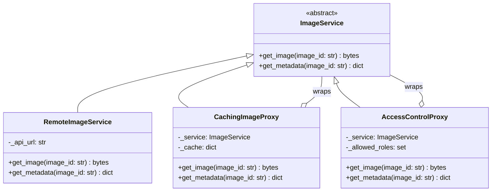

# Proxy Pattern

> Provide a surrogate or placeholder for another object to control access to it -- enabling lazy loading, access control, caching, or logging without modifying the real object.

## Table of Contents
- [Core Concepts](#core-concepts)
- [Code Examples](#code-examples)
- [Common Pitfalls](#common-pitfalls)
- [Key Takeaways](#key-takeaways)
- [Exercises](#exercises)

## Core Concepts

### Intent

#### What
The Proxy pattern places a stand-in object between the client and the real object. The proxy implements the same interface as the real object, so the client doesn't know (or care) whether it's talking to the real thing or a proxy. The proxy controls *access* to the real object -- deciding when to create it, who can use it, whether to cache results, or whether to log usage.

#### How
The proxy holds a reference to the real object (or creates it on demand) and forwards calls to it. Before or after forwarding, the proxy applies its control logic: checking permissions, returning cached results, deferring expensive initialization, or recording access.

#### Why It Matters
You can't always modify the real object. It might be in a third-party library, or modifying it would violate the Single Responsibility Principle. A proxy lets you add control logic transparently -- clients keep using the same interface, and the real object stays focused on its core job.

### Types of Proxy

#### Virtual Proxy (Lazy Loading)

Delays the creation of an expensive object until it's actually needed. If a 50MB image might never be displayed, don't load it at construction time -- let the proxy load it on first access.

#### Protection Proxy (Access Control)

Controls who can access the real object. Checks permissions before forwarding the request. If the caller doesn't have the right role, the proxy rejects the call without ever touching the real object.

#### Caching Proxy

Stores results from the real object and returns cached values for repeated requests. Useful when the real object is slow (database queries, API calls, heavy computation).

#### Remote Proxy

Represents an object in a different address space (different machine, different process). The proxy handles serialization, network communication, and deserialization, making the remote object look local.

### Participants

#### What

- **Subject** -- the shared interface that both the RealSubject and Proxy implement. This is what clients program against.
- **RealSubject** -- the actual object that does the real work. It has no knowledge of proxies.
- **Proxy** -- the stand-in that controls access to the RealSubject. It holds a reference (or lazily creates) the RealSubject and delegates calls to it after applying its control logic.

#### How
The client creates or receives a Proxy through the Subject interface. When the client calls a method, the proxy decides whether to forward the call to the RealSubject, return a cached result, deny access, or defer creation.

#### Why It Matters
Because the proxy and the real object share the same interface, you can swap them transparently. This is the Liskov Substitution Principle at work -- anywhere you use a Subject, you can use either the real thing or a proxy.

### Structure



### Proxy vs Decorator

#### What
Proxy and Decorator have nearly identical structures -- both wrap an object that shares the same interface. The difference is in *intent*.

#### How

| Aspect | Proxy | Decorator |
|--------|-------|-----------|
| **Intent** | Control access to an object | Add behavior to an object |
| **Who creates the real object** | Often the proxy itself (lazy creation) | Always the client (passed in) |
| **Typical use** | Lazy loading, access control, caching | Logging, encryption, compression |
| **Lifecycle control** | Proxy may manage the real object's lifecycle | Decorator doesn't own the wrapped object |
| **Stacking** | Rarely stacked | Commonly stacked (multiple decorators) |

#### Why It Matters
If you're adding *new behavior* (logging, timing, encryption), use Decorator. If you're controlling *access* (permissions, lazy loading, caching), use Proxy. The structural similarity is intentional -- both leverage wrapping -- but knowing the semantic difference helps you name and design them correctly.

### When NOT to Use

- **The real object is cheap to create** -- if initialization is fast and memory is cheap, a virtual proxy adds complexity without benefit. Just create the object directly.
- **You only need function-level caching** -- Python's `@functools.lru_cache` is simpler than a full caching proxy class. Use the built-in when it fits.
- **Access control belongs at a different layer** -- if authentication/authorization is handled by your web framework's middleware, adding a protection proxy at the service level is redundant.
- **The indirection makes debugging harder** -- every proxy layer is another frame in the stack trace. If you're spending more time debugging through proxies than you're saving, simplify.

### Real-World Examples

- **Python's `__getattr__`** -- implementing `__getattr__` on a class makes it a proxy-like interceptor. Every attribute access that isn't found on the object gets routed to `__getattr__`, which can delegate to a wrapped object.
- **Django lazy querysets** -- `User.objects.filter(active=True)` returns a lazy proxy. The actual SQL query doesn't execute until you iterate the queryset, access `.count()`, or slice it. This is a virtual proxy.
- **`unittest.mock.MagicMock`** -- a proxy that records all method calls and attribute accesses for later assertion. It implements the Subject interface dynamically.
- **SQLAlchemy lazy loading** -- relationship attributes on ORM models are proxies that load related objects from the database only when accessed.

### Differentiating Structural Patterns

All six structural patterns deal with composing classes and objects, but each solves a different problem:

| Pattern | Problem It Solves | Key Participants | When to Use |
|---------|-------------------|------------------|-------------|
| **Adapter** | Incompatible interfaces | Target, Adapter, Adaptee | Integrating third-party code with a different interface |
| **Bridge** | Tight coupling between abstraction and implementation | Abstraction, Implementor | When abstraction and implementation need to vary independently |
| **Composite** | Treating individual objects and groups uniformly | Component, Leaf, Composite | Tree structures (file systems, menus, UI components) |
| **Decorator** | Adding behavior without modifying existing code | Component, Decorator | Stacking optional behaviors (logging, caching, auth) |
| **Facade** | Complex subsystem with too many classes | Facade, Subsystem classes | Providing a simplified API over a complex subsystem |
| **Proxy** | Controlling access to an object | Subject, Proxy, RealSubject | Lazy loading, access control, caching, remote access |

The key differentiator: **Adapter translates**, **Bridge separates**, **Composite groups**, **Decorator adds**, **Facade simplifies**, **Proxy controls**.

## Code Examples

### Lazy-Loading Image Proxy with Caching

```python
"""Proxy Pattern: lazy-loading image service with caching and access control.

Demonstrates virtual proxy (lazy loading), caching proxy, and protection proxy
layered over a remote image service.
"""

from abc import ABC, abstractmethod
from dataclasses import dataclass, field
from typing import Any
import time


# --- Data models ---

@dataclass
class ImageMetadata:
    image_id: str
    width: int
    height: int
    format: str
    size_bytes: int


@dataclass
class User:
    username: str
    role: str  # "admin", "editor", "viewer"


# --- Subject interface ---

class ImageService(ABC):
    """Abstract interface for image operations.

    Both the real service and all proxies implement this interface,
    making them interchangeable from the client's perspective.
    """

    @abstractmethod
    def get_image(self, image_id: str) -> bytes:
        """Fetch the raw image data."""
        ...

    @abstractmethod
    def get_metadata(self, image_id: str) -> ImageMetadata:
        """Fetch image metadata without loading the full image."""
        ...

    @abstractmethod
    def delete_image(self, image_id: str) -> bool:
        """Delete an image. Returns True if successful."""
        ...


# --- RealSubject ---

class RemoteImageService(ImageService):
    """The real image service -- simulates expensive remote API calls.

    In production, this would make HTTP requests to a cloud storage service
    like S3, Google Cloud Storage, or a CDN.
    """

    def __init__(self, api_url: str) -> None:
        self._api_url = api_url
        # Simulate a remote image store
        self._store: dict[str, dict[str, Any]] = {
            "img-001": {
                "data": b"\x89PNG\r\n" + b"\x00" * 1024,  # Fake 1KB image
                "metadata": ImageMetadata("img-001", 1920, 1080, "png", 1030),
            },
            "img-002": {
                "data": b"\xff\xd8\xff\xe0" + b"\x00" * 2048,  # Fake 2KB JPEG
                "metadata": ImageMetadata("img-002", 3840, 2160, "jpeg", 2052),
            },
        }

    def get_image(self, image_id: str) -> bytes:
        # Simulate network latency for a large image download
        print(f"    [Remote] Downloading {image_id} from {self._api_url}...")
        time.sleep(0.1)  # Simulate 100ms network call
        entry = self._store.get(image_id)
        if entry is None:
            raise FileNotFoundError(f"Image not found: {image_id}")
        return entry["data"]

    def get_metadata(self, image_id: str) -> ImageMetadata:
        print(f"    [Remote] Fetching metadata for {image_id}...")
        time.sleep(0.05)  # Metadata is faster than full image
        entry = self._store.get(image_id)
        if entry is None:
            raise FileNotFoundError(f"Image not found: {image_id}")
        return entry["metadata"]

    def delete_image(self, image_id: str) -> bool:
        print(f"    [Remote] Deleting {image_id}...")
        if image_id in self._store:
            del self._store[image_id]
            return True
        return False


# --- Caching Proxy ---

class CachingImageProxy(ImageService):
    """Caching proxy: stores previously fetched images and metadata in memory.

    Eliminates redundant remote calls for images that have already been loaded.
    This is the most common type of proxy in real applications.
    """

    def __init__(self, service: ImageService) -> None:
        self._service = service
        self._image_cache: dict[str, bytes] = {}
        self._metadata_cache: dict[str, ImageMetadata] = {}

    def get_image(self, image_id: str) -> bytes:
        if image_id not in self._image_cache:
            print(f"  [Cache] MISS for image {image_id}")
            self._image_cache[image_id] = self._service.get_image(image_id)
        else:
            print(f"  [Cache] HIT for image {image_id}")
        return self._image_cache[image_id]

    def get_metadata(self, image_id: str) -> ImageMetadata:
        if image_id not in self._metadata_cache:
            print(f"  [Cache] MISS for metadata {image_id}")
            self._metadata_cache[image_id] = self._service.get_metadata(image_id)
        else:
            print(f"  [Cache] HIT for metadata {image_id}")
        return self._metadata_cache[image_id]

    def delete_image(self, image_id: str) -> bool:
        # Invalidate cache on delete -- stale cache is worse than no cache
        self._image_cache.pop(image_id, None)
        self._metadata_cache.pop(image_id, None)
        return self._service.delete_image(image_id)


# --- Protection Proxy ---

class AccessControlProxy(ImageService):
    """Protection proxy: checks user permissions before forwarding requests.

    Read operations require 'viewer' role or above.
    Delete operations require 'admin' role.
    """

    # Role hierarchy: admin > editor > viewer
    _ROLE_LEVELS: dict[str, int] = {"viewer": 1, "editor": 2, "admin": 3}

    def __init__(self, service: ImageService, current_user: User) -> None:
        self._service = service
        self._current_user = current_user

    def _check_permission(self, required_role: str) -> None:
        """Raise PermissionError if current user lacks the required role."""
        user_level = self._ROLE_LEVELS.get(self._current_user.role, 0)
        required_level = self._ROLE_LEVELS.get(required_role, 0)
        if user_level < required_level:
            raise PermissionError(
                f"User '{self._current_user.username}' with role "
                f"'{self._current_user.role}' cannot perform action "
                f"requiring '{required_role}' role"
            )

    def get_image(self, image_id: str) -> bytes:
        self._check_permission("viewer")
        return self._service.get_image(image_id)

    def get_metadata(self, image_id: str) -> ImageMetadata:
        self._check_permission("viewer")
        return self._service.get_metadata(image_id)

    def delete_image(self, image_id: str) -> bool:
        self._check_permission("admin")
        return self._service.delete_image(image_id)


# --- Client code ---

def main() -> None:
    # Build the proxy chain:
    # Client -> AccessControl -> Caching -> RemoteService
    remote_service = RemoteImageService(api_url="https://images.example.com")
    cached_service = CachingImageProxy(remote_service)

    admin_user = User(username="alice", role="admin")
    viewer_user = User(username="bob", role="viewer")

    # Admin access -- full permissions
    admin_service: ImageService = AccessControlProxy(cached_service, admin_user)

    print("=== Admin fetches image (first time -- cache miss) ===")
    img_data = admin_service.get_image("img-001")
    print(f"Got {len(img_data)} bytes\n")

    print("=== Admin fetches same image (cache hit -- no remote call) ===")
    img_data = admin_service.get_image("img-001")
    print(f"Got {len(img_data)} bytes\n")

    print("=== Admin fetches metadata ===")
    meta = admin_service.get_metadata("img-001")
    print(f"Metadata: {meta}\n")

    # Viewer access -- can read but not delete
    viewer_service: ImageService = AccessControlProxy(cached_service, viewer_user)

    print("=== Viewer fetches image (cache hit from admin's earlier request) ===")
    img_data = viewer_service.get_image("img-001")
    print(f"Got {len(img_data)} bytes\n")

    print("=== Viewer tries to delete (should fail) ===")
    try:
        viewer_service.delete_image("img-001")
    except PermissionError as e:
        print(f"Access denied: {e}\n")

    print("=== Admin deletes image (should succeed and invalidate cache) ===")
    admin_service.delete_image("img-001")
    print()


if __name__ == "__main__":
    main()
```

### Python's `__getattr__` as a Generic Proxy

```python
"""Using Python's __getattr__ to build a lightweight logging proxy.

This technique works for any object -- no need to know the interface upfront.
It's the Pythonic way to build proxies when you don't need strict type safety.
"""

from typing import Any
import time


class LoggingProxy:
    """Generic proxy that logs all attribute accesses and method calls.

    Uses __getattr__ to intercept attribute lookups. When the attribute
    is callable (a method), wraps it to log the call with timing.
    """

    def __init__(self, target: Any, label: str = "") -> None:
        # Use object.__setattr__ to avoid triggering __getattr__
        object.__setattr__(self, "_target", target)
        object.__setattr__(self, "_label", label or type(target).__name__)

    def __getattr__(self, name: str) -> Any:
        """Intercepts attribute access and delegates to the target.

        If the attribute is callable, returns a wrapper that logs the call.
        If it's a data attribute, logs the access and returns the value.
        """
        attr = getattr(self._target, name)

        if callable(attr):
            def method_wrapper(*args: Any, **kwargs: Any) -> Any:
                start = time.perf_counter()
                result = attr(*args, **kwargs)
                elapsed = (time.perf_counter() - start) * 1000
                print(f"[{self._label}] {name}() -> {elapsed:.1f}ms")
                return result
            return method_wrapper

        print(f"[{self._label}] accessed .{name} = {attr!r}")
        return attr


# Example usage with a plain class -- no interface needed
class DataProcessor:
    """A regular class with no knowledge of proxies."""

    def __init__(self, name: str) -> None:
        self.name = name
        self.processed_count = 0

    def process(self, data: list[int]) -> list[int]:
        """Process data by doubling each element."""
        time.sleep(0.01)  # Simulate work
        self.processed_count += 1
        return [x * 2 for x in data]

    def summary(self) -> str:
        return f"{self.name}: processed {self.processed_count} batches"


if __name__ == "__main__":
    real = DataProcessor("BatchProcessor")
    proxied = LoggingProxy(real, "DataProxy")

    # Client uses the proxy exactly like the real object
    result = proxied.process([1, 2, 3])
    print(f"Result: {result}")

    # Attribute access is also logged
    _ = proxied.name

    print(proxied.summary())
```

## Common Pitfalls

### Proxy That Doesn't Match the Real Object's Interface

```python
from abc import ABC, abstractmethod

class Service(ABC):
    @abstractmethod
    def fetch(self, query: str) -> list[str]: ...

class RealService(Service):
    def fetch(self, query: str) -> list[str]:
        return [f"result for {query}"]

# BAD — proxy adds methods not in the interface, breaking substitutability
class BadProxy(Service):
    def __init__(self, service: RealService) -> None:
        self._service = service

    def fetch(self, query: str) -> list[str]:
        return self._service.fetch(query)

    def clear_cache(self) -> None:
        """This method isn't on Service -- clients can't call it
        through the abstract interface."""
        pass

# GOOD — proxy strictly implements the same interface
class GoodProxy(Service):
    def __init__(self, service: Service) -> None:
        self._service = service
        self._cache: dict[str, list[str]] = {}

    def fetch(self, query: str) -> list[str]:
        if query not in self._cache:
            self._cache[query] = self._service.fetch(query)
        return self._cache[query]
```

### Forgetting to Invalidate Cache on Mutations

```python
# BAD — cache returns stale data after the underlying data changes
class BadCachingProxy(ImageService):
    def delete_image(self, image_id: str) -> bool:
        # Deletes from remote but cache still has the old data!
        return self._service.delete_image(image_id)

    def get_image(self, image_id: str) -> bytes:
        if image_id in self._cache:
            return self._cache[image_id]  # Returns deleted image!
        return self._service.get_image(image_id)

# GOOD — invalidate cache entries when mutations occur
class GoodCachingProxy(ImageService):
    def delete_image(self, image_id: str) -> bool:
        # Invalidate BEFORE delegating, so even if delete fails,
        # we don't serve potentially stale data
        self._cache.pop(image_id, None)
        return self._service.delete_image(image_id)
```

### Using Proxy When `functools.lru_cache` Suffices

```python
import functools

# BAD — building a full proxy class for simple function caching
class ExpensiveComputationProxy:
    def __init__(self) -> None:
        self._cache: dict[int, int] = {}

    def compute(self, n: int) -> int:
        if n not in self._cache:
            self._cache[n] = self._expensive_work(n)
        return self._cache[n]

    def _expensive_work(self, n: int) -> int:
        return sum(i * i for i in range(n))

# GOOD — use Python's built-in caching for simple function-level caching
@functools.lru_cache(maxsize=128)
def compute(n: int) -> int:
    """lru_cache handles caching, eviction, and thread safety for free."""
    return sum(i * i for i in range(n))
```

## Key Takeaways

- **Proxy controls access, Decorator adds behavior** -- they look structurally identical but serve different purposes. If you're checking permissions or deferring creation, it's a proxy. If you're adding logging or encryption, it's a decorator.
- **Four types, one structure** -- virtual (lazy loading), protection (access control), caching (result storage), and remote (network transparency) proxies all implement the same interface as the real object.
- **The proxy must be a perfect stand-in** -- if swapping the proxy for the real object changes behavior (beyond the proxy's intended control), the proxy is broken. This is the Liskov Substitution Principle.
- **Python offers built-in proxy mechanisms** -- `__getattr__` for generic proxies, `@property` for lazy attributes, `functools.lru_cache` for caching. Use the simplest tool that fits.
- **Cache invalidation is the hard part** -- a caching proxy must invalidate entries when the underlying data changes. "There are only two hard things in computer science: cache invalidation and naming things."

## Exercises

1. **Build a virtual proxy** -- create a `LazyDatabase` proxy that delays connecting to a database until the first query is executed. The proxy should implement the same interface as `Database` (with `connect()`, `query()`, `close()` methods). Test that the connection is only established on first `query()` call.

2. **Rate-limiting proxy** -- implement a proxy for an `ApiClient` that limits calls to N per minute. If the limit is exceeded, the proxy should raise a `RateLimitExceeded` exception instead of forwarding to the real client. Track calls using timestamps.

3. **Proxy vs Decorator analysis** -- you have a `FileStorage` service. You need to add: (a) access control (only admins can delete), (b) logging of all operations, (c) compression of stored data. For each, argue whether it should be a proxy or a decorator, and explain why.

4. **Generic `__getattr__` proxy** -- extend the `LoggingProxy` from the code examples to also intercept `__setattr__` (log attribute writes) and `__delattr__` (log attribute deletes). What challenges do you encounter with `__init__`?

5. **Compare structural patterns** -- using the Differentiating Structural Patterns table, pick a real system you've worked with and identify at least 3 structural patterns in it. For each, explain which participants map to which classes in the system.

---
up:: [Schedule](../../Schedule.md)
#type/learning #source/self-study #status/seed
