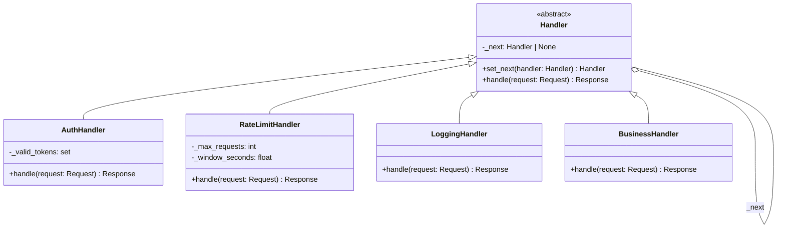
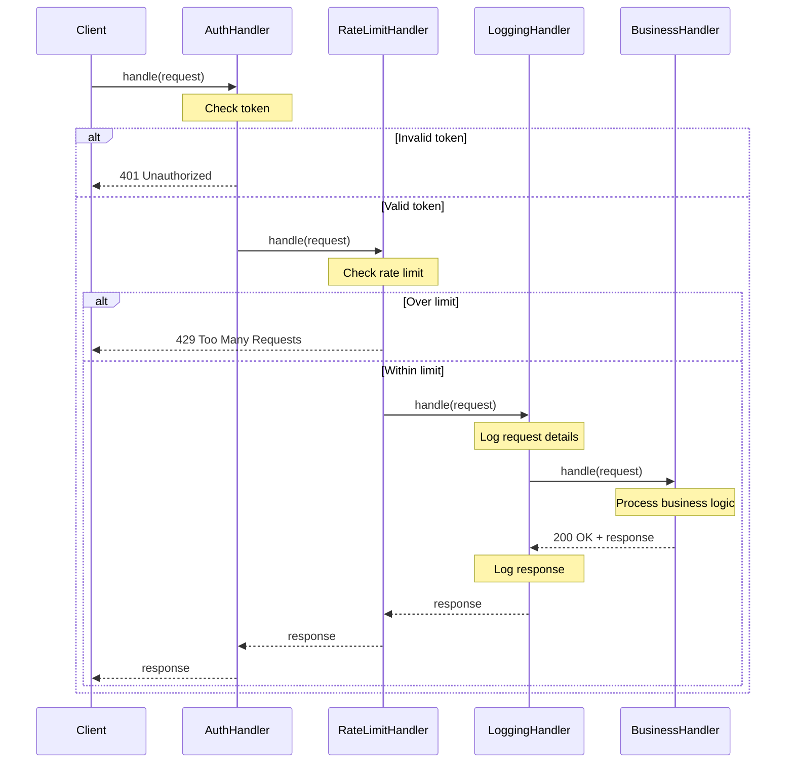

# Chain of Responsibility Pattern

> Pass a request along a chain of handlers, where each handler either processes the request or forwards it to the next handler in the chain.

## Table of Contents
- [Core Concepts](#core-concepts)
- [Code Examples](#code-examples)
- [Common Pitfalls](#common-pitfalls)
- [Key Takeaways](#key-takeaways)
- [Exercises](#exercises)

## Core Concepts

### Intent

#### What
The Chain of Responsibility pattern decouples the sender of a request from its receiver by giving multiple objects a chance to handle the request. The request travels along a chain of handlers until one of them processes it -- or it falls off the end unhandled.

#### How
Each handler holds a reference to the next handler in the chain. When a handler receives a request, it either processes it (and optionally stops the chain) or forwards it to the next handler. The client only knows about the first handler -- it has no idea how many handlers exist or which one ultimately handles the request.

#### Why It Matters
Without this pattern, the sender needs to know exactly which object can handle its request. That creates tight coupling -- every time you add a new handler, you modify the sender's logic. With a chain, you can add, remove, or reorder handlers without touching the sender or other handlers. This is exactly how HTTP middleware works: each middleware processes headers, checks authentication, logs requests, or rate-limits -- and the request keeps flowing until it reaches the final handler.

### Participants

#### What

- **Handler** -- the abstract base class or interface that defines `handle(request)` and holds a reference to the next handler (`_next`). It provides a default implementation that forwards to the next handler.
- **ConcreteHandler** -- a specific handler that processes certain types of requests. It decides whether to handle the request or pass it along. Each handler has a single responsibility.
- **Client** -- builds the chain by linking handlers together and sends requests to the first handler. The client doesn't know which handler will ultimately process the request.

#### How
The client constructs the chain: `auth -> rate_limit -> logging -> business_handler`. When a request arrives, `auth` checks credentials. If valid, it forwards to `rate_limit`. If within limits, it forwards to `logging`. After logging, the request reaches `business_handler`, which produces the actual response. Any handler can short-circuit the chain (e.g., `auth` rejecting an unauthenticated request).

#### Why It Matters
Each handler is independent and testable in isolation. You can test `AuthHandler` without `RateLimitHandler`. You can reorder them: put logging first to log even rejected requests, or put it last to log only successful ones. This composability is the pattern's power.

### Structure



### Request Flow

The following sequence diagram shows how a request passes through the chain, with possible short-circuiting at any point:



### Two Flavors: "Stop on First" vs "Pipeline"

#### What
There are two common variations:

1. **Stop on first handler** -- the chain stops as soon as one handler processes the request. Classic GoF interpretation. Example: exception handlers, event bubbling.
2. **Pipeline** -- every handler processes the request and passes it along. No handler "claims" the request. Example: HTTP middleware, logging chains.

#### How
In "stop on first," each handler checks if it can handle the request. If yes, it processes it and returns. If no, it forwards to the next handler.

In "pipeline," each handler always processes the request and always forwards it. The handlers transform, enrich, or validate the request as it flows through.

#### Why It Matters
Most real-world middleware systems use the pipeline flavor. Django's middleware, FastAPI's middleware, and Express.js middleware all process every request through every handler. Understanding which flavor you need prevents confusion when designing your chain.

### When NOT to Use

- **Only one handler will ever exist** -- if there's only one possible handler, the chain is unnecessary overhead. Just call the handler directly.
- **Handler ordering is critical and fragile** -- if the chain breaks when handlers are reordered, you have implicit dependencies between handlers. Consider making these dependencies explicit instead.
- **Requests must be handled by a specific handler** -- if the client knows exactly which handler should process its request, a direct call is simpler. The chain is for when the client *doesn't know* (or shouldn't care).
- **Performance-critical hot paths** -- each handler adds a method call and potential overhead. For ultra-low-latency code, a direct call is faster than traversing a chain.

### Real-World Examples

- **Django middleware** -- each middleware class has `__call__`, `process_request`, `process_response`, and `process_exception` hooks. Requests pass through all middleware in order, then responses pass back in reverse order.
- **FastAPI middleware** -- `@app.middleware("http")` registers handlers that receive the request and a `call_next` function. Each middleware decides what to do before and after `call_next`.
- **Python's `logging` module** -- loggers form a hierarchy. A log record travels up the logger tree until a handler processes it. Each logger can have handlers, filters, and a parent logger. `logging.getLogger("app.db.query")` sends records to its own handlers, then up to `app.db`, then `app`, then the root logger.
- **DOM event bubbling** -- a click on a `<button>` inside a `<div>` inside `<body>` fires the event on the button first, then the div, then the body. Each element's handler can stop propagation.

## Code Examples

### HTTP Middleware Pipeline

```python
"""Chain of Responsibility: HTTP middleware pipeline.

Demonstrates a realistic middleware chain with authentication,
rate limiting, logging, and business logic handlers.
"""

from abc import ABC, abstractmethod
from dataclasses import dataclass, field
from collections import defaultdict
import time


# --- Request/Response models ---

@dataclass
class Request:
    """Simplified HTTP request."""
    path: str
    method: str = "GET"
    headers: dict[str, str] = field(default_factory=dict)
    body: str = ""
    # Metadata added by middleware as the request flows through
    context: dict[str, object] = field(default_factory=dict)


@dataclass
class Response:
    """Simplified HTTP response."""
    status: int
    body: str
    headers: dict[str, str] = field(default_factory=dict)


# --- Abstract Handler ---

class Middleware(ABC):
    """Base handler in the chain.

    Each middleware holds a reference to the next middleware.
    The set_next() method returns the next handler for fluent chaining.
    """

    def __init__(self) -> None:
        self._next: Middleware | None = None

    def set_next(self, handler: "Middleware") -> "Middleware":
        """Link this handler to the next one. Returns the next handler
        so you can chain: a.set_next(b).set_next(c)"""
        self._next = handler
        return handler

    def handle(self, request: Request) -> Response:
        """Default: forward to next handler. Subclasses override to add logic."""
        if self._next is not None:
            return self._next.handle(request)
        # End of chain with no handler -- return 404
        return Response(status=404, body="No handler found")


# --- Concrete Handlers ---

class AuthMiddleware(Middleware):
    """Authentication handler: validates bearer tokens.

    Short-circuits the chain with 401 if the token is invalid.
    Adds user info to request context for downstream handlers.
    """

    def __init__(self, valid_tokens: dict[str, str]) -> None:
        super().__init__()
        # Maps token -> username
        self._valid_tokens = valid_tokens

    def handle(self, request: Request) -> Response:
        token = request.headers.get("Authorization", "")

        # Allow unauthenticated access to public paths
        if request.path.startswith("/public"):
            request.context["user"] = "anonymous"
            return super().handle(request)

        if token not in self._valid_tokens:
            print(f"  [Auth] REJECTED -- invalid token")
            return Response(
                status=401,
                body="Unauthorized: invalid or missing token",
            )

        username = self._valid_tokens[token]
        request.context["user"] = username
        print(f"  [Auth] Authenticated user: {username}")
        return super().handle(request)


class RateLimitMiddleware(Middleware):
    """Rate limiting handler: tracks requests per user per time window.

    Short-circuits with 429 if a user exceeds the limit.
    Uses a sliding window counter for simplicity.
    """

    def __init__(self, max_requests: int, window_seconds: float) -> None:
        super().__init__()
        self._max_requests = max_requests
        self._window_seconds = window_seconds
        # Maps user -> list of request timestamps
        self._request_log: dict[str, list[float]] = defaultdict(list)

    def handle(self, request: Request) -> Response:
        user = str(request.context.get("user", "anonymous"))
        now = time.time()
        cutoff = now - self._window_seconds

        # Remove expired timestamps
        self._request_log[user] = [
            t for t in self._request_log[user] if t > cutoff
        ]

        if len(self._request_log[user]) >= self._max_requests:
            print(f"  [RateLimit] REJECTED -- {user} exceeded {self._max_requests} "
                  f"requests per {self._window_seconds}s")
            return Response(
                status=429,
                body=f"Rate limit exceeded: max {self._max_requests} requests "
                     f"per {self._window_seconds}s",
            )

        self._request_log[user].append(now)
        print(f"  [RateLimit] {user}: "
              f"{len(self._request_log[user])}/{self._max_requests} requests used")
        return super().handle(request)


class LoggingMiddleware(Middleware):
    """Logging handler: logs request and response details with timing.

    This is a pipeline-style handler -- it always forwards the request
    and processes both the request (before) and response (after).
    """

    def handle(self, request: Request) -> Response:
        start = time.perf_counter()
        user = request.context.get("user", "unknown")
        print(f"  [Log] --> {request.method} {request.path} (user={user})")

        # Forward to next handler and capture response
        response = super().handle(request)

        elapsed_ms = (time.perf_counter() - start) * 1000
        print(f"  [Log] <-- {response.status} ({elapsed_ms:.1f}ms)")
        return response


class RequestHandler(Middleware):
    """Terminal handler: processes the actual business logic.

    In a real system, this would be your view/controller/endpoint.
    Routes are registered as a dict mapping paths to handler functions.
    """

    def __init__(self) -> None:
        super().__init__()
        self._routes: dict[str, callable] = {}

    def register(self, path: str, handler: callable) -> None:
        """Register a route handler."""
        self._routes[path] = handler

    def handle(self, request: Request) -> Response:
        handler = self._routes.get(request.path)
        if handler is None:
            return Response(status=404, body=f"Not found: {request.path}")
        return handler(request)


# --- Build and use the chain ---

def main() -> None:
    # --- Set up business logic handlers ---
    endpoint = RequestHandler()
    endpoint.register("/api/users", lambda req: Response(
        status=200, body=f"Users list for {req.context.get('user')}"
    ))
    endpoint.register("/public/health", lambda req: Response(
        status=200, body="OK"
    ))

    # --- Build the middleware chain ---
    # Order matters: Auth -> RateLimit -> Logging -> Endpoint
    auth = AuthMiddleware(valid_tokens={
        "token-alice": "alice",
        "token-bob": "bob",
    })
    rate_limit = RateLimitMiddleware(max_requests=3, window_seconds=60.0)
    logging_mw = LoggingMiddleware()

    # Fluent chain construction
    auth.set_next(rate_limit).set_next(logging_mw).set_next(endpoint)

    # --- Scenario 1: Authenticated request ---
    print("=== Authenticated request ===")
    req = Request(
        path="/api/users",
        headers={"Authorization": "token-alice"},
    )
    resp = auth.handle(req)
    print(f"Response: {resp.status} - {resp.body}\n")

    # --- Scenario 2: Unauthenticated request (short-circuits at auth) ---
    print("=== Unauthenticated request ===")
    req = Request(path="/api/users")
    resp = auth.handle(req)
    print(f"Response: {resp.status} - {resp.body}\n")

    # --- Scenario 3: Public endpoint (bypasses auth) ---
    print("=== Public endpoint ===")
    req = Request(path="/public/health")
    resp = auth.handle(req)
    print(f"Response: {resp.status} - {resp.body}\n")

    # --- Scenario 4: Rate limit exceeded ---
    print("=== Rate limit test (4 rapid requests, limit is 3) ===")
    for i in range(4):
        req = Request(
            path="/api/users",
            headers={"Authorization": "token-bob"},
        )
        resp = auth.handle(req)
        print(f"Request {i + 1}: {resp.status} - {resp.body}\n")


if __name__ == "__main__":
    main()
```

### Chain Builder with Type-Safe Construction

```python
"""Alternative chain construction using a builder pattern.

Instead of manually linking handlers with set_next(), a builder
constructs the chain from a list, ensuring correct ordering.
"""

from __future__ import annotations
from abc import ABC, abstractmethod
from dataclasses import dataclass


@dataclass
class Event:
    """A support ticket event to be routed to the right handler."""
    level: str  # "info", "warning", "error", "critical"
    message: str
    source: str


class SupportHandler(ABC):
    """Abstract handler for support ticket routing."""

    def __init__(self) -> None:
        self._next: SupportHandler | None = None

    def set_next(self, handler: SupportHandler) -> SupportHandler:
        self._next = handler
        return handler

    @abstractmethod
    def handle(self, event: Event) -> str | None:
        """Handle the event or return None to pass to next handler."""
        ...

    def _forward(self, event: Event) -> str | None:
        """Forward to the next handler in the chain."""
        if self._next is not None:
            return self._next.handle(event)
        return None  # End of chain -- nobody handled it


class InfoHandler(SupportHandler):
    """Handles informational events -- auto-responds with FAQ links."""

    def handle(self, event: Event) -> str | None:
        if event.level == "info":
            return f"[Auto-Reply] FAQ link sent for: {event.message}"
        return self._forward(event)


class WarningHandler(SupportHandler):
    """Handles warnings -- assigns to junior support team."""

    def handle(self, event: Event) -> str | None:
        if event.level == "warning":
            return f"[Junior Support] Ticket created: {event.message}"
        return self._forward(event)


class ErrorHandler(SupportHandler):
    """Handles errors -- assigns to senior support team."""

    def handle(self, event: Event) -> str | None:
        if event.level == "error":
            return f"[Senior Support] Escalated: {event.message}"
        return self._forward(event)


class CriticalHandler(SupportHandler):
    """Handles critical events -- pages the on-call engineer."""

    def handle(self, event: Event) -> str | None:
        if event.level == "critical":
            return f"[PAGER] On-call engineer alerted: {event.message}"
        return self._forward(event)


def build_chain(handlers: list[SupportHandler]) -> SupportHandler:
    """Build a chain from a list of handlers.

    Returns the first handler in the chain. This is cleaner than
    manually calling set_next() for each pair.
    """
    if not handlers:
        raise ValueError("Chain must have at least one handler")

    for i in range(len(handlers) - 1):
        handlers[i].set_next(handlers[i + 1])
    return handlers[0]


def main() -> None:
    # Build chain from a list -- easy to reorder or add new handlers
    chain = build_chain([
        InfoHandler(),
        WarningHandler(),
        ErrorHandler(),
        CriticalHandler(),
    ])

    events = [
        Event("info", "How do I reset my password?", "user@example.com"),
        Event("warning", "Slow response times on /api/search", "monitoring"),
        Event("error", "Database connection pool exhausted", "app-server-3"),
        Event("critical", "All payment processing failed", "payment-service"),
        Event("unknown", "Something weird happened", "???"),
    ]

    for event in events:
        result = chain.handle(event)
        if result:
            print(f"{event.level.upper()}: {result}")
        else:
            print(f"{event.level.upper()}: No handler found for '{event.message}'")


if __name__ == "__main__":
    main()
```

## Common Pitfalls

### Chain Never Terminates

```python
# BAD — every handler forwards unconditionally, no terminal handler
class BadHandler(Middleware):
    def handle(self, request: Request) -> Response:
        print("Processing...")
        # Always forwards -- if _next is None, crashes with AttributeError
        return self._next.handle(request)

# GOOD — base class checks for None; terminal handler produces a response
class GoodHandler(Middleware):
    def handle(self, request: Request) -> Response:
        print("Processing...")
        if self._next is not None:
            return self._next.handle(request)
        return Response(status=200, body="Default response")
```

### Mutable Request State Causes Bugs

```python
from dataclasses import dataclass, field

@dataclass
class Request:
    path: str
    context: dict[str, object] = field(default_factory=dict)

# BAD — handler modifies request state that later handlers depend on
class BadAuthHandler(Middleware):
    def handle(self, request: Request) -> Response:
        # Overwrites context entirely -- destroys data from previous handlers
        request.context = {"user": "alice"}
        return super().handle(request)

# GOOD — handlers add to context without overwriting existing data
class GoodAuthHandler(Middleware):
    def handle(self, request: Request) -> Response:
        # Adds to context, preserving data from upstream handlers
        request.context["user"] = "alice"
        request.context["auth_method"] = "bearer"
        return super().handle(request)
```

### Forgetting That Order Matters

```python
# BAD — logging comes before auth, so rejected requests are never logged
# This is a design decision, not a bug, but often unintentional
chain_bad = [AuthHandler(), LoggingHandler(), BusinessHandler()]
# If auth rejects, LoggingHandler.handle() is never called

# GOOD — logging comes first so all requests (even rejected ones) are logged
chain_good = [LoggingHandler(), AuthHandler(), BusinessHandler()]
# LoggingHandler sees every request, then auth filters
```

## Key Takeaways

- **Decouple sender from receiver** -- the client sends a request to the chain, not to a specific handler. This means you can add, remove, or reorder handlers without modifying the client.
- **Two flavors** -- "stop on first match" (event handling, support routing) vs "pipeline" (HTTP middleware, where every handler processes every request). Know which one you need.
- **Order matters** -- middleware order is a design decision with real consequences. Auth before rate-limiting means unauthenticated users don't count toward limits. Rate-limiting before auth means attackers can't overwhelm the auth system.
- **Ensure requests are always handled** -- either include a terminal handler that always produces a response, or make the base class return a sensible default when the chain ends.
- **Each handler has one job** -- if a handler checks auth AND rate-limits AND logs, you've lost the pattern's benefit. Split it into three handlers.

## Exercises

1. **Add a CORS middleware** -- implement a `CORSMiddleware` handler that adds `Access-Control-Allow-Origin` headers to the response. It should handle OPTIONS preflight requests by short-circuiting the chain with a 204 response and appropriate CORS headers.

2. **Fallback handler** -- modify the middleware pipeline so that if no registered route matches, a `FallbackHandler` returns a helpful 404 response with a list of available routes. Where in the chain should this handler be placed?

3. **Bidirectional pipeline** -- Django middleware processes requests on the way in and responses on the way out (in reverse order). Implement a middleware base class with `process_request(request)` and `process_response(request, response)` methods. The chain should call `process_request` in order and `process_response` in reverse.

4. **Dynamic chain modification** -- implement `add_handler(handler, position)` and `remove_handler(handler)` methods that modify the chain at runtime. What thread-safety concerns arise?

5. **Chain of Responsibility vs Strategy** -- both patterns can be used for request routing. Explain when you'd use Chain of Responsibility (request passes through handlers) vs Strategy (client selects the handler directly). Give a concrete example for each.

---
up:: [Schedule](../../Schedule.md)
#type/learning #source/self-study #status/seed
