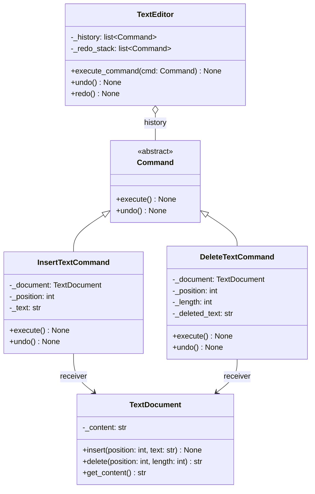

# Command Pattern

> Encapsulate a request as an object, allowing you to parameterize clients with different requests, queue or log operations, and support undoable actions.

## Table of Contents
- [Core Concepts](#core-concepts)
- [Code Examples](#code-examples)
- [Common Pitfalls](#common-pitfalls)
- [Key Takeaways](#key-takeaways)
- [Exercises](#exercises)

## Core Concepts

### Intent

#### What
The Command pattern turns a request (an action + its arguments) into a standalone object. Instead of calling `editor.insert_text("hello")` directly, you create an `InsertTextCommand("hello")` object and hand it to an invoker. The invoker can execute it now, queue it for later, log it, or undo it.

#### How
A Command object encapsulates everything needed to perform an action: the receiver (the object that does the work), the method to call, and the arguments. The invoker calls `command.execute()` without knowing what the command does internally. For undo support, each command also implements `undo()` with the inverse operation.

#### Why It Matters
Without commands, undo/redo requires tracking every state change manually. With commands, each operation records exactly how to reverse itself. Task queues work the same way -- commands can be serialized, stored in a database, and executed by worker processes hours later. This pattern is the foundation of every text editor's undo stack, every database transaction log, and every task queue (Celery, Sidekiq, etc.).

### Participants

#### What

- **Command** -- the abstract interface declaring `execute()` and optionally `undo()`. This is the contract that all concrete commands implement.
- **ConcreteCommand** -- implements `execute()` by calling specific actions on the Receiver. Stores enough state to reverse the action in `undo()`. Examples: `InsertTextCommand`, `DeleteTextCommand`, `BoldTextCommand`.
- **Invoker** -- asks the command to carry out the request. It doesn't know what the command does -- it just calls `execute()`. Manages the command history for undo/redo. Examples: toolbar buttons, menu items, keyboard shortcuts.
- **Receiver** -- the object that performs the actual work. It has the domain knowledge and methods. The command delegates to the receiver. Examples: text document, database, file system.
- **Client** -- creates ConcreteCommand objects and associates them with the appropriate Receiver. Configures the Invoker with commands.

#### How
The client creates a command: `cmd = InsertTextCommand(document, position=5, text="hello")`. The invoker stores the command and calls `cmd.execute()` when triggered (button click, keyboard shortcut). The command calls `document.insert(5, "hello")` on the receiver. For undo, the invoker calls `cmd.undo()`, which calls `document.delete(5, 5)` (removing 5 characters starting at position 5).

#### Why It Matters
The invoker is completely decoupled from the receiver. A toolbar button doesn't know whether it's triggering a text insertion, a font change, or a file save. It just calls `execute()` on whatever command it holds. This makes it trivial to reassign keyboard shortcuts, record macros (replay a sequence of commands), or implement plugins (new command classes).

### Structure



### When NOT to Use

- **Simple actions that don't need undo, queuing, or logging** -- if you just need to call a method, call it. Wrapping `save_file()` in a `SaveFileCommand` adds ceremony without benefit unless you need undo or queuing.
- **Actions with no meaningful inverse** -- some operations can't be undone (sending an email, launching a missile). If `undo()` would be a no-op, the Command pattern's main advantage disappears. You might still use it for queuing or logging, but consider whether a simple function reference suffices.
- **Performance-critical paths** -- creating a command object for every keystroke in a high-speed input system adds GC pressure. Consider batching keystrokes into a single command.
- **When a simple callback suffices** -- Python's first-class functions mean you can pass `lambda: document.insert(5, "hello")` as a callback. If you don't need undo, a function reference is simpler than a command class.

### Real-World Examples

- **Django management commands** -- `python manage.py migrate`, `python manage.py collectstatic`. Each management command is a class with a `handle()` method. The framework (invoker) discovers and executes them.
- **Python's `subprocess` module** -- `subprocess.run(["git", "commit", "-m", "msg"])` encapsulates a system command as a function call. The arguments are the "command object" -- they can be constructed, logged, serialized, and executed later.
- **GUI button callbacks** -- every GUI framework separates buttons (invoker) from actions (command). Tkinter's `Button(command=func)` is a lightweight version of this pattern. Qt's signal/slot system is a more sophisticated one.
- **Celery task queue** -- `@celery.task` turns a function into a serializable command object that can be sent to a worker queue and executed later on a different machine.

## Code Examples

### Text Editor with Undo/Redo

```python
"""Command Pattern: text editor with full undo/redo support.

Demonstrates InsertText and DeleteText commands with undo capability,
managed by a TextEditor invoker that maintains history and redo stacks.
"""

from abc import ABC, abstractmethod
from dataclasses import dataclass, field


# --- Receiver: the object that does the actual work ---

class TextDocument:
    """The receiver -- manages the actual text content.

    This class knows nothing about commands or undo. It just provides
    primitive insert/delete operations. The commands orchestrate these
    operations and manage their reversibility.
    """

    def __init__(self, content: str = "") -> None:
        self._content = content

    def insert(self, position: int, text: str) -> None:
        """Insert text at the given position."""
        if position < 0 or position > len(self._content):
            raise IndexError(
                f"Position {position} out of range [0, {len(self._content)}]"
            )
        self._content = (
            self._content[:position] + text + self._content[position:]
        )

    def delete(self, position: int, length: int) -> str:
        """Delete `length` characters starting at `position`. Returns deleted text."""
        if position < 0 or position + length > len(self._content):
            raise IndexError(
                f"Cannot delete {length} chars at position {position} "
                f"(content length: {len(self._content)})"
            )
        deleted = self._content[position:position + length]
        self._content = self._content[:position] + self._content[position + length:]
        return deleted

    def get_content(self) -> str:
        """Return the current content."""
        return self._content

    def __repr__(self) -> str:
        return f"TextDocument({self._content!r})"


# --- Command interface ---

class Command(ABC):
    """Abstract command with execute and undo."""

    @abstractmethod
    def execute(self) -> None:
        """Perform the action."""
        ...

    @abstractmethod
    def undo(self) -> None:
        """Reverse the action."""
        ...

    @abstractmethod
    def description(self) -> str:
        """Human-readable description for logging/display."""
        ...


# --- Concrete Commands ---

class InsertTextCommand(Command):
    """Insert text at a specified position. Undo removes the inserted text."""

    def __init__(self, document: TextDocument, position: int, text: str) -> None:
        self._document = document
        self._position = position
        self._text = text

    def execute(self) -> None:
        self._document.insert(self._position, self._text)

    def undo(self) -> None:
        # Remove exactly what was inserted: same position, same length
        self._document.delete(self._position, len(self._text))

    def description(self) -> str:
        preview = self._text[:20] + "..." if len(self._text) > 20 else self._text
        return f"Insert '{preview}' at position {self._position}"


class DeleteTextCommand(Command):
    """Delete text at a specified position. Undo re-inserts the deleted text.

    The key insight: we must store the deleted text during execute()
    so we can restore it during undo(). This is why commands need state.
    """

    def __init__(self, document: TextDocument, position: int, length: int) -> None:
        self._document = document
        self._position = position
        self._length = length
        self._deleted_text: str = ""  # Captured during execute()

    def execute(self) -> None:
        # Store the text we're about to delete -- needed for undo
        self._deleted_text = self._document.delete(self._position, self._length)

    def undo(self) -> None:
        # Re-insert the deleted text at the original position
        self._document.insert(self._position, self._deleted_text)

    def description(self) -> str:
        if self._deleted_text:
            preview = (self._deleted_text[:20] + "..."
                       if len(self._deleted_text) > 20 else self._deleted_text)
            return f"Delete '{preview}' at position {self._position}"
        return f"Delete {self._length} chars at position {self._position}"


class ReplaceTextCommand(Command):
    """Replace text in a range. Composed of delete + insert internally.

    Demonstrates a macro command that combines two operations into one
    undoable unit. Undo reverses both operations in the correct order.
    """

    def __init__(
        self,
        document: TextDocument,
        position: int,
        length: int,
        new_text: str,
    ) -> None:
        self._document = document
        self._position = position
        self._length = length
        self._new_text = new_text
        self._old_text: str = ""  # Captured during execute()

    def execute(self) -> None:
        self._old_text = self._document.delete(self._position, self._length)
        self._document.insert(self._position, self._new_text)

    def undo(self) -> None:
        # Reverse order: remove new text, then re-insert old text
        self._document.delete(self._position, len(self._new_text))
        self._document.insert(self._position, self._old_text)

    def description(self) -> str:
        return (f"Replace '{self._old_text or '...'}' with "
                f"'{self._new_text}' at position {self._position}")


# --- Invoker: manages command execution and history ---

class TextEditor:
    """The invoker -- executes commands and manages undo/redo stacks.

    The editor knows nothing about text manipulation. It only knows
    how to execute commands and maintain history. This separation
    means you can add new command types without modifying the editor.
    """

    def __init__(self, document: TextDocument) -> None:
        self._document = document
        self._history: list[Command] = []      # Undo stack
        self._redo_stack: list[Command] = []    # Redo stack

    def execute(self, command: Command) -> None:
        """Execute a command and add it to the undo history."""
        command.execute()
        self._history.append(command)
        # New action invalidates redo history -- you can't redo after
        # executing a new command (standard editor behavior)
        self._redo_stack.clear()
        print(f"  Executed: {command.description()}")
        print(f"  Content:  '{self._document.get_content()}'")

    def undo(self) -> None:
        """Undo the last command."""
        if not self._history:
            print("  Nothing to undo")
            return
        command = self._history.pop()
        command.undo()
        self._redo_stack.append(command)
        print(f"  Undid: {command.description()}")
        print(f"  Content: '{self._document.get_content()}'")

    def redo(self) -> None:
        """Redo the last undone command."""
        if not self._redo_stack:
            print("  Nothing to redo")
            return
        command = self._redo_stack.pop()
        command.execute()
        self._history.append(command)
        print(f"  Redid: {command.description()}")
        print(f"  Content: '{self._document.get_content()}'")

    @property
    def can_undo(self) -> bool:
        return len(self._history) > 0

    @property
    def can_redo(self) -> bool:
        return len(self._redo_stack) > 0

    def history_summary(self) -> list[str]:
        """Return descriptions of all commands in the undo history."""
        return [cmd.description() for cmd in self._history]


# --- Client code ---

def main() -> None:
    doc = TextDocument()
    editor = TextEditor(doc)

    print("=== Building a sentence ===")
    editor.execute(InsertTextCommand(doc, position=0, text="Hello"))
    editor.execute(InsertTextCommand(doc, position=5, text=" World"))
    editor.execute(InsertTextCommand(doc, position=11, text="!"))

    print("\n=== Undo last insertion ===")
    editor.undo()  # Removes "!"

    print("\n=== Undo again ===")
    editor.undo()  # Removes " World"

    print("\n=== Redo ===")
    editor.redo()  # Re-inserts " World"

    print("\n=== Delete 'World' and replace with 'Python' ===")
    editor.execute(ReplaceTextCommand(doc, position=6, length=5, new_text="Python"))

    print("\n=== Undo the replacement ===")
    editor.undo()  # Restores "World"

    print("\n=== Command history ===")
    for i, desc in enumerate(editor.history_summary(), 1):
        print(f"  {i}. {desc}")


if __name__ == "__main__":
    main()
```

### Command Queue with Macro Support

```python
"""Command Pattern: task queue with batch execution and macro recording.

Demonstrates commands as serializable, queueable objects that can be
batched into macros for replay.
"""

from abc import ABC, abstractmethod
from dataclasses import dataclass, field


# --- Receiver ---

@dataclass
class FileSystem:
    """Simulated file system as the receiver."""
    files: dict[str, str] = field(default_factory=dict)

    def create_file(self, path: str, content: str) -> None:
        self.files[path] = content
        print(f"    Created: {path}")

    def delete_file(self, path: str) -> str:
        content = self.files.pop(path, "")
        print(f"    Deleted: {path}")
        return content

    def rename_file(self, old_path: str, new_path: str) -> None:
        if old_path not in self.files:
            raise FileNotFoundError(f"File not found: {old_path}")
        self.files[new_path] = self.files.pop(old_path)
        print(f"    Renamed: {old_path} -> {new_path}")


# --- Commands ---

class FileCommand(ABC):
    @abstractmethod
    def execute(self) -> None: ...

    @abstractmethod
    def undo(self) -> None: ...


class CreateFileCommand(FileCommand):
    def __init__(self, fs: FileSystem, path: str, content: str) -> None:
        self._fs = fs
        self._path = path
        self._content = content

    def execute(self) -> None:
        self._fs.create_file(self._path, self._content)

    def undo(self) -> None:
        self._fs.delete_file(self._path)


class DeleteFileCommand(FileCommand):
    def __init__(self, fs: FileSystem, path: str) -> None:
        self._fs = fs
        self._path = path
        self._saved_content: str = ""

    def execute(self) -> None:
        self._saved_content = self._fs.delete_file(self._path)

    def undo(self) -> None:
        self._fs.create_file(self._path, self._saved_content)


class RenameFileCommand(FileCommand):
    def __init__(self, fs: FileSystem, old_path: str, new_path: str) -> None:
        self._fs = fs
        self._old_path = old_path
        self._new_path = new_path

    def execute(self) -> None:
        self._fs.rename_file(self._old_path, self._new_path)

    def undo(self) -> None:
        self._fs.rename_file(self._new_path, self._old_path)


# --- Macro: a command that contains other commands ---

class MacroCommand(FileCommand):
    """A composite command that executes a sequence of commands as one unit.

    Undo reverses all commands in reverse order, maintaining consistency.
    This is the Command pattern + Composite pattern working together.
    """

    def __init__(self, commands: list[FileCommand] | None = None) -> None:
        self._commands: list[FileCommand] = commands or []

    def add(self, command: FileCommand) -> None:
        self._commands.append(command)

    def execute(self) -> None:
        for cmd in self._commands:
            cmd.execute()

    def undo(self) -> None:
        # Undo in reverse order -- last executed, first undone
        for cmd in reversed(self._commands):
            cmd.undo()


def main() -> None:
    fs = FileSystem()

    # Record a macro: create a project scaffold
    scaffold_macro = MacroCommand()
    scaffold_macro.add(CreateFileCommand(fs, "/project/README.md", "# My Project"))
    scaffold_macro.add(CreateFileCommand(fs, "/project/main.py", "print('hello')"))
    scaffold_macro.add(CreateFileCommand(fs, "/project/tests/__init__.py", ""))
    scaffold_macro.add(
        CreateFileCommand(fs, "/project/tests/test_main.py", "def test_main(): ...")
    )

    print("=== Execute scaffold macro ===")
    scaffold_macro.execute()
    print(f"Files: {list(fs.files.keys())}\n")

    print("=== Undo entire scaffold (one operation) ===")
    scaffold_macro.undo()
    print(f"Files: {list(fs.files.keys())}\n")

    print("=== Redo scaffold ===")
    scaffold_macro.execute()

    print("\n=== Rename and verify ===")
    rename_cmd = RenameFileCommand(fs, "/project/main.py", "/project/app.py")
    rename_cmd.execute()
    print(f"Files: {list(fs.files.keys())}\n")

    print("=== Undo rename ===")
    rename_cmd.undo()
    print(f"Files: {list(fs.files.keys())}")


if __name__ == "__main__":
    main()
```

## Common Pitfalls

### Command That Doesn't Store Enough State for Undo

```python
# BAD — DeleteTextCommand doesn't save what was deleted
class BadDeleteCommand(Command):
    def __init__(self, document: TextDocument, position: int, length: int) -> None:
        self._document = document
        self._position = position
        self._length = length

    def execute(self) -> None:
        self._document.delete(self._position, self._length)
        # The deleted text is lost forever -- undo is impossible

    def undo(self) -> None:
        # What do we insert? We don't know what was deleted!
        self._document.insert(self._position, "???")

# GOOD — capture deleted text during execute() for later undo
class GoodDeleteCommand(Command):
    def __init__(self, document: TextDocument, position: int, length: int) -> None:
        self._document = document
        self._position = position
        self._length = length
        self._deleted_text: str = ""  # Will be captured during execute

    def execute(self) -> None:
        self._deleted_text = self._document.delete(self._position, self._length)

    def undo(self) -> None:
        self._document.insert(self._position, self._deleted_text)
```

### Executing a Command Twice Without Re-Creating It

```python
# BAD — reusing a command object that has mutable state from previous execution
cmd = DeleteTextCommand(doc, position=0, length=5)
cmd.execute()   # Deletes "Hello", saves _deleted_text = "Hello"
cmd.undo()      # Re-inserts "Hello" -- correct

cmd.execute()   # Deletes "Hello" again, overwrites _deleted_text
# But what if the content at position 0 changed between calls?
# _deleted_text now has stale data from the second execution

# GOOD — create a new command instance for each action
cmd1 = DeleteTextCommand(doc, position=0, length=5)
cmd1.execute()
cmd1.undo()

# For a new deletion, create a fresh command
cmd2 = DeleteTextCommand(doc, position=0, length=5)
cmd2.execute()
```

### Using Command When a Simple Callback Suffices

```python
from typing import Callable

# BAD — full command pattern for a one-shot action with no undo
class SaveFileCommand:
    def __init__(self, path: str, content: str) -> None:
        self._path = path
        self._content = content

    def execute(self) -> None:
        with open(self._path, "w") as f:
            f.write(self._content)

    def undo(self) -> None:
        pass  # Can't meaningfully undo a file save

# GOOD — just use a function. Simpler, clearer, fewer moving parts.
def save_file(path: str, content: str) -> None:
    with open(path, "w") as f:
        f.write(content)

# Or if you need to pass it around as a callback:
action: Callable[[], None] = lambda: save_file("/tmp/out.txt", "data")
```

## Key Takeaways

- **Commands turn actions into objects** -- once an action is an object, you can store it, queue it, serialize it, log it, and undo it. This is the fundamental insight.
- **Undo requires capturing state during execute** -- the command must store enough information to reverse itself. `DeleteTextCommand` must remember what text was deleted. Design your commands with undo in mind from the start.
- **The invoker is decoupled from the receiver** -- toolbar buttons, keyboard shortcuts, and menu items all call `command.execute()` without knowing what the command does. Reassigning shortcuts is trivial.
- **Macros are composite commands** -- a `MacroCommand` holds a list of commands and executes/undoes them as a unit. This is the Command + Composite patterns working together.
- **Don't use Command when a function reference suffices** -- Python's first-class functions mean `button.on_click = lambda: save()` is often simpler than creating a `SaveCommand` class. Use Command when you need undo, queuing, or logging.

## Exercises

1. **Add a BatchInsertCommand** -- implement a command that inserts text at multiple positions in a single undoable operation. The undo should remove all inserted text. Consider: what happens if the positions shift after each insertion?

2. **Implement command serialization** -- make the `InsertTextCommand` and `DeleteTextCommand` serializable to JSON (use `dataclasses` and a `to_dict()`/`from_dict()` pattern). Write a function that replays a list of serialized commands on a fresh document.

3. **Transaction with rollback** -- implement a `TransactionCommand` that executes a list of commands. If any command fails (raises an exception), it automatically undoes all previously executed commands in reverse order. This is how database transactions work.

4. **Command history with memory limit** -- modify the `TextEditor` to limit the undo history to N commands. When the limit is reached, the oldest command is discarded. What happens to memory when commands store large chunks of deleted text?

5. **GUI simulation** -- create a simple menu system where each menu item holds a `Command`. Implement `CopyCommand`, `PasteCommand`, and `CutCommand` operating on a clipboard and document. How would you handle `PasteCommand.undo()` (removing the pasted text)?

---
up:: [Schedule](../../Schedule.md)
#type/learning #source/self-study #status/seed
