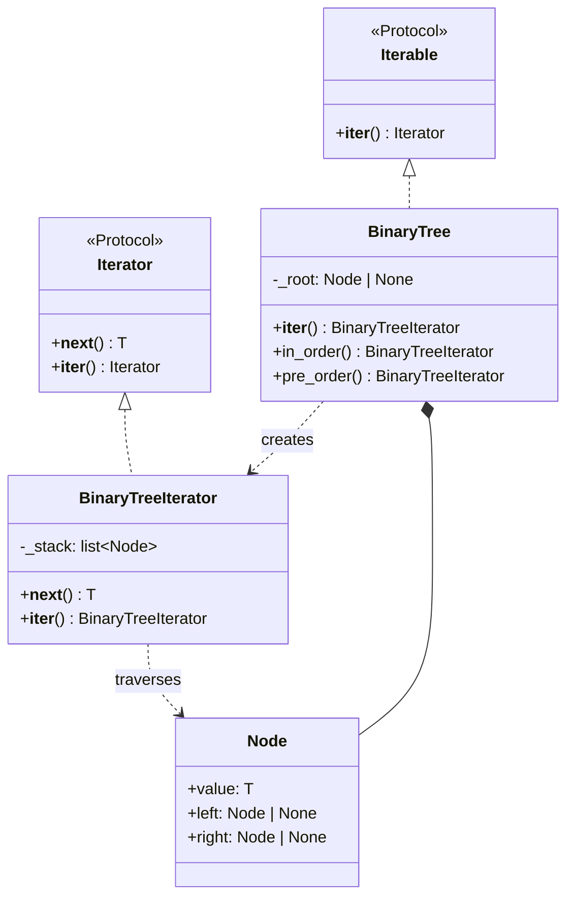

# Iterator Pattern

> Access elements of a collection sequentially without exposing its underlying representation, enabling uniform traversal across different data structures.

## Table of Contents
- [Core Concepts](#core-concepts)
- [Code Examples](#code-examples)
- [Common Pitfalls](#common-pitfalls)
- [Key Takeaways](#key-takeaways)
- [Exercises](#exercises)

## Core Concepts

### Intent

#### What
The Iterator pattern provides a standard way to traverse a collection's elements one by one without revealing how the collection stores them internally. Whether the underlying structure is an array, a linked list, a tree, or a database result set, the client uses the same traversal interface.

#### How
The collection implements a method that returns an iterator object. The iterator tracks the current position and provides `next()` to advance. The client loops by calling `next()` repeatedly until the iterator signals exhaustion. The collection's internal structure -- how elements are stored, indexed, or linked -- stays hidden.

#### Why It Matters
Without iterators, every collection requires custom traversal code. Lists need index-based loops, trees need recursive traversal, database results need cursor management. The Iterator pattern unifies all of these behind a single interface. This is so fundamental that Python built it into the language itself: the `for` loop, `list()`, `sum()`, and every other function that consumes a sequence all rely on the iterator protocol.

### Participants

#### What

- **Iterator** -- the interface for traversing elements. In Python, this means implementing `__next__()` (returns the next element or raises `StopIteration`). The iterator holds the traversal state (current position, visited nodes, etc.).
- **ConcreteIterator** -- implements the iterator for a specific collection. A `BinaryTreeIterator` traverses nodes in-order; a `GraphBFSIterator` uses a queue for breadth-first traversal. Each knows how to navigate the collection's internal structure.
- **Iterable (Aggregate)** -- the collection interface. In Python, this means implementing `__iter__()` which returns an Iterator. The iterable is the "thing you loop over."
- **ConcreteIterable (ConcreteAggregate)** -- the actual collection (tree, graph, custom data structure) that creates the appropriate iterator for itself.

#### How
When you write `for item in collection`, Python calls `collection.__iter__()` to get an iterator, then calls `iterator.__next__()` repeatedly until `StopIteration` is raised. The `for` loop handles `StopIteration` automatically -- you never see it.

#### Why It Matters
This separation means a single collection can support multiple traversal strategies. A binary tree can offer in-order, pre-order, and post-order iterators. A graph can offer BFS and DFS iterators. The client picks the traversal it needs without knowing the tree/graph's internal structure.

### Structure



### Python's Iterator Protocol

#### What
Python's iterator protocol is a two-method contract:

1. **`__iter__()`** -- called by `iter()`. Returns an iterator object. For iterables (like lists), this returns a new iterator. For iterators themselves, this returns `self`.
2. **`__next__()`** -- called by `next()`. Returns the next element or raises `StopIteration` when exhausted.

#### How
The `for` loop is syntactic sugar for the iterator protocol:

```python
# This for loop:
for item in collection:
    process(item)

# Is equivalent to:
iterator = iter(collection)  # calls collection.__iter__()
while True:
    try:
        item = next(iterator)  # calls iterator.__next__()
        process(item)
    except StopIteration:
        break
```

#### Why It Matters
Every Python object that works with `for` loops implements this protocol. Lists, dicts, sets, files, range objects, generators, database querysets -- they all follow the same contract. When you implement `__iter__` and `__next__` on your own class, it integrates seamlessly with `for`, `list()`, `sum()`, `map()`, `filter()`, list comprehensions, and the entire Python ecosystem.

### Generators as Iterators

#### What
A generator is a function that uses `yield` instead of `return`. Calling a generator function doesn't execute the body -- it returns a generator object that implements the iterator protocol automatically.

#### How
When `__next__()` is called on a generator object, the function body executes until it hits `yield`, which produces a value and suspends execution. The next `__next__()` call resumes from where `yield` left off. When the function body ends (or hits `return`), `StopIteration` is raised automatically.

#### Why It Matters
Generators eliminate the boilerplate of writing a full iterator class. Instead of managing `__init__`, `__iter__`, `__next__`, and manual state (stack, index, visited set), you write a simple function with `yield`. The Python runtime handles all the state management. For most custom iteration needs, a generator is the right tool.

```python
# Full iterator class: ~20 lines of boilerplate
class CountUp:
    def __init__(self, start: int, stop: int) -> None:
        self._current = start
        self._stop = stop

    def __iter__(self):
        return self

    def __next__(self) -> int:
        if self._current >= self._stop:
            raise StopIteration
        value = self._current
        self._current += 1
        return value

# Generator: 3 lines, same behavior
def count_up(start: int, stop: int):
    current = start
    while current < stop:
        yield current
        current += 1
```

### When NOT to Use

- **Random access is needed** -- iterators only go forward. If clients need `collection[i]` or `collection[i:j]`, provide a `__getitem__` method instead. Don't force sequential iteration when random access is the actual need.
- **The collection is a simple list** -- Python's built-in list is already iterable. Don't wrap it in a custom iterator unless you need to change the traversal logic.
- **Multiple simultaneous iterations over the same data** -- a single iterator instance tracks one position. If you need multiple cursors, ensure `__iter__()` returns a new iterator each time (not `self` on the iterable).
- **You need to know the size upfront** -- iterators don't have a length. If clients need `len()`, implement `__len__` on the collection. Iterators can be infinite (which is a feature, not a bug).

### Real-World Examples

- **Python's `iter()` and `for` loop** -- the entire `for` loop is built on the iterator protocol. `for x in [1, 2, 3]` calls `list.__iter__()` which returns a `list_iterator`, then calls `__next__()` three times.
- **`itertools` module** -- `itertools.chain()`, `itertools.islice()`, `itertools.groupby()`, and friends all consume and produce iterators. They compose lazily -- no intermediate lists are created.
- **File objects** -- `open("file.txt")` returns an iterable. `for line in f` reads one line at a time, making it memory-efficient for large files.
- **Django querysets** -- `User.objects.filter(active=True)` returns a lazy iterable. The SQL query doesn't execute until you iterate. You can chain `.filter()`, `.order_by()`, `.values()` without hitting the database until iteration.
- **Generator expressions** -- `(x**2 for x in range(1_000_000))` creates a lazy iterator that computes values on demand. Unlike a list comprehension `[x**2 for x in range(1_000_000)]`, it uses O(1) memory.

## Code Examples

### Binary Tree with Multiple Traversal Strategies

```python
"""Iterator Pattern: binary tree with in-order, pre-order, and level-order iterators.

Demonstrates how a single collection can support multiple traversal strategies
through different iterator implementations.
"""

from __future__ import annotations
from collections import deque
from dataclasses import dataclass
from typing import Iterator, Generic, TypeVar

T = TypeVar("T")


@dataclass
class TreeNode(Generic[T]):
    """A node in a binary tree."""
    value: T
    left: TreeNode[T] | None = None
    right: TreeNode[T] | None = None


class InOrderIterator(Generic[T]):
    """In-order traversal: left subtree -> root -> right subtree.

    Uses an explicit stack to simulate the recursive call stack.
    This produces values in sorted order for a BST.
    """

    def __init__(self, root: TreeNode[T] | None) -> None:
        self._stack: list[TreeNode[T]] = []
        # Push all left children to start at the leftmost node
        self._push_left_chain(root)

    def _push_left_chain(self, node: TreeNode[T] | None) -> None:
        """Push a node and all its left descendants onto the stack."""
        while node is not None:
            self._stack.append(node)
            node = node.left

    def __iter__(self) -> InOrderIterator[T]:
        return self

    def __next__(self) -> T:
        if not self._stack:
            raise StopIteration

        node = self._stack.pop()
        # After visiting a node, process its right subtree
        self._push_left_chain(node.right)
        return node.value


class PreOrderIterator(Generic[T]):
    """Pre-order traversal: root -> left subtree -> right subtree.

    Visits the root first, then recursively visits left and right.
    Useful for copying/serializing a tree.
    """

    def __init__(self, root: TreeNode[T] | None) -> None:
        self._stack: list[TreeNode[T]] = []
        if root is not None:
            self._stack.append(root)

    def __iter__(self) -> PreOrderIterator[T]:
        return self

    def __next__(self) -> T:
        if not self._stack:
            raise StopIteration

        node = self._stack.pop()
        # Push right first, then left -- so left is processed first (LIFO)
        if node.right is not None:
            self._stack.append(node.right)
        if node.left is not None:
            self._stack.append(node.left)
        return node.value


class LevelOrderIterator(Generic[T]):
    """Level-order (BFS) traversal: visit nodes level by level.

    Uses a queue instead of a stack. Produces values in breadth-first order.
    """

    def __init__(self, root: TreeNode[T] | None) -> None:
        self._queue: deque[TreeNode[T]] = deque()
        if root is not None:
            self._queue.append(root)

    def __iter__(self) -> LevelOrderIterator[T]:
        return self

    def __next__(self) -> T:
        if not self._queue:
            raise StopIteration

        node = self._queue.popleft()
        if node.left is not None:
            self._queue.append(node.left)
        if node.right is not None:
            self._queue.append(node.right)
        return node.value


class BinaryTree(Generic[T]):
    """A binary tree that supports multiple traversal strategies.

    The default iteration is in-order. Clients can explicitly request
    other traversals via .pre_order() and .level_order().
    """

    def __init__(self, root: TreeNode[T] | None = None) -> None:
        self._root = root

    def __iter__(self) -> InOrderIterator[T]:
        """Default traversal: in-order (sorted order for BSTs)."""
        return InOrderIterator(self._root)

    def pre_order(self) -> PreOrderIterator[T]:
        """Pre-order traversal: root first, then children."""
        return PreOrderIterator(self._root)

    def level_order(self) -> LevelOrderIterator[T]:
        """Level-order (BFS) traversal: breadth-first."""
        return LevelOrderIterator(self._root)


def main() -> None:
    # Build a BST:
    #        4
    #       / \
    #      2   6
    #     / \ / \
    #    1  3 5  7
    tree = BinaryTree(
        TreeNode(4,
            left=TreeNode(2, TreeNode(1), TreeNode(3)),
            right=TreeNode(6, TreeNode(5), TreeNode(7)),
        )
    )

    # Default iteration: in-order (sorted)
    print("In-order:    ", list(tree))
    # Output: [1, 2, 3, 4, 5, 6, 7]

    # Pre-order: root first
    print("Pre-order:   ", list(tree.pre_order()))
    # Output: [4, 2, 1, 3, 6, 5, 7]

    # Level-order: breadth-first
    print("Level-order: ", list(tree.level_order()))
    # Output: [4, 2, 6, 1, 3, 5, 7]

    # Works seamlessly with Python's ecosystem
    print(f"Sum:         {sum(tree)}")
    print(f"Min:         {min(tree)}")
    print(f"Max:         {max(tree)}")
    print(f"Sorted:      {sorted(tree, reverse=True)}")

    # Multiple independent iterations work because __iter__ returns
    # a new iterator each time
    for a in tree:
        for b in tree:
            if a + b == 8:
                print(f"Pair summing to 8: ({a}, {b})")


if __name__ == "__main__":
    main()
```

### Generator-Based Iterators

```python
"""Generator-based iterators: the Pythonic way to implement iteration.

Generators automatically implement the iterator protocol. They're ideal
when the traversal logic is straightforward and you want minimal boilerplate.
"""

from __future__ import annotations
from typing import Generator, Iterator
from dataclasses import dataclass


@dataclass
class TreeNode:
    value: int
    left: TreeNode | None = None
    right: TreeNode | None = None


def in_order(node: TreeNode | None) -> Generator[int, None, None]:
    """In-order traversal using a generator.

    Compare this with the 25-line InOrderIterator class above.
    The yield keyword suspends and resumes execution, automatically
    managing the traversal state that we had to track manually with a stack.
    """
    if node is not None:
        yield from in_order(node.left)   # Traverse left subtree
        yield node.value                  # Visit current node
        yield from in_order(node.right)  # Traverse right subtree


def fibonacci() -> Generator[int, None, None]:
    """Infinite Fibonacci sequence generator.

    Generators can be infinite -- they only compute values on demand.
    Use itertools.islice() to take a finite number of values.
    """
    a, b = 0, 1
    while True:  # Infinite -- never raises StopIteration on its own
        yield a
        a, b = b, a + b


def chunked(iterable: Iterator, chunk_size: int) -> Generator[list, None, None]:
    """Split any iterable into chunks of a given size.

    This is a generator that consumes another iterator -- a common pattern
    for building lazy processing pipelines.
    """
    chunk: list = []
    for item in iterable:
        chunk.append(item)
        if len(chunk) == chunk_size:
            yield chunk
            chunk = []
    if chunk:  # Don't forget the last partial chunk
        yield chunk


def read_csv_lazily(lines: list[str]) -> Generator[dict[str, str], None, None]:
    """Parse CSV data lazily, one row at a time.

    In production, you'd read from a file. This demonstrates how generators
    enable processing of datasets larger than memory.
    """
    header: list[str] = []
    for i, line in enumerate(lines):
        fields = [f.strip() for f in line.split(",")]
        if i == 0:
            header = fields
            continue
        yield dict(zip(header, fields))


def main() -> None:
    import itertools

    # --- Tree traversal with generator ---
    tree = TreeNode(4,
        left=TreeNode(2, TreeNode(1), TreeNode(3)),
        right=TreeNode(6, TreeNode(5), TreeNode(7)),
    )
    print("In-order (generator):", list(in_order(tree)))

    # --- Infinite sequence with islice ---
    first_10_fibs = list(itertools.islice(fibonacci(), 10))
    print(f"First 10 Fibonacci:  {first_10_fibs}")

    # --- Chunking an iterable ---
    data = range(1, 12)
    chunks = list(chunked(iter(data), chunk_size=3))
    print(f"Chunked:             {chunks}")

    # --- Lazy CSV processing ---
    csv_data = [
        "name, age, city",
        "Alice, 30, New York",
        "Bob, 25, San Francisco",
        "Charlie, 35, Chicago",
    ]
    for row in read_csv_lazily(csv_data):
        print(f"  Row: {row}")

    # --- Generator pipeline: compose lazy transformations ---
    # This never creates a full list in memory
    numbers = range(1, 1_000_001)
    squares = (x ** 2 for x in numbers)                    # Lazy
    evens = (x for x in squares if x % 2 == 0)             # Lazy
    first_5 = itertools.islice(evens, 5)                    # Lazy
    print(f"\nFirst 5 even squares: {list(first_5)}")       # Evaluates here


if __name__ == "__main__":
    main()
```

## Common Pitfalls

### Iterable That Returns `self` as Iterator (Can't Iterate Twice)

```python
# BAD — the collection IS the iterator (returns self from __iter__)
class BadCollection:
    def __init__(self, data: list[int]) -> None:
        self._data = data
        self._index = 0

    def __iter__(self):
        return self  # Returns self -- iteration state is on the collection

    def __next__(self) -> int:
        if self._index >= len(self._data):
            raise StopIteration
        val = self._data[self._index]
        self._index += 1
        return val

coll = BadCollection([1, 2, 3])
print(list(coll))  # [1, 2, 3] -- works the first time
print(list(coll))  # [] -- exhausted! _index is still at 3

# GOOD — __iter__ returns a NEW iterator each time
class GoodCollection:
    def __init__(self, data: list[int]) -> None:
        self._data = data

    def __iter__(self):
        # Each call creates a fresh iterator with its own state
        return iter(self._data)

coll = GoodCollection([1, 2, 3])
print(list(coll))  # [1, 2, 3]
print(list(coll))  # [1, 2, 3] -- works again!
```

### Modifying Collection During Iteration

```python
# BAD — adding/removing elements while iterating causes bugs or crashes
items = [1, 2, 3, 4, 5]
for item in items:
    if item % 2 == 0:
        items.remove(item)  # RuntimeError or skipped elements!
# Result is unpredictable: might get [1, 3, 5] or [1, 3, 4, 5]

# GOOD — iterate over a copy, or build a new collection
items = [1, 2, 3, 4, 5]

# Option 1: list comprehension (builds new list)
odds = [x for x in items if x % 2 != 0]

# Option 2: iterate over a copy
for item in items[:]:  # [:] creates a shallow copy
    if item % 2 == 0:
        items.remove(item)
```

### Not Using `yield from` for Recursive Generators

```python
from __future__ import annotations
from dataclasses import dataclass

@dataclass
class TreeNode:
    value: int
    left: TreeNode | None = None
    right: TreeNode | None = None

# BAD — manually iterating over sub-generator, losing lazy evaluation
from typing import Generator

def bad_in_order(node: TreeNode | None) -> Generator[int, None, None]:
    if node is not None:
        # This forces the entire left subtree into a list first!
        for val in list(bad_in_order(node.left)):
            yield val
        yield node.value
        for val in list(bad_in_order(node.right)):
            yield val

# GOOD — yield from delegates to the sub-generator lazily
def good_in_order(node: TreeNode | None) -> Generator[int, None, None]:
    if node is not None:
        yield from good_in_order(node.left)   # Lazy delegation
        yield node.value
        yield from good_in_order(node.right)  # Lazy delegation
```

## Key Takeaways

- **Iterator = sequential access without exposing internals** -- the client doesn't know (or need to know) whether it's traversing a list, tree, graph, or database result set. The interface is always `__iter__` and `__next__`.
- **Generators are the Pythonic way** -- for most custom iteration, a generator function with `yield` is simpler and clearer than a full iterator class. Use classes when you need multiple simultaneous iterators or complex state.
- **`__iter__` on iterables should return a NEW iterator** -- if your iterable returns `self` from `__iter__`, it can only be iterated once. Always create a fresh iterator object.
- **Lazy evaluation saves memory** -- generators compute values on demand. Processing a million-row CSV with a generator uses O(1) memory; loading it into a list uses O(n). This is the key advantage of iterators over materialized collections.
- **`itertools` is your friend** -- `chain()`, `islice()`, `groupby()`, `product()`, `combinations()` and more compose iterators without materializing intermediate results. Master `itertools` to write efficient, elegant data processing pipelines.

## Exercises

1. **Implement a `FlattenIterator`** -- write an iterator that takes a nested list (e.g., `[1, [2, [3, 4], 5], 6]`) and yields elements one at a time in order. Handle arbitrary nesting depth. Implement it both as a class with `__iter__`/`__next__` and as a generator with `yield from`.

2. **Paginated API iterator** -- create a `PaginatedResults` class that simulates paginated API responses. It should lazily fetch pages (each containing 10 items) and yield items one at a time. The client should be able to write `for item in PaginatedResults(api_client)` without knowing about pagination.

3. **Multiple traversals for a graph** -- implement a `Graph` class with both BFS and DFS iterators. The graph should use adjacency lists. Show that `list(graph.bfs(start))` and `list(graph.dfs(start))` produce different orderings for the same graph.

4. **Implement `itertools.groupby` from scratch** -- write a generator function `my_groupby(iterable, key_func)` that yields `(key, group_iterator)` pairs, grouping consecutive elements with the same key. Test it with a list of dictionaries grouped by a field.

5. **Infinite iterator composition** -- create three infinite generators: `naturals()` (1, 2, 3, ...), `squares()` (1, 4, 9, ...), and `primes()` (2, 3, 5, 7, ...). Using `itertools`, compose them to find the first 5 prime numbers that are also perfect squares minus one (i.e., numbers p where p+1 is a perfect square). If none exist, explain why.

---
up:: [Schedule](../../Schedule.md)
#type/learning #source/self-study #status/seed
