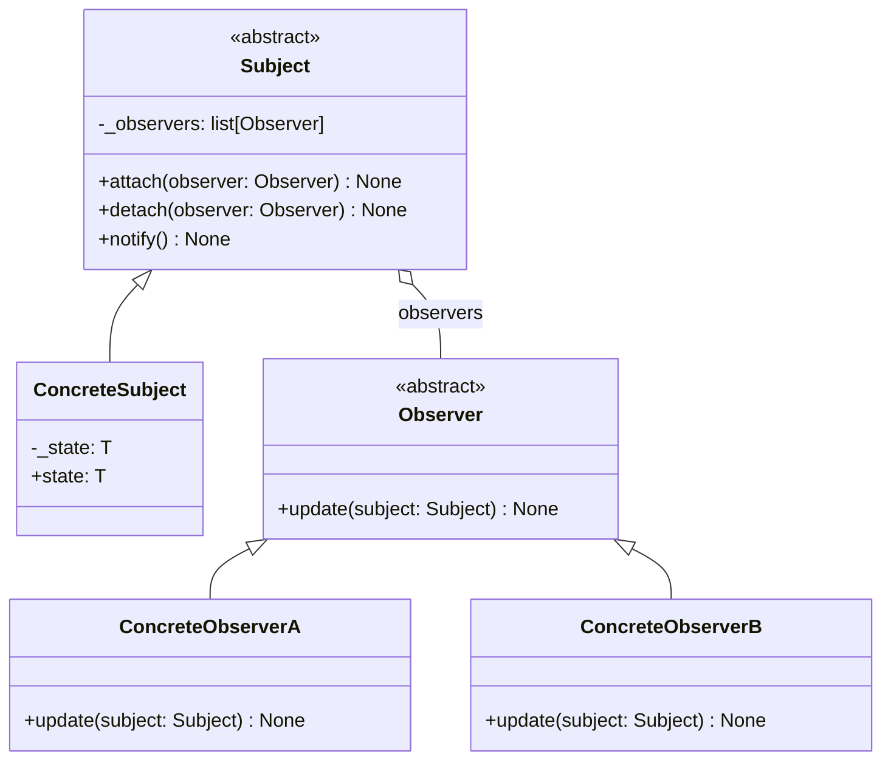
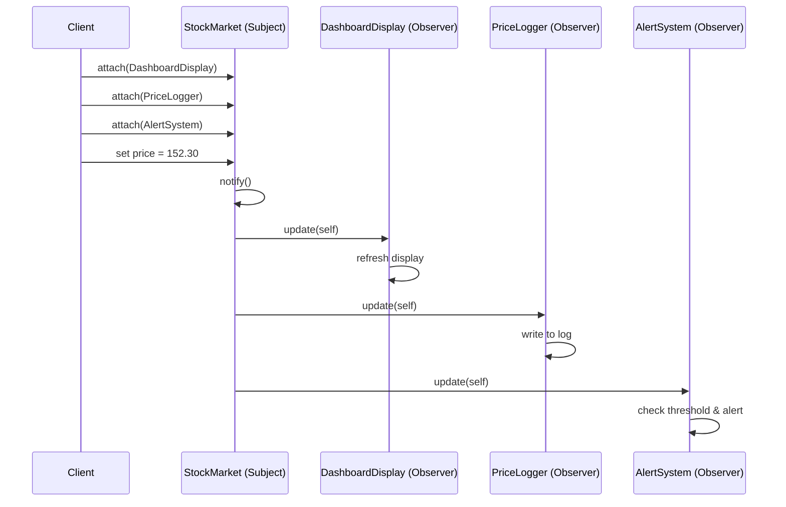

# Observer Pattern

> Define a one-to-many dependency between objects so that when one object changes state, all its dependents are automatically notified and updated -- the backbone of every event-driven system you have ever used.

## Table of Contents
- [Core Concepts](#core-concepts)
- [Code Examples](#code-examples)
- [Common Pitfalls](#common-pitfalls)
- [Key Takeaways](#key-takeaways)
- [Exercises](#exercises)

## Core Concepts

### Intent

#### What

The Observer pattern establishes a subscription mechanism that lets multiple objects (observers) listen for and react to events happening in another object (the subject). When the subject's state changes, every registered observer is notified automatically.

#### How

The subject maintains a list of observers. When something interesting happens, the subject iterates through the list and calls a notification method on each observer. Observers can attach or detach themselves at runtime, making the relationship dynamic.

#### Why It Matters

Without Observer, you either poll for changes (wasteful and slow) or hard-code the dependencies (tight coupling). Observer decouples the "thing that changes" from the "things that care about the change." This is why every GUI framework, message broker, and reactive library is built on some variation of this pattern.

### Participants

#### What

| Participant | Responsibility |
|---|---|
| **Subject** (Publisher) | Maintains a list of observers and provides methods to attach, detach, and notify them. Knows nothing about what observers do with the data. |
| **ConcreteSubject** | Stores the state of interest. When its state changes, it triggers notification to all registered observers. |
| **Observer** (Subscriber) | Defines an updating interface -- a contract that all concrete observers must fulfill. |
| **ConcreteObserver** | Implements the update interface to keep its own state consistent with the subject's state. Each observer decides independently what to do with the notification. |

#### How

1. Concrete observers register themselves with a concrete subject.
2. The subject's state changes (e.g., a stock price updates).
3. The subject calls `notify()`, which iterates over all registered observers.
4. Each observer's `update()` method is called, receiving the new state (push model) or a reference to the subject (pull model).

#### Why It Matters

The participant separation enforces the Open/Closed Principle: you can add new observers without modifying the subject. A stock price feed does not know -- and should not know -- whether it is feeding a dashboard, a logger, or an alert system.

### Structure



### Notification Flow



### Push vs Pull Model

#### What

There are two approaches to delivering data from subject to observer:

- **Push model**: The subject sends the changed data directly as arguments to `update()`. Observers get exactly what the subject decides to send.
- **Pull model**: The subject sends a reference to itself. Observers query the subject for whatever data they need.

#### How

Push is simpler but couples the update signature to the data shape. Pull is more flexible -- each observer can request different pieces of state -- but requires observers to know the subject's interface.

#### Why It Matters

In practice, the pull model scales better. When a subject has many state attributes, push forces you to either send everything (wasteful) or maintain multiple update signatures (messy). With pull, each observer is responsible for fetching what it needs.

### When NOT to Use Observer

- **Simple one-to-one relationships**: If only one object ever cares about the change, a direct method call is clearer than the Observer machinery.
- **Order-dependent updates**: Observer does not guarantee notification order. If observer B must run after observer A, you need a different mechanism (e.g., Chain of Responsibility or explicit sequencing).
- **Synchronous cascading updates**: If observer A's reaction triggers a state change on the subject, which notifies observer B, which triggers another change... you get infinite loops or unpredictable cascades. Use event queues or debouncing instead.
- **Performance-critical hot paths**: Iterating over a list of observers and calling virtual methods has overhead. In tight inner loops (game physics, signal processing), direct calls or data-oriented designs are better.

### Real-World Anchoring

#### What

Observer is everywhere:

- **Python's `signal` module**: `signal.signal(SIGINT, handler)` -- you register a handler (observer) for a signal (subject event).
- **Django signals**: `post_save.connect(my_handler, sender=MyModel)` -- the ORM is the subject, your handler is the observer.
- **JavaScript event listeners**: `element.addEventListener('click', handler)` -- the DOM element is the subject.
- **RxPY (ReactiveX for Python)**: Observables emit values, observers subscribe and react. The entire library is a formalization of Observer.

#### Why It Matters

Recognizing Observer in the wild helps you use these frameworks correctly. When you understand that Django signals are just Observer, you know the tradeoffs: unordered execution, potential for hidden side effects, difficulty in debugging "who reacted to what."

## Code Examples

### Stock Price Monitor with Multiple Observers

```python
from abc import ABC, abstractmethod
from dataclasses import dataclass, field
from datetime import datetime


class Observer(ABC):
    """Abstract observer -- all subscribers implement this interface."""

    @abstractmethod
    def update(self, subject: "StockMarket") -> None:
        """Called by the subject when state changes."""
        ...


class StockMarket:
    """Concrete subject -- tracks stock prices and notifies observers on change."""

    def __init__(self) -> None:
        self._observers: list[Observer] = []
        self._prices: dict[str, float] = {}
        self._last_updated_ticker: str = ""

    def attach(self, observer: Observer) -> None:
        """Register an observer. Idempotent -- won't add duplicates."""
        if observer not in self._observers:
            self._observers.append(observer)

    def detach(self, observer: Observer) -> None:
        """Unregister an observer. Silent no-op if not found."""
        self._observers = [o for o in self._observers if o is not observer]

    def notify(self) -> None:
        """Push notification to every registered observer."""
        for observer in self._observers:
            observer.update(self)

    def set_price(self, ticker: str, price: float) -> None:
        """Update a stock price and trigger notification."""
        self._prices[ticker] = price
        self._last_updated_ticker = ticker
        # State changed -- notify all observers
        self.notify()

    @property
    def last_updated_ticker(self) -> str:
        return self._last_updated_ticker

    def get_price(self, ticker: str) -> float | None:
        """Pull model -- observers call this to get the data they need."""
        return self._prices.get(ticker)


class DashboardDisplay(Observer):
    """Concrete observer -- renders current prices to a display."""

    def __init__(self, name: str) -> None:
        self._name = name

    def update(self, subject: StockMarket) -> None:
        ticker = subject.last_updated_ticker
        price = subject.get_price(ticker)
        # In a real app, this would update a GUI widget
        print(f"[{self._name}] {ticker}: ${price:,.2f}")


class PriceLogger(Observer):
    """Concrete observer -- logs every price change to an audit trail."""

    def __init__(self) -> None:
        self._log: list[str] = []

    def update(self, subject: StockMarket) -> None:
        ticker = subject.last_updated_ticker
        price = subject.get_price(ticker)
        timestamp = datetime.now().isoformat(timespec="seconds")
        entry = f"{timestamp} | {ticker} = ${price:,.2f}"
        self._log.append(entry)
        print(f"[Logger] Recorded: {entry}")

    def get_log(self) -> list[str]:
        return list(self._log)


@dataclass
class AlertRule:
    """Configuration for a price alert threshold."""
    ticker: str
    threshold: float
    direction: str  # "above" or "below"


class AlertSystem(Observer):
    """Concrete observer -- fires alerts when prices cross configured thresholds."""

    def __init__(self, rules: list[AlertRule] | None = None) -> None:
        self._rules: list[AlertRule] = rules or []

    def add_rule(self, rule: AlertRule) -> None:
        self._rules.append(rule)

    def update(self, subject: StockMarket) -> None:
        ticker = subject.last_updated_ticker
        price = subject.get_price(ticker)
        if price is None:
            return

        for rule in self._rules:
            if rule.ticker != ticker:
                continue
            if rule.direction == "above" and price > rule.threshold:
                print(f"[ALERT] {ticker} is ${price:,.2f} -- ABOVE threshold ${rule.threshold:,.2f}!")
            elif rule.direction == "below" and price < rule.threshold:
                print(f"[ALERT] {ticker} is ${price:,.2f} -- BELOW threshold ${rule.threshold:,.2f}!")


# --- Usage ---

def main() -> None:
    # Create the subject
    market = StockMarket()

    # Create observers with different concerns
    dashboard = DashboardDisplay("Main Dashboard")
    logger = PriceLogger()
    alerts = AlertSystem([
        AlertRule(ticker="AAPL", threshold=200.0, direction="above"),
        AlertRule(ticker="TSLA", threshold=150.0, direction="below"),
    ])

    # Subscribe observers -- they don't know about each other
    market.attach(dashboard)
    market.attach(logger)
    market.attach(alerts)

    # Simulate price changes -- all observers react automatically
    print("--- AAPL update ---")
    market.set_price("AAPL", 195.50)

    print("\n--- AAPL crosses alert threshold ---")
    market.set_price("AAPL", 205.75)

    print("\n--- TSLA update ---")
    market.set_price("TSLA", 148.20)

    # Dynamically detach the dashboard -- logger and alerts continue
    print("\n--- Dashboard detached ---")
    market.detach(dashboard)
    market.set_price("AAPL", 210.00)


if __name__ == "__main__":
    main()
```

### Protocol-Based Observer (Pythonic Alternative)

```python
from typing import Protocol, runtime_checkable


@runtime_checkable
class PriceObserver(Protocol):
    """Structural subtyping -- any object with this method qualifies as an observer.
    No inheritance required. This is more Pythonic than ABC for simple interfaces."""

    def on_price_change(self, ticker: str, price: float) -> None: ...


class SimplePriceFeed:
    """Subject using Protocol-based observers -- no ABC inheritance needed."""

    def __init__(self) -> None:
        self._observers: list[PriceObserver] = []

    def subscribe(self, observer: PriceObserver) -> None:
        if isinstance(observer, PriceObserver):  # runtime_checkable validates duck typing
            self._observers.append(observer)

    def publish(self, ticker: str, price: float) -> None:
        for obs in self._observers:
            obs.on_price_change(ticker, price)


class ConsoleDisplay:
    """No inheritance needed -- just implement the method signature."""

    def on_price_change(self, ticker: str, price: float) -> None:
        print(f"Display: {ticker} = ${price:.2f}")


class SlackNotifier:
    """Another observer -- completely independent, no shared base class."""

    def __init__(self, channel: str) -> None:
        self._channel = channel

    def on_price_change(self, ticker: str, price: float) -> None:
        print(f"Slack #{self._channel}: {ticker} updated to ${price:.2f}")


def main() -> None:
    feed = SimplePriceFeed()
    feed.subscribe(ConsoleDisplay())
    feed.subscribe(SlackNotifier("trading"))

    feed.publish("GOOG", 178.45)


if __name__ == "__main__":
    main()
```

## Common Pitfalls

### Pitfall 1: Forgetting to Detach Observers (Memory Leak)

```python
# BAD — Observer stays registered after it's no longer needed
class TemporaryDisplay(Observer):
    def update(self, subject: StockMarket) -> None:
        print("Temporary display update")

def create_temporary_view(market: StockMarket) -> None:
    temp = TemporaryDisplay()
    market.attach(temp)
    # temp goes out of scope but market still holds a reference to it
    # The observer is NEVER garbage collected and keeps receiving updates

# GOOD — Always detach when the observer's lifecycle ends
def create_temporary_view(market: StockMarket) -> None:
    temp = TemporaryDisplay()
    market.attach(temp)
    try:
        # ... use the temporary view ...
        pass
    finally:
        market.detach(temp)  # Clean up the subscription
```

### Pitfall 2: Modifying the Observer List During Notification

```python
# BAD — Detaching inside update() mutates the list while iterating
class SelfRemovingObserver(Observer):
    def update(self, subject: StockMarket) -> None:
        print("One-shot observer firing")
        subject.detach(self)  # Modifies _observers mid-iteration -- skips next observer!

# GOOD — Iterate over a copy of the observer list
class StockMarketSafe:
    def notify(self) -> None:
        # Snapshot the list before iterating -- safe even if observers detach themselves
        for observer in list(self._observers):
            observer.update(self)
```

### Pitfall 3: Tight Coupling via Push Model

```python
# BAD — Subject pushes specific data, coupling the interface to the data shape
class Observer(ABC):
    @abstractmethod
    def update(self, ticker: str, price: float, volume: int, timestamp: str) -> None:
        ...
    # Adding a new field (e.g., market_cap) requires changing EVERY observer

# GOOD — Use pull model: pass the subject, let observers query what they need
class Observer(ABC):
    @abstractmethod
    def update(self, subject: "StockMarket") -> None:
        ...
    # Observers call subject.get_price(), subject.get_volume(), etc.
    # Adding new fields to the subject doesn't break existing observers
```

### Pitfall 4: No Guard Against Duplicate Subscriptions

```python
# BAD — Same observer added twice gets notified twice
market.attach(dashboard)
market.attach(dashboard)  # Oops -- dashboard.update() called twice per notification

# GOOD — Guard against duplicates in attach()
def attach(self, observer: Observer) -> None:
    if observer not in self._observers:
        self._observers.append(observer)
```

## Key Takeaways

- Observer decouples the producer of events from the consumers. The subject knows it has subscribers, but not what they do -- this is the key to extensibility.
- Prefer the **pull model** (pass `self` to observers) over the push model for flexibility. Observers should fetch what they need rather than being force-fed a fixed data shape.
- Always manage observer lifecycle: detach when done, guard against duplicates, and iterate over a **copy** of the observer list during notification.
- In Python, `Protocol` often replaces `ABC` for the observer interface -- it enables duck typing without requiring inheritance, which is more idiomatic.
- Observer is the foundation of reactive programming (RxPY), event-driven architectures (Django signals), and every GUI framework's event system.

## Exercises

1. **Event filtering**: Extend the `StockMarket` example so that observers can subscribe to specific tickers only (e.g., "only notify me about AAPL changes"). How does this change the `attach()` signature and the `notify()` logic?

2. **Async notification**: Rewrite the `notify()` method to dispatch observer updates using `asyncio` so that slow observers (e.g., one that calls an external API) do not block fast ones. What new problems does this introduce?

3. **Undo support**: Design an observer system for a text editor where the subject is the document and observers include a change history tracker. The tracker must support undo -- rolling back the document to a previous state. How do you prevent the undo operation from triggering another round of notifications?

4. **Weak references**: The memory leak pitfall is a real problem in long-lived systems. Rewrite the subject to store observers using `weakref.WeakSet` instead of a list. What are the tradeoffs? What happens if an observer has no other references?

5. **Observer ordering**: You have three observers: `Validator`, `Transformer`, and `Persister`. The `Transformer` must run after `Validator`, and `Persister` must run after `Transformer`. The basic Observer pattern does not guarantee order. Design a solution that preserves the Observer pattern's decoupling while enforcing execution order.

---
up:: [Schedule](../../Schedule.md)
#type/learning #source/self-study #status/seed
