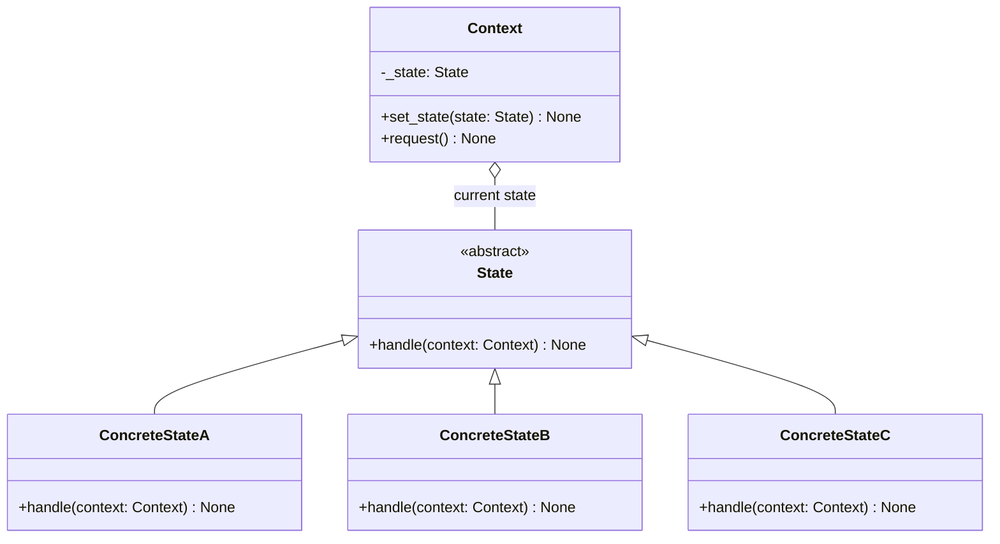
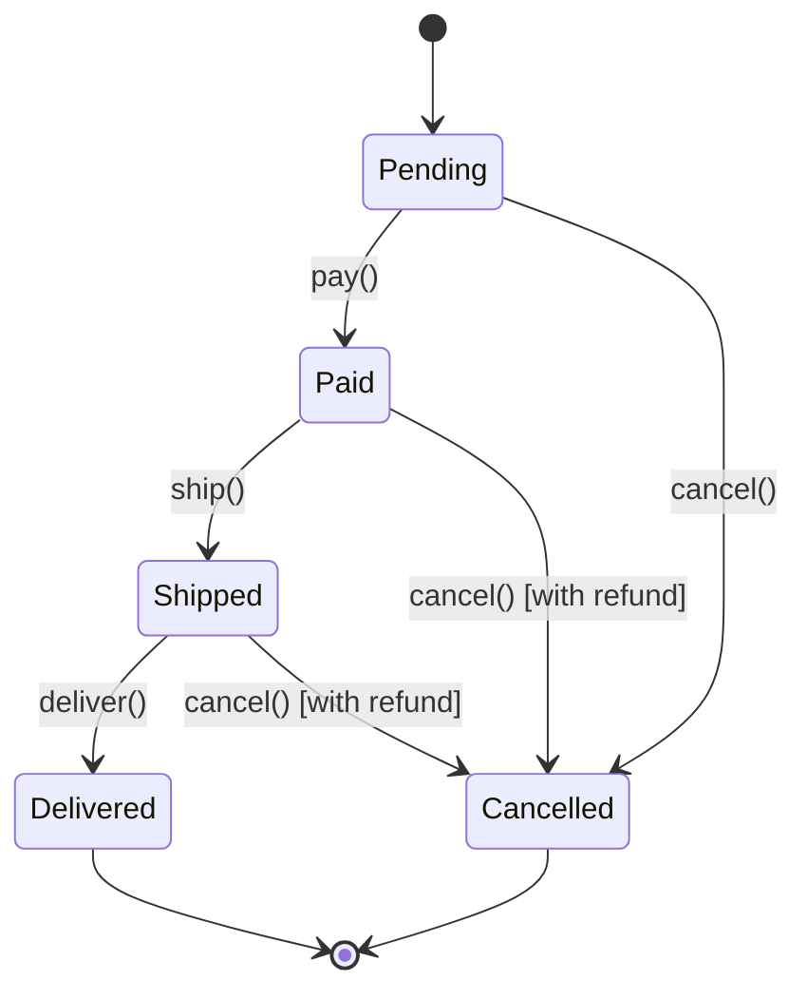

# State Pattern

> Allow an object to alter its behavior when its internal state changes, making the object appear to change its class -- the clean alternative to sprawling if/else chains that check state at every turn.

## Table of Contents
- [Core Concepts](#core-concepts)
- [Code Examples](#code-examples)
- [Common Pitfalls](#common-pitfalls)
- [Key Takeaways](#key-takeaways)
- [Exercises](#exercises)

## Core Concepts

### Intent

#### What

The State pattern lets an object change its behavior at runtime by delegating state-specific logic to separate state objects. Instead of a monolithic class with conditionals like `if self.state == "pending": ...` scattered everywhere, each state becomes its own class that encapsulates the behavior for that state.

#### How

The object (called the Context) holds a reference to a current state object. When a method is called on the context, it delegates to the current state. The state object can replace itself with a different state on the context, causing the context's behavior to change on the next call.

#### Why It Matters

State machines are everywhere: order processing, network connections, document workflows, game characters. Without this pattern, adding a new state means hunting through every method in the class to add another `elif` branch. With State, adding a new state means adding a new class -- existing states are untouched. This is the Open/Closed Principle in action.

### Participants

#### What

| Participant | Responsibility |
|---|---|
| **Context** | Maintains a reference to the current state object. Delegates state-specific behavior to it. Provides an interface for clients and for states to trigger transitions. |
| **State** (interface/ABC) | Defines the interface for state-specific behavior. Every method that varies by state appears here. |
| **ConcreteState** | Implements the behavior for a specific state. Handles transitions by setting the context's state to a different ConcreteState. |

#### How

1. Client calls a method on the Context (e.g., `order.pay()`).
2. Context delegates to `self._state.pay(context=self)`.
3. The current ConcreteState executes state-specific logic (e.g., PendingState processes the payment).
4. The ConcreteState transitions the context to the next state (e.g., sets context's state to PaidState).
5. Future calls to `order.ship()` now delegate to PaidState, which has different behavior.

#### Why It Matters

The context never needs to know which state it is in -- it just delegates. Each state class is a self-contained unit that knows its own behavior and its valid transitions. This makes state machines debuggable, testable, and extensible.

### Structure



### State Transitions for Order Processing



### State vs Strategy Pattern

#### What

State and Strategy are structurally identical -- both use composition to delegate behavior to an interchangeable object. The difference is in **intent and who controls the switching**:

| Aspect | State | Strategy |
|---|---|---|
| **Intent** | Behavior changes as internal state evolves | Client selects an algorithm |
| **Who switches** | State objects switch themselves (automatic transitions) | Client code switches the strategy (explicit selection) |
| **States know each other** | Yes -- each state knows which state comes next | No -- strategies are independent and unaware of each other |
| **Lifecycle** | States transition in a defined flow (state machine) | Strategies are set once or swapped on demand |

#### Why It Matters

If you find yourself writing a Strategy where the strategies trigger transitions to other strategies, you actually need State. If your "states" are independent algorithms with no transition logic, you actually need Strategy. Misidentifying which pattern you need leads to convoluted designs.

### When NOT to Use State

- **Two or three simple states**: If your object has only a couple of states with trivial behavior differences, an `if/elif` is clearer than creating a class hierarchy. State adds structural overhead that pays off at four or more states.
- **States with no behavior differences**: If the states only affect data (e.g., a flag that changes a color), you do not need separate classes -- a simple enum suffices.
- **States that never transition**: If the behavior is set once and never changes, this is Strategy, not State.
- **Overly fine-grained states**: If you decompose too aggressively (one state for every possible micro-variation), the number of state classes explodes and the transition graph becomes impossible to follow.

### Real-World Anchoring

#### What

- **TCP connection states**: `LISTEN`, `SYN_SENT`, `ESTABLISHED`, `FIN_WAIT`, `CLOSED` -- each state handles incoming packets differently and transitions based on the packet type. This is a textbook state machine.
- **Workflow engines (Airflow, Prefect)**: Tasks transition through `queued -> running -> success/failed`. Each state determines what operations are valid.
- **Game character states**: A character in `Idle`, `Running`, `Jumping`, `Attacking` states has completely different behavior for the same input (pressing the attack button while jumping triggers an aerial attack, while idle triggers a ground attack).
- **Django/DRF serializer validation**: Not a direct State pattern, but the concept of "an object behaves differently depending on whether it has been validated" is the same intuition.

#### Why It Matters

When you see `if self.status == "running": ... elif self.status == "paused": ...` in real code, you should immediately think "State pattern." It is one of the strongest signals that a refactoring opportunity exists.

## Code Examples

### Order Processing System

```python
from __future__ import annotations

from abc import ABC, abstractmethod
from dataclasses import dataclass, field
from datetime import datetime


class OrderState(ABC):
    """Abstract state -- defines every action an order can receive.
    Invalid actions for a given state raise errors by default."""

    @abstractmethod
    def get_status(self) -> str:
        """Return the human-readable status name."""
        ...

    def pay(self, context: Order) -> None:
        raise InvalidOrderAction(f"Cannot pay: order is {self.get_status()}")

    def ship(self, context: Order) -> None:
        raise InvalidOrderAction(f"Cannot ship: order is {self.get_status()}")

    def deliver(self, context: Order) -> None:
        raise InvalidOrderAction(f"Cannot deliver: order is {self.get_status()}")

    def cancel(self, context: Order) -> None:
        raise InvalidOrderAction(f"Cannot cancel: order is {self.get_status()}")


class InvalidOrderAction(Exception):
    """Raised when an action is invalid for the current order state."""
    pass


class PendingState(OrderState):
    """Order has been created but not yet paid."""

    def get_status(self) -> str:
        return "Pending"

    def pay(self, context: Order) -> None:
        # Validate payment (in reality, this would call a payment gateway)
        if context.total <= 0:
            raise ValueError("Order total must be positive to process payment")
        context.add_event("Payment processed")
        # Transition to the next state -- THIS is what makes it the State pattern
        context.set_state(PaidState())

    def cancel(self, context: Order) -> None:
        context.add_event("Order cancelled (no payment to refund)")
        context.set_state(CancelledState())


class PaidState(OrderState):
    """Payment received, awaiting shipment."""

    def get_status(self) -> str:
        return "Paid"

    def ship(self, context: Order) -> None:
        if not context.shipping_address:
            raise ValueError("Shipping address required before shipping")
        context.add_event(f"Shipped to {context.shipping_address}")
        context.set_state(ShippedState())

    def cancel(self, context: Order) -> None:
        # Paid orders require a refund on cancellation
        context.add_event(f"Order cancelled -- refund of ${context.total:,.2f} issued")
        context.set_state(CancelledState())


class ShippedState(OrderState):
    """Order is in transit."""

    def get_status(self) -> str:
        return "Shipped"

    def deliver(self, context: Order) -> None:
        context.add_event("Package delivered")
        context.set_state(DeliveredState())

    def cancel(self, context: Order) -> None:
        # Shipped orders can be cancelled (return/refund process)
        context.add_event(f"Order cancelled in transit -- return initiated, refund of ${context.total:,.2f}")
        context.set_state(CancelledState())


class DeliveredState(OrderState):
    """Order has been delivered. Terminal state."""

    def get_status(self) -> str:
        return "Delivered"

    # No actions override the base class -- pay, ship, deliver, cancel all raise errors


class CancelledState(OrderState):
    """Order has been cancelled. Terminal state."""

    def get_status(self) -> str:
        return "Cancelled"

    # Terminal state -- all actions raise errors via the base class defaults


@dataclass
class Order:
    """Context -- holds the current state and delegates behavior to it."""

    order_id: str
    total: float
    shipping_address: str = ""
    _state: OrderState = field(default_factory=PendingState)
    _events: list[str] = field(default_factory=list)

    def set_state(self, state: OrderState) -> None:
        """Called by state objects to transition to a new state."""
        old_status = self._state.get_status()
        self._state = state
        new_status = self._state.get_status()
        print(f"  Order {self.order_id}: {old_status} -> {new_status}")

    def add_event(self, event: str) -> None:
        timestamp = datetime.now().isoformat(timespec="seconds")
        self._events.append(f"[{timestamp}] {event}")

    # --- Public interface: delegates everything to the current state ---

    @property
    def status(self) -> str:
        return self._state.get_status()

    def pay(self) -> None:
        self._state.pay(self)

    def ship(self) -> None:
        self._state.ship(self)

    def deliver(self) -> None:
        self._state.deliver(self)

    def cancel(self) -> None:
        self._state.cancel(self)

    def get_history(self) -> list[str]:
        return list(self._events)


def main() -> None:
    # Happy path: pending -> paid -> shipped -> delivered
    order = Order(order_id="ORD-001", total=99.99, shipping_address="123 Main St")
    print(f"Status: {order.status}")  # Pending

    order.pay()
    print(f"Status: {order.status}")  # Paid

    order.ship()
    print(f"Status: {order.status}")  # Shipped

    order.deliver()
    print(f"Status: {order.status}")  # Delivered

    # Try to ship a delivered order -- should raise an error
    try:
        order.ship()
    except InvalidOrderAction as e:
        print(f"Error: {e}")

    print()

    # Cancellation path: pending -> paid -> cancelled (with refund)
    order2 = Order(order_id="ORD-002", total=49.99)
    order2.pay()
    order2.cancel()  # Should mention refund
    print(f"Status: {order2.status}")  # Cancelled

    # Print event history
    print("\nOrder history:")
    for event in order2.get_history():
        print(f"  {event}")


if __name__ == "__main__":
    main()
```

### Protocol-Based State (Lightweight Alternative)

```python
from __future__ import annotations

from typing import Protocol


class DocumentState(Protocol):
    """Structural subtyping -- no inheritance required.
    Use this approach when the state interface is simple and
    you prefer duck typing over class hierarchies."""

    def edit(self, doc: Document, content: str) -> None: ...
    def review(self, doc: Document) -> None: ...
    def publish(self, doc: Document) -> None: ...
    def status_name(self) -> str: ...


class DraftState:
    """Document is being written. Edits are allowed."""

    def status_name(self) -> str:
        return "Draft"

    def edit(self, doc: Document, content: str) -> None:
        doc.content = content
        print(f"  Draft updated: {content[:50]}...")

    def review(self, doc: Document) -> None:
        if not doc.content:
            raise ValueError("Cannot submit empty document for review")
        doc.set_state(ReviewState())

    def publish(self, doc: Document) -> None:
        raise RuntimeError("Cannot publish a draft -- submit for review first")


class ReviewState:
    """Document is under review. No edits allowed."""

    def status_name(self) -> str:
        return "Under Review"

    def edit(self, doc: Document, content: str) -> None:
        raise RuntimeError("Cannot edit during review")

    def review(self, doc: Document) -> None:
        # Reviewer approves -> transition to published
        doc.set_state(PublishedState())

    def publish(self, doc: Document) -> None:
        raise RuntimeError("Cannot publish directly -- must pass review")


class PublishedState:
    """Document is published. Creates a new draft on edit."""

    def status_name(self) -> str:
        return "Published"

    def edit(self, doc: Document, content: str) -> None:
        # Editing a published doc creates a new version (draft)
        print("  Creating new draft version from published document")
        doc.content = content
        doc.version += 1
        doc.set_state(DraftState())

    def review(self, doc: Document) -> None:
        raise RuntimeError("Published document -- already reviewed")

    def publish(self, doc: Document) -> None:
        raise RuntimeError("Already published")


class Document:
    """Context for the document workflow state machine."""

    def __init__(self, title: str) -> None:
        self.title: str = title
        self.content: str = ""
        self.version: int = 1
        self._state: DocumentState = DraftState()

    def set_state(self, state: DocumentState) -> None:
        old = self._state.status_name()
        self._state = state
        new = self._state.status_name()
        print(f"  [{self.title}] {old} -> {new}")

    @property
    def status(self) -> str:
        return self._state.status_name()

    def edit(self, content: str) -> None:
        self._state.edit(self, content)

    def review(self) -> None:
        self._state.review(self)

    def publish(self) -> None:
        self._state.publish(self)


def main() -> None:
    doc = Document("Design Patterns Guide")

    doc.edit("Chapter 1: Introduction to State Pattern...")
    print(f"Status: {doc.status}")  # Draft

    doc.review()  # Submit for review
    print(f"Status: {doc.status}")  # Under Review

    doc.review()  # Reviewer approves
    print(f"Status: {doc.status}")  # Published

    # Editing a published doc starts a new draft version
    doc.edit("Chapter 1 (revised): Better introduction...")
    print(f"Status: {doc.status}, Version: {doc.version}")  # Draft, v2


if __name__ == "__main__":
    main()
```

## Common Pitfalls

### Pitfall 1: Checking State Type Instead of Delegating

```python
# BAD — Defeats the entire purpose of the State pattern
class Order:
    def ship(self) -> None:
        if isinstance(self._state, PaidState):
            # ... shipping logic ...
            self._state = ShippedState()
        elif isinstance(self._state, PendingState):
            raise ValueError("Must pay first")
        elif isinstance(self._state, ShippedState):
            raise ValueError("Already shipped")
        # You just recreated the if/elif chain the pattern was supposed to eliminate

# GOOD — Delegate unconditionally; the state knows what to do
class Order:
    def ship(self) -> None:
        self._state.ship(self)  # PaidState ships; others raise errors
```

### Pitfall 2: State Objects Holding Mutable Shared State

```python
# BAD — Sharing a single state instance across multiple contexts
paid_state = PaidState()  # One instance shared by all orders
order_a.set_state(paid_state)
order_b.set_state(paid_state)
# If PaidState holds per-order data (retry count, timestamp), it's now corrupted

# GOOD — Create fresh state instances for each transition
class PendingState(OrderState):
    def pay(self, context: Order) -> None:
        context.set_state(PaidState())  # New instance every time
```

### Pitfall 3: Transitions Scattered Across Context and States

```python
# BAD — Some transitions in the context, some in state objects
class Order:
    def pay(self) -> None:
        self._state.pay(self)
        # Wait, but also:
        if self._state.get_status() == "Paid":
            self._state = ShippedState()  # Transition logic in BOTH places!

# GOOD — All transition logic lives in the state objects exclusively
class PaidState(OrderState):
    def ship(self, context: Order) -> None:
        context.set_state(ShippedState())  # Single source of truth for transitions
```

### Pitfall 4: Missing Default Error Behavior

```python
# BAD — Every state must implement every method, even invalid ones
class PendingState(OrderState):
    def deliver(self, context: Order) -> None:
        pass  # Silently does nothing -- bugs hide here

# GOOD — Base class raises errors by default; states only override valid actions
class OrderState(ABC):
    def deliver(self, context: Order) -> None:
        raise InvalidOrderAction(f"Cannot deliver: order is {self.get_status()}")
    # States only override methods that ARE valid for that state
```

## Key Takeaways

- The State pattern replaces conditional logic (`if state == X`) with polymorphism -- each state is a class that knows its own behavior and valid transitions.
- State objects control transitions, not the context. This centralizes the state machine logic and makes it auditable.
- State and Strategy are structurally identical but differ in intent: State objects transition automatically based on internal logic; Strategy objects are selected externally by the client.
- Use State when you have four or more states with distinct behavior. For simpler cases, an enum and a few conditionals are perfectly fine -- do not over-engineer.
- Always provide sensible defaults in the base State class (raising errors for invalid actions) so that concrete states only need to implement what they explicitly allow.

## Exercises

1. **Add a return state**: Extend the order processing example with a `ReturnedState` that can only be reached from `DeliveredState`. A returned order should trigger a refund and transition to a `RefundedState`. How many existing state classes need to change?

2. **State history**: Modify the `Order` context to maintain a history of all states it has been in (not just events). Add an `undo()` method that reverts to the previous state. What challenges does this create for states that have side effects (like issuing a refund)?

3. **Guard conditions**: In the shipping example, add a guard condition: an order can only be shipped if the `shipping_address` is validated (not just non-empty, but passes a validation function). Where should this validation live -- in the state, the context, or a separate validator? Justify your choice.

4. **State pattern vs enum**: Rewrite the order processing example using a simple enum for states and `match` statements (Python 3.10+) instead of the State pattern. Compare the two implementations: which is easier to read? Which is easier to extend with a new state? At what complexity point does the State pattern become the better choice?

5. **Concurrent state machines**: Two orders share a single inventory system. When Order A transitions to `Shipped`, it must decrement inventory. If inventory is zero, Order B cannot transition to `Shipped`. Design the interaction between the State pattern and a shared resource. Where do you put the inventory check?

---
up:: [Schedule](../../Schedule.md)
#type/learning #source/self-study #status/seed
