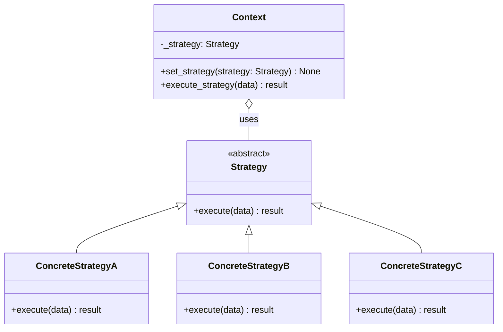

# Strategy Pattern

> Define a family of algorithms, encapsulate each one in its own class, and make them interchangeable -- so the code that uses an algorithm never needs to know which specific algorithm it is running.

## Table of Contents
- [Core Concepts](#core-concepts)
- [Code Examples](#code-examples)
- [Common Pitfalls](#common-pitfalls)
- [Key Takeaways](#key-takeaways)
- [Exercises](#exercises)

## Core Concepts

### Intent

#### What

The Strategy pattern extracts a family of algorithms into separate classes (strategies) that share a common interface. A context object holds a reference to one of these strategies and delegates the algorithmic work to it. The strategy can be swapped at runtime without the context knowing or caring which algorithm is being used.

#### How

1. Define a common interface (Strategy) that all algorithms must follow.
2. Implement each algorithm in its own class (ConcreteStrategy).
3. The Context holds a reference to one Strategy and delegates to it.
4. The client selects which strategy to inject into the context.

#### Why It Matters

Without Strategy, algorithm selection lives inside the context as a chain of `if/elif` blocks. Every time you add a new algorithm, you modify the context class -- violating the Open/Closed Principle. With Strategy, adding a new algorithm means creating a new class. The context, the client code, and all existing algorithms remain untouched.

### Participants

#### What

| Participant | Responsibility |
|---|---|
| **Strategy** (interface/ABC) | Declares the interface common to all supported algorithms. The context uses this interface to call the algorithm. |
| **ConcreteStrategy** | Implements one specific algorithm following the Strategy interface. Self-contained -- knows nothing about the context or other strategies. |
| **Context** | Holds a reference to a Strategy object. Delegates the algorithmic work to the current strategy. May provide data to the strategy via method parameters or by passing itself. |

#### How

The client creates a ConcreteStrategy and passes it to the Context (via constructor or setter). When the context needs to perform the algorithm, it calls `self._strategy.execute(data)`. The context never uses `isinstance` checks or conditionals to decide behavior -- it trusts the strategy interface.

#### Why It Matters

The participants enforce a clean separation: the context handles the workflow, the strategy handles the algorithm. This makes both independently testable. You can unit-test a payment strategy without setting up the entire order processing pipeline.

### Structure



### Strategy vs State

#### What

Strategy and State are structurally identical -- both delegate behavior to an interchangeable object held by a context. The critical difference is **who controls the switching and why**:

| Aspect | Strategy | State |
|---|---|---|
| **Who selects** | The client chooses the strategy explicitly | The state objects transition themselves automatically |
| **Awareness** | Strategies do not know about each other | States know about other states (they trigger transitions) |
| **Switching frequency** | Typically set once, or changed infrequently | Transitions happen as part of normal operation |
| **Purpose** | Select an algorithm from a family | Model an object whose behavior evolves through a lifecycle |

#### How

Ask yourself: "Does the object cycle through behaviors on its own?" If yes, use State. "Does the client pick a behavior from a menu?" If yes, use Strategy.

#### Why It Matters

Using State when you need Strategy (or vice versa) leads to awkward designs. If your "strategies" are triggering transitions to other strategies, you have disguised State. If your "states" are independent and never transition, you have over-engineered Strategy.

### When NOT to Use Strategy

- **Only one algorithm exists**: If there is only one way to do the thing and no foreseeable alternatives, Strategy is premature abstraction. Just inline the logic.
- **Algorithms are trivial**: If the "algorithm" is a one-liner (e.g., `tax = price * 0.1`), wrapping it in a class adds ceremony without benefit. A plain function or lambda suffices.
- **Client does not need to choose**: If the algorithm is always determined by internal state (not client selection), you likely need State, not Strategy.
- **Too many strategies with shared state**: If strategies need access to many context internals, the interface becomes bloated with parameters. Consider whether the algorithm truly belongs outside the context.

### Real-World Anchoring

#### What

- **Python's `sorted(key=...)`**: The `key` parameter is a strategy. You pass in a function that defines the comparison algorithm. The sorting context (Timsort) does not know or care what your key function does.
- **Django authentication backends**: `AUTHENTICATION_BACKENDS` is a list of strategy classes. Django iterates through them, and each backend implements `authenticate()` differently (database, LDAP, OAuth). Adding a new auth method means adding a new backend class.
- **FastAPI dependency injection**: `Depends(get_db)` injects a strategy for obtaining a database session. You can swap it for a test double without changing the endpoint code.
- **Compression algorithms**: `gzip`, `bzip2`, `lzma` all implement the same compress/decompress interface. A file archiver selects the strategy based on user preference.

#### Why It Matters

Strategy is one of the most natural patterns in Python because Python treats functions as first-class objects. Passing a `key` function to `sorted()` is Strategy without the class boilerplate. Understanding this connection helps you decide when you need full class-based Strategy versus a simple callable.

### Functions as Strategies (Pythonic Simplification)

#### What

In Python, you do not always need a class hierarchy for Strategy. Because functions are first-class objects, a strategy can be a plain callable. This is idiomatic when the strategy has no internal state.

#### How

Instead of `class CreditCardStrategy(PaymentStrategy)`, you can define `def pay_with_credit_card(amount: float) -> PaymentResult`. The context accepts a `Callable` instead of an ABC.

#### Why It Matters

Class-based Strategy is essential when strategies need configuration, internal state, or multiple methods. But for stateless single-method strategies, Python's callable-based approach is cleaner and avoids unnecessary boilerplate. Know both forms and choose the right one.

## Code Examples

### Payment Processing System (Class-Based Strategy)

```python
from __future__ import annotations

from abc import ABC, abstractmethod
from dataclasses import dataclass
from enum import Enum, auto


class PaymentStatus(Enum):
    SUCCESS = auto()
    FAILED = auto()
    PENDING = auto()


@dataclass
class PaymentResult:
    """Result returned by every payment strategy."""
    status: PaymentStatus
    transaction_id: str
    message: str


class PaymentStrategy(ABC):
    """Abstract strategy -- every payment method implements this interface."""

    @abstractmethod
    def pay(self, amount: float, currency: str = "USD") -> PaymentResult:
        """Process a payment. Returns a standardized result."""
        ...

    @abstractmethod
    def validate(self) -> bool:
        """Validate that the payment method is configured correctly."""
        ...


class CreditCardStrategy(PaymentStrategy):
    """Concrete strategy -- processes payments via credit card."""

    def __init__(self, card_number: str, expiry: str, cvv: str) -> None:
        self._card_number = card_number
        self._expiry = expiry
        self._cvv = cvv

    def validate(self) -> bool:
        # In production, this would call a card validation API
        if len(self._card_number) != 16 or not self._card_number.isdigit():
            return False
        if len(self._cvv) != 3 or not self._cvv.isdigit():
            return False
        return True

    def pay(self, amount: float, currency: str = "USD") -> PaymentResult:
        if not self.validate():
            return PaymentResult(
                status=PaymentStatus.FAILED,
                transaction_id="",
                message="Invalid card details",
            )
        # Simulate credit card processing
        masked_card = f"****-****-****-{self._card_number[-4:]}"
        return PaymentResult(
            status=PaymentStatus.SUCCESS,
            transaction_id=f"CC-{self._card_number[-4:]}-001",
            message=f"Charged {currency} {amount:.2f} to {masked_card}",
        )


class PayPalStrategy(PaymentStrategy):
    """Concrete strategy -- processes payments via PayPal."""

    def __init__(self, email: str) -> None:
        self._email = email

    def validate(self) -> bool:
        return "@" in self._email and "." in self._email.split("@")[-1]

    def pay(self, amount: float, currency: str = "USD") -> PaymentResult:
        if not self.validate():
            return PaymentResult(
                status=PaymentStatus.FAILED,
                transaction_id="",
                message="Invalid PayPal email",
            )
        return PaymentResult(
            status=PaymentStatus.SUCCESS,
            transaction_id=f"PP-{hash(self._email) % 10000:04d}",
            message=f"PayPal payment of {currency} {amount:.2f} from {self._email}",
        )


class BankTransferStrategy(PaymentStrategy):
    """Concrete strategy -- processes payments via bank transfer (async)."""

    def __init__(self, account_number: str, routing_number: str) -> None:
        self._account = account_number
        self._routing = routing_number

    def validate(self) -> bool:
        return len(self._account) >= 8 and len(self._routing) == 9

    def pay(self, amount: float, currency: str = "USD") -> PaymentResult:
        if not self.validate():
            return PaymentResult(
                status=PaymentStatus.FAILED,
                transaction_id="",
                message="Invalid bank account details",
            )
        # Bank transfers are typically asynchronous
        return PaymentResult(
            status=PaymentStatus.PENDING,
            transaction_id=f"BT-{self._account[-4:]}-001",
            message=f"Bank transfer of {currency} {amount:.2f} initiated (2-3 business days)",
        )


@dataclass
class CheckoutContext:
    """Context -- orchestrates checkout flow, delegates payment to the current strategy."""

    _strategy: PaymentStrategy

    def set_payment_method(self, strategy: PaymentStrategy) -> None:
        """Swap the payment strategy at runtime."""
        self._strategy = strategy

    def checkout(self, amount: float, currency: str = "USD") -> PaymentResult:
        """Process the payment using the current strategy.
        The context handles workflow; the strategy handles payment logic."""
        print(f"Processing {currency} {amount:.2f} payment...")

        # Validate before attempting payment
        if not self._strategy.validate():
            return PaymentResult(
                status=PaymentStatus.FAILED,
                transaction_id="",
                message="Payment method validation failed",
            )

        result = self._strategy.pay(amount, currency)
        print(f"  Result: {result.message}")
        return result


def main() -> None:
    # Client selects the strategy -- this is what distinguishes Strategy from State
    credit_card = CreditCardStrategy("4111111111111234", "12/28", "123")
    paypal = PayPalStrategy("user@example.com")
    bank = BankTransferStrategy("12345678", "021000021")

    checkout = CheckoutContext(_strategy=credit_card)

    # Process with credit card
    print("--- Credit Card ---")
    checkout.checkout(99.99)

    # Swap to PayPal at runtime -- same context, different algorithm
    print("\n--- PayPal ---")
    checkout.set_payment_method(paypal)
    checkout.checkout(49.99)

    # Swap to bank transfer
    print("\n--- Bank Transfer ---")
    checkout.set_payment_method(bank)
    checkout.checkout(500.00)


if __name__ == "__main__":
    main()
```

### Function-Based Strategy (Pythonic Alternative)

```python
from typing import Callable
from dataclasses import dataclass


# Strategy is just a callable type alias -- no ABC needed
SortStrategy = Callable[[list[dict[str, object]]], list[dict[str, object]]]


def sort_by_price(products: list[dict[str, object]]) -> list[dict[str, object]]:
    """Strategy: sort products by price ascending."""
    return sorted(products, key=lambda p: float(str(p["price"])))


def sort_by_rating(products: list[dict[str, object]]) -> list[dict[str, object]]:
    """Strategy: sort products by rating descending."""
    return sorted(products, key=lambda p: float(str(p["rating"])), reverse=True)


def sort_by_name(products: list[dict[str, object]]) -> list[dict[str, object]]:
    """Strategy: sort products alphabetically."""
    return sorted(products, key=lambda p: str(p["name"]).lower())


class ProductCatalog:
    """Context -- displays products using a pluggable sort strategy."""

    def __init__(self, products: list[dict[str, object]]) -> None:
        self._products = products

    def display(self, sort_strategy: SortStrategy) -> None:
        """Display products using the provided sort strategy.
        The strategy is passed per-call -- even simpler than storing it."""
        sorted_products = sort_strategy(self._products)
        for p in sorted_products:
            print(f"  {p['name']}: ${p['price']} ({p['rating']} stars)")


def main() -> None:
    products = [
        {"name": "Keyboard", "price": 79.99, "rating": 4.5},
        {"name": "Mouse", "price": 29.99, "rating": 4.8},
        {"name": "Monitor", "price": 349.99, "rating": 4.2},
        {"name": "Headset", "price": 59.99, "rating": 4.7},
    ]

    catalog = ProductCatalog(products)

    print("Sorted by price:")
    catalog.display(sort_by_price)

    print("\nSorted by rating:")
    catalog.display(sort_by_rating)

    print("\nSorted by name:")
    catalog.display(sort_by_name)

    # Lambda strategy for one-off use -- no need to define a named function
    print("\nSorted by price descending (lambda):")
    catalog.display(lambda ps: sorted(ps, key=lambda p: float(str(p["price"])), reverse=True))


if __name__ == "__main__":
    main()
```

## Common Pitfalls

### Pitfall 1: Using Conditionals to Select Behavior Instead of Strategy

```python
# BAD — The entire point of Strategy is to eliminate this
class Checkout:
    def process(self, method: str, amount: float) -> None:
        if method == "credit_card":
            print(f"Charging card ${amount:.2f}")
        elif method == "paypal":
            print(f"PayPal payment ${amount:.2f}")
        elif method == "bank":
            print(f"Bank transfer ${amount:.2f}")
        # Adding a new method requires modifying this class

# GOOD — Delegate to a strategy object
class Checkout:
    def __init__(self, strategy: PaymentStrategy) -> None:
        self._strategy = strategy

    def process(self, amount: float) -> None:
        self._strategy.pay(amount)  # New methods = new classes, no change here
```

### Pitfall 2: Strategy That Depends on Context Internals

```python
# BAD — Strategy reaches into context's private state
class DiscountStrategy(ABC):
    @abstractmethod
    def calculate(self, context: "Cart") -> float: ...

class VIPDiscount(DiscountStrategy):
    def calculate(self, context: "Cart") -> float:
        # Accessing private internals -- tight coupling defeats the purpose
        return sum(i._base_price * i._quantity for i in context._items) * 0.2

# GOOD — Pass the data the strategy needs as parameters
class DiscountStrategy(ABC):
    @abstractmethod
    def calculate(self, subtotal: float, item_count: int) -> float: ...

class VIPDiscount(DiscountStrategy):
    def calculate(self, subtotal: float, item_count: int) -> float:
        return subtotal * 0.2  # Strategy only knows what it's given
```

### Pitfall 3: Over-Engineering with Classes When a Function Suffices

```python
# BAD — Full class hierarchy for a one-method stateless strategy
class UpperCaseFormatter:
    def format(self, text: str) -> str:
        return text.upper()

class LowerCaseFormatter:
    def format(self, text: str) -> str:
        return text.lower()

class TitleCaseFormatter:
    def format(self, text: str) -> str:
        return text.title()

# GOOD — Use plain functions when strategy has no state
def format_text(text: str, formatter: Callable[[str], str] = str.upper) -> str:
    return formatter(text)

format_text("hello world", str.upper)   # "HELLO WORLD"
format_text("hello world", str.title)   # "Hello World"
```

### Pitfall 4: Not Providing a Default Strategy

```python
# BAD — Context requires a strategy at all times, even when a sensible default exists
class Sorter:
    def __init__(self, strategy: SortStrategy) -> None:
        self._strategy = strategy  # Caller must always provide one

# GOOD — Provide a reasonable default; allow override
class Sorter:
    def __init__(self, strategy: SortStrategy | None = None) -> None:
        # Default to natural ordering if no strategy is provided
        self._strategy = strategy or sorted
```

## Key Takeaways

- Strategy extracts algorithms into separate classes behind a common interface, making them interchangeable without modifying the context that uses them.
- The **client** chooses which strategy to use -- this is the key difference from State, where state objects transition themselves.
- In Python, prefer **function-based strategies** for stateless, single-method cases. Reserve class-based strategies for algorithms that need configuration, state, or multiple methods.
- Strategy is the composition-based counterpart to Template Method's inheritance-based approach. Favor Strategy (composition) when you want maximum flexibility; use Template Method when subclasses share most of the algorithm.
- Real-world examples abound: `sorted(key=...)`, Django auth backends, FastAPI dependencies. If you have ever passed a callback function, you have used Strategy.

## Exercises

1. **Shipping cost calculator**: Implement a Strategy-based shipping calculator with three strategies: StandardShipping ($5.99 flat), ExpressShipping ($14.99 flat), and FreeShipping (orders over $100). The context should be an `Order` that calculates total cost including shipping. Use the ABC-based approach.

2. **Validation strategies**: Design a form validation system where each field can have a different validation strategy (email validator, phone validator, required-field validator). A `FormValidator` context applies the appropriate strategy to each field. How do you handle fields that need multiple validations (e.g., required AND valid email)?

3. **Runtime strategy selection**: Build a text compression utility that lets the user choose a compression strategy at runtime from a registry. The registry maps string names to strategy instances. Implement at least two strategies using Python's `zlib` and `bz2` modules. How does the registry pattern complement Strategy?

4. **Function vs class**: Take the payment processing example and rewrite it using function-based strategies (callables). What do you lose compared to the class-based version? At what point would you switch back to classes?

5. **Strategy with caching**: Design a pricing strategy that caches its results (e.g., a currency conversion strategy that caches exchange rates). Where should the cache live -- in the strategy, in the context, or in a separate object? What happens when you swap strategies -- should the cache persist or reset?

---
up:: [Schedule](../../Schedule.md)
#type/learning #source/self-study #status/seed
