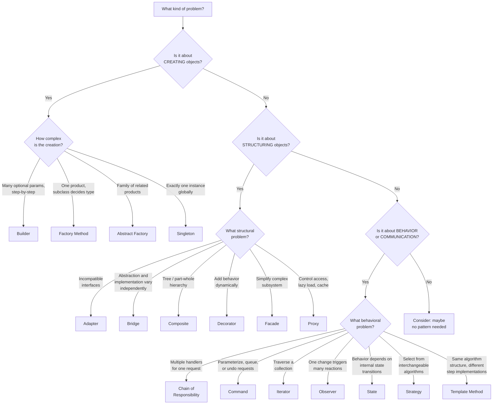

# Differentiating Design Patterns

> Knowing individual patterns is step one; the real skill is recognizing which pattern fits the problem in front of you -- and knowing when no pattern is needed at all.

## Table of Contents
- [Core Concepts](#core-concepts)
- [Code Examples](#code-examples)
- [Common Pitfalls](#common-pitfalls)
- [Key Takeaways](#key-takeaways)
- [Exercises](#exercises)

## Core Concepts

### Why Differentiation Is the Hard Part

#### What

Most design pattern resources teach each pattern in isolation. But in practice, the challenge is never "how does Observer work?" -- it is "I have a problem; which pattern, if any, solves it?" Patterns overlap in structure, differ in intent, and the wrong choice creates more complexity than it removes.

#### How

Pattern selection is a three-step process:

1. **Categorize the problem**: Is this about creating objects (Creational), organizing structure (Structural), or managing behavior/communication (Behavioral)?
2. **Narrow by problem characteristics**: Within the category, what are the specific constraints? Do you need runtime flexibility? One-to-many relationships? Step-by-step construction?
3. **Validate the fit**: Does the pattern's intent match your problem? If you are bending the pattern to fit, it is the wrong pattern.

#### Why It Matters

Choosing the wrong pattern is worse than using no pattern. A forced Factory where a constructor suffices adds ceremony. A misapplied State where Strategy belongs creates tangled transition logic. The goal is always **clarity** -- patterns should make code easier to understand, not harder.

### Behavioral Patterns Comparison

#### What

The behavioral patterns covered in this curriculum each solve a distinct problem in how objects communicate, divide responsibility, or change behavior. The table below is your decision matrix.

| Pattern | Problem It Solves | Key Mechanism | When to Use |
|---|---|---|---|
| **Chain of Responsibility** | Multiple handlers might process a request; which one handles it is determined at runtime | Linked chain of handler objects; request passes until one handles it | Middleware pipelines, event handling, logging chains |
| **Command** | Need to parameterize, queue, undo, or log requests as objects | Encapsulate a request as an object with `execute()` and optionally `undo()` | Undo/redo, task queues, macro recording, transaction systems |
| **Iterator** | Need to traverse a collection without exposing its internal structure | Provide a standard traversal interface (`__iter__`, `__next__`) | Any collection traversal; so fundamental it is built into most languages |
| **Observer** | One object changes and multiple others need to react | Subject maintains a subscriber list; notifies all on state change | Event systems, reactive UIs, pub/sub messaging |
| **State** | Object's behavior depends on its internal state and transitions are well-defined | Delegate behavior to state objects that replace themselves | Order workflows, TCP connections, game character states |
| **Strategy** | Need to select from a family of interchangeable algorithms | Inject an algorithm object; context delegates to it | Payment methods, sorting strategies, compression algorithms |
| **Template Method** | Multiple algorithms share the same structure but differ in specific steps | Base class defines skeleton; subclasses override steps via inheritance | Data pipelines, test frameworks, ETL processes |

#### Why It Matters

When you face a behavioral design problem, scan this table. "Does my problem involve multiple handlers for one request? Chain of Responsibility. Does it involve one change triggering multiple reactions? Observer." The table collapses hours of deliberation into seconds.

### All Categories Comparison

#### What

The three categories address fundamentally different concerns:

| Category | Core Question | Common Thread | Example Patterns |
|---|---|---|---|
| **Creational** | "How do I create objects?" | Decouple object creation from object use. Centralize creation logic so the rest of the system works with abstractions. | Factory Method, Abstract Factory, Builder, Singleton |
| **Structural** | "How do I compose objects?" | Organize classes and objects into larger structures while keeping them flexible and efficient. Adapt, wrap, and compose. | Adapter, Bridge, Composite, Decorator, Facade, Proxy |
| **Behavioral** | "How do objects communicate and divide responsibility?" | Define clear protocols for how objects interact, share work, and respond to changes. | Chain of Responsibility, Command, Iterator, Observer, State, Strategy, Template Method |

#### How

When analyzing a design problem:

- If the problem is "I need to create objects without specifying their exact class" -- look at Creational.
- If the problem is "I need to make incompatible things work together" or "I need to add behavior without changing existing classes" -- look at Structural.
- If the problem is "Objects need to communicate/coordinate" or "Behavior changes based on context" -- look at Behavioral.

#### Why It Matters

Category recognition is your first filter. It immediately eliminates two-thirds of the patterns from consideration. You would never reach for Strategy to solve an object creation problem, or for Factory to solve a communication problem.

### Decision Flowchart



### Pattern Selection Guide by Problem Type

#### What

Given a real-world problem description, which pattern fits?

| Problem Scenario | Pattern | Why This Pattern |
|---|---|---|
| "We need to support multiple payment methods that the user selects at checkout" | **Strategy** | Family of interchangeable algorithms, client selects |
| "When a user places an order, we need to send an email, update inventory, and notify the warehouse" | **Observer** | One event triggers multiple independent reactions |
| "An order goes through pending, paid, shipped, delivered stages with different behavior at each" | **State** | Object behavior changes with internal state transitions |
| "We need undo/redo for text editing operations" | **Command** | Encapsulate operations as objects that can be reversed |
| "HTTP requests pass through auth, rate-limit, logging, and finally the handler" | **Chain of Responsibility** | Request passes through a chain of handlers |
| "We read data, validate it, transform it, then write it -- same structure, different sources" | **Template Method** | Fixed algorithm skeleton, varying step implementations |
| "We need to integrate a legacy payment API that has a completely different interface from ours" | **Adapter** | Convert one interface to another |
| "We want to add logging, caching, and retry logic to API calls without modifying the API client" | **Decorator** | Wrap objects to add behavior dynamically |
| "Users can build complex search queries with many optional filters, sorting, and pagination" | **Builder** | Complex object construction with many optional parameters |
| "We need a simplified API for a subsystem that involves 5 different services" | **Facade** | Single entry point to a complex subsystem |

#### Why It Matters

This table is a cheat sheet for real-world decision-making. When a colleague describes a problem, pattern recognition should fire immediately: "That sounds like Chain of Responsibility" or "That is a Strategy problem."

### Commonly Confused Pattern Pairs

#### Strategy vs State

Both delegate behavior to an interchangeable object. The difference is **who controls the switching**:

- **Strategy**: The client explicitly selects the algorithm. Strategies are independent and unaware of each other. A payment processor does not switch itself from CreditCard to PayPal.
- **State**: State objects transition themselves. Each state knows which state comes next. An order in PaidState transitions to ShippedState automatically when `ship()` is called.

**Test**: "Does the object cycle through behaviors on its own?" -- State. "Does the client pick a behavior?" -- Strategy.

#### Adapter vs Facade

Both sit between your code and another system, but for different reasons:

- **Adapter**: Makes an incompatible interface compatible. One-to-one wrapping. The adapted class already does what you need -- it just has the wrong interface.
- **Facade**: Simplifies a complex subsystem. One-to-many wrapping. The subsystem has too much complexity -- you create a higher-level API that hides it.

**Test**: "Is the interface wrong?" -- Adapter. "Is the system too complex?" -- Facade.

#### Decorator vs Proxy

Both wrap an object and share its interface:

- **Decorator**: Adds new behavior. Decorators are stackable: `LoggingDecorator(CachingDecorator(service))`. The client knowingly composes them.
- **Proxy**: Controls access to the object. The proxy usually has the same lifecycle management as the object. The client often does not know it is using a proxy.

**Test**: "Am I adding features?" -- Decorator. "Am I controlling access (lazy-load, security, caching)?" -- Proxy.

#### Factory Method vs Abstract Factory

Both create objects, but at different scales:

- **Factory Method**: One method, one product. A class defers instantiation to subclasses. `create_button()` returns a `Button`.
- **Abstract Factory**: One factory, multiple related products. Creates a family of objects that must be consistent. A `UIFactory` creates `Button`, `Checkbox`, and `TextField` that all match the same platform.

**Test**: "Do I need one product?" -- Factory Method. "Do I need a family of related products?" -- Abstract Factory.

### Signs of Pattern Overuse

#### What

Patterns are tools, not goals. Overuse creates complexity that patterns were supposed to prevent.

#### How to Spot It

- **Pattern for a single implementation**: If you have an `AbstractFactory` with exactly one `ConcreteFactory` and no plans for more, you have added a layer of indirection for no benefit.
- **Speculative flexibility**: "We might need this someday" is not a reason to add a pattern. YAGNI (You Aren't Gonna Need It) applies.
- **Code harder to understand**: If a junior engineer cannot follow the flow after reading the code for 15 minutes, you may have over-patterned.
- **More infrastructure than logic**: If your pattern infrastructure (interfaces, base classes, factories) outnumbers the classes that do actual work, reassess.
- **Patterns applied to trivial problems**: A Strategy pattern for two formatting options that will never grow is over-engineering. An `if/else` is fine.

#### Why It Matters

The best engineers apply patterns judiciously. They know the cost of each pattern (indirection, class count, cognitive load) and only pay that cost when the benefit (flexibility, maintainability) exceeds it. "No pattern" is always a valid design choice.

## Code Examples

### Choosing Between Patterns: Notification System

This example demonstrates a realistic scenario where you must decide between Observer, Strategy, and Chain of Responsibility -- and why Observer is the right fit.

```python
from __future__ import annotations

from abc import ABC, abstractmethod
from dataclasses import dataclass
from enum import Enum, auto


# --- The Problem ---
# When an order is placed, we need to:
# 1. Send a confirmation email to the customer
# 2. Notify the warehouse to prepare the shipment
# 3. Update the analytics dashboard
# 4. Send a Slack message to the sales team
#
# These reactions are INDEPENDENT -- they don't depend on each other.
# Any of them can be added or removed without affecting the others.
#
# Let's evaluate three patterns:


# ============================================================
# WRONG FIT: Strategy Pattern
# ============================================================
# Strategy would mean: pick ONE notification method.
# But we need ALL of them to fire. Strategy is for selecting
# from alternatives, not for broadcasting to many listeners.
#
# class NotificationStrategy(ABC):
#     def notify(self, order): ...
#
# class EmailStrategy(NotificationStrategy): ...
# class SlackStrategy(NotificationStrategy): ...
#
# order_service.set_strategy(EmailStrategy())  # Only email? No.
# We need email AND slack AND warehouse AND analytics.


# ============================================================
# WRONG FIT: Chain of Responsibility
# ============================================================
# Chain of Responsibility would mean: pass the order through a
# chain and STOP when one handler processes it.
# But we don't want to stop -- every handler should fire.
#
# Also, Chain of Responsibility implies the request might go
# unhandled. Our notifications are mandatory.


# ============================================================
# RIGHT FIT: Observer Pattern
# ============================================================
# Observer is correct because:
# 1. One event (order placed) triggers MULTIPLE reactions
# 2. Reactions are independent -- they don't know about each other
# 3. New reactions can be added without modifying the event source
# 4. Reactions can be dynamically attached/detached


class OrderEventType(Enum):
    PLACED = auto()
    SHIPPED = auto()
    DELIVERED = auto()


@dataclass
class OrderEvent:
    event_type: OrderEventType
    order_id: str
    customer_email: str
    total: float
    items: list[str]


class OrderEventListener(ABC):
    """Observer interface -- each listener reacts to order events independently."""

    @abstractmethod
    def on_event(self, event: OrderEvent) -> None: ...


class EmailNotifier(OrderEventListener):
    """Sends confirmation emails to customers."""

    def on_event(self, event: OrderEvent) -> None:
        if event.event_type == OrderEventType.PLACED:
            print(
                f"  [Email] Sending confirmation to {event.customer_email}: "
                f"Order {event.order_id} for ${event.total:.2f}"
            )


class WarehouseNotifier(OrderEventListener):
    """Notifies the warehouse to prepare the shipment."""

    def on_event(self, event: OrderEvent) -> None:
        if event.event_type == OrderEventType.PLACED:
            print(
                f"  [Warehouse] Prepare shipment for order {event.order_id}: "
                f"{', '.join(event.items)}"
            )


class AnalyticsTracker(OrderEventListener):
    """Records the order in the analytics system."""

    def __init__(self) -> None:
        self._total_revenue: float = 0.0
        self._order_count: int = 0

    def on_event(self, event: OrderEvent) -> None:
        if event.event_type == OrderEventType.PLACED:
            self._total_revenue += event.total
            self._order_count += 1
            print(
                f"  [Analytics] Order #{self._order_count} recorded. "
                f"Running revenue: ${self._total_revenue:.2f}"
            )


class SlackNotifier(OrderEventListener):
    """Posts a message in the sales team Slack channel."""

    def __init__(self, channel: str) -> None:
        self._channel = channel

    def on_event(self, event: OrderEvent) -> None:
        if event.event_type == OrderEventType.PLACED:
            print(
                f"  [Slack #{self._channel}] New order {event.order_id}: "
                f"${event.total:.2f} ({len(event.items)} items)"
            )


class OrderService:
    """Subject -- manages orders and notifies listeners on events."""

    def __init__(self) -> None:
        self._listeners: list[OrderEventListener] = []

    def add_listener(self, listener: OrderEventListener) -> None:
        if listener not in self._listeners:
            self._listeners.append(listener)

    def remove_listener(self, listener: OrderEventListener) -> None:
        self._listeners = [ln for ln in self._listeners if ln is not listener]

    def _emit(self, event: OrderEvent) -> None:
        """Notify all listeners -- each reacts independently."""
        for listener in list(self._listeners):
            listener.on_event(event)

    def place_order(
        self, order_id: str, customer_email: str, total: float, items: list[str]
    ) -> None:
        print(f"\nOrder {order_id} placed!")
        event = OrderEvent(
            event_type=OrderEventType.PLACED,
            order_id=order_id,
            customer_email=customer_email,
            total=total,
            items=items,
        )
        self._emit(event)


def main() -> None:
    # Set up the order service with all listeners
    service = OrderService()
    service.add_listener(EmailNotifier())
    service.add_listener(WarehouseNotifier())

    analytics = AnalyticsTracker()
    service.add_listener(analytics)
    service.add_listener(SlackNotifier("sales"))

    # Place orders -- all listeners react to each order
    service.place_order("ORD-001", "alice@example.com", 149.99, ["Keyboard", "Mouse"])
    service.place_order("ORD-002", "bob@example.com", 349.99, ["Monitor"])

    # Remove slack notifications (e.g., during maintenance)
    # Other listeners are unaffected -- this is Observer's strength
    print("\n--- Slack notifications disabled ---")
    # We'd need a reference to remove it; in practice, store references
    # For demo purposes, just showing the concept


if __name__ == "__main__":
    main()
```

### Quick Pattern Identification Practice

```python
# For each code snippet, identify which pattern is being used and why.

# --- Snippet 1: What pattern is this? ---
from abc import ABC, abstractmethod

class Compressor(ABC):
    @abstractmethod
    def compress(self, data: bytes) -> bytes: ...

class GzipCompressor(Compressor):
    def compress(self, data: bytes) -> bytes:
        import gzip
        return gzip.compress(data)

class Bz2Compressor(Compressor):
    def compress(self, data: bytes) -> bytes:
        import bz2
        return bz2.compress(data)

class FileArchiver:
    def __init__(self, compressor: Compressor) -> None:
        self._compressor = compressor

    def archive(self, data: bytes) -> bytes:
        return self._compressor.compress(data)

# Answer: STRATEGY -- the client selects which compression algorithm to use.
# The FileArchiver (context) delegates to an interchangeable Compressor (strategy).


# --- Snippet 2: What pattern is this? ---
class Middleware(ABC):
    def __init__(self, next_handler: "Middleware | None" = None) -> None:
        self._next = next_handler

    def handle(self, request: dict[str, str]) -> dict[str, str] | None:
        result = self.process(request)
        if result is not None:
            return result
        if self._next:
            return self._next.handle(request)
        return None

    @abstractmethod
    def process(self, request: dict[str, str]) -> dict[str, str] | None: ...

# Answer: CHAIN OF RESPONSIBILITY -- the request passes through a linked chain
# of handlers. Each handler either processes the request or passes it along.


# --- Snippet 3: What pattern is this? ---
class ReportGenerator(ABC):
    def generate(self) -> str:
        data = self.fetch_data()
        validated = self.validate(data)
        formatted = self.format(validated)
        return formatted

    @abstractmethod
    def fetch_data(self) -> list[dict[str, object]]: ...

    def validate(self, data: list[dict[str, object]]) -> list[dict[str, object]]:
        return data  # Default: accept all

    @abstractmethod
    def format(self, data: list[dict[str, object]]) -> str: ...

# Answer: TEMPLATE METHOD -- the base class defines the algorithm skeleton
# (fetch -> validate -> format). Subclasses override specific steps.
```

## Common Pitfalls

### Pitfall 1: Choosing a Pattern by Structure Instead of Intent

```python
# BAD — "Strategy and State look the same, I'll just use Strategy"
class OrderProcessor:
    def __init__(self, strategy: "ProcessingStrategy") -> None:
        self._strategy = strategy

    def process(self) -> None:
        self._strategy.execute(self)

class PendingStrategy:
    def execute(self, ctx: OrderProcessor) -> None:
        print("Processing pending order")
        ctx._strategy = PaidStrategy()  # Strategies transitioning themselves?!
        # This is State masquerading as Strategy -- confusing for readers

# GOOD — Use the pattern whose INTENT matches
class OrderProcessor:
    def __init__(self) -> None:
        self._state: OrderState = PendingState()

    def process(self) -> None:
        self._state.handle(self)  # State objects control their own transitions

    def set_state(self, state: "OrderState") -> None:
        self._state = state
```

### Pitfall 2: Applying Patterns Prematurely

```python
# BAD — Factory pattern for a class that will never have variants
class LoggerFactory(ABC):
    @abstractmethod
    def create_logger(self) -> "Logger": ...

class ConsoleLoggerFactory(LoggerFactory):
    def create_logger(self) -> "Logger":
        return ConsoleLogger()

# ConsoleLoggerFactory is the ONLY factory. This adds 2 classes for zero benefit.

# GOOD — Start simple; refactor to a pattern when the need arises
class Logger:
    def log(self, message: str) -> None:
        print(message)

logger = Logger()  # Simple, direct, clear
# When you actually need multiple logger types, THEN add the factory
```

### Pitfall 3: Using the Wrong Category of Pattern

```python
# BAD — Using a behavioral pattern (Strategy) for a structural problem
# Problem: "We have a legacy API with a different interface"
class LegacyApiStrategy:
    def execute(self, data: dict[str, str]) -> str:
        # Translating the interface inside a "strategy" -- wrong pattern
        legacy_format = self._convert_to_legacy(data)
        return legacy_api.call(legacy_format)

# This is not algorithm selection; this is interface translation.

# GOOD — Use Adapter (a structural pattern) for interface incompatibility
class LegacyApiAdapter:
    def __init__(self, legacy_api: "LegacyApi") -> None:
        self._legacy = legacy_api

    def process(self, data: dict[str, str]) -> str:
        legacy_format = self._convert(data)
        return self._legacy.call(legacy_format)
```

### Pitfall 4: Stacking Too Many Patterns

```python
# BAD — Over-engineering a simple feature with three patterns
class NotificationFactoryAbstractFactory(ABC):
    """Factory to create notification strategy factories..."""
    @abstractmethod
    def create_strategy_factory(self) -> "NotificationStrategyFactory": ...

# A factory that creates factories that create strategies?
# This is a sign you have gone too far.

# GOOD — Use the simplest pattern that solves the problem
class NotificationService:
    """Just use Observer if you need multiple listeners."""
    def __init__(self) -> None:
        self._listeners: list[Callable[[str], None]] = []

    def subscribe(self, listener: Callable[[str], None]) -> None:
        self._listeners.append(listener)

    def notify(self, message: str) -> None:
        for listener in self._listeners:
            listener(message)
```

## Key Takeaways

- **Categorize first**: Creational (creating objects), Structural (composing objects), or Behavioral (object communication). This eliminates two-thirds of patterns from consideration immediately.
- **Match by intent, not structure**: Strategy and State look identical in UML. The difference is intent: Strategy is client-selected algorithm substitution; State is internally-driven behavior evolution. Always ask "what problem am I solving?" before selecting a pattern.
- **The best pattern is often no pattern**: Patterns add indirection and class count. If a simple function, `if/else`, or direct method call is clear enough, do not add a pattern for "future flexibility" that may never materialize.
- **Learn the confusion pairs**: Strategy vs State, Adapter vs Facade, Decorator vs Proxy, Factory Method vs Abstract Factory. Being able to articulate the difference between these pairs is the mark of a design-mature engineer.
- **Patterns are a vocabulary, not a checklist**: The real value of learning patterns is the shared language. When you say "Observer" in a code review, the entire team understands the architecture instantly. Use patterns to communicate, not to impress.

## Exercises

1. **Pattern identification**: For each scenario below, name the best-fit pattern and explain why:
   - (a) A file upload service that passes files through virus scanning, content validation, thumbnail generation, and storage -- each step may reject the file.
   - (b) A document that can be in Draft, Review, or Published state, with different allowed operations at each stage.
   - (c) A reporting system that generates PDF, Excel, and HTML reports using the same data but different formatting logic.
   - (d) A data import tool that reads CSV, JSON, or XML -- same overall pipeline, different parsing at each stage.
   - (e) A notification system where placing an order triggers email, SMS, push notification, and inventory update simultaneously.

2. **Pattern discrimination**: You are building a pricing engine. Prices depend on: customer type (regular, VIP, wholesale), region (US, EU, Asia), and time of day (peak, off-peak). A colleague suggests using State pattern. Another suggests Strategy. A third suggests Decorator. Analyze each option: which fits best and why? Could a combination of patterns work?

3. **Refactoring exercise**: Given this code, identify which pattern would improve it and refactor:
   ```python
   class ReportService:
       def generate(self, report_type: str, data: list) -> str:
           if report_type == "pdf":
               # ... 30 lines of PDF generation ...
               pass
           elif report_type == "excel":
               # ... 30 lines of Excel generation ...
               pass
           elif report_type == "html":
               # ... 30 lines of HTML generation ...
               pass
           return ""
   ```

4. **Pattern combination**: Design an e-commerce system that uses at least three different patterns working together. Draw a diagram showing which pattern handles which responsibility. Explain why you chose each pattern and where the pattern boundaries are.

5. **Anti-pattern detection**: Review the following design and identify what is wrong:
   - An `AbstractNotificationFactoryBuilder` that builds factories that create notification strategy objects.
   - Each strategy has a `setState()` method that transitions to another strategy.
   - The factory uses a Singleton to ensure only one factory exists.

   How many patterns are misapplied here? What would a simpler design look like?

---
up:: [Schedule](../../Schedule.md)
#type/learning #source/self-study #status/seed
