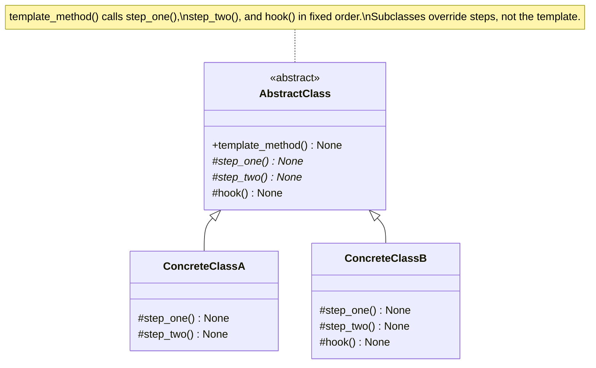

# Template Method Pattern

> Define the skeleton of an algorithm in a base class and let subclasses override specific steps without changing the algorithm's overall structure -- the foundation of every framework that says "don't call us, we'll call you."

## Table of Contents
- [Core Concepts](#core-concepts)
- [Code Examples](#code-examples)
- [Common Pitfalls](#common-pitfalls)
- [Key Takeaways](#key-takeaways)
- [Exercises](#exercises)

## Core Concepts

### Intent

#### What

The Template Method pattern defines the overall structure (skeleton) of an algorithm in a base class method, while deferring some steps to subclasses. The base class controls the workflow -- the order in which steps execute -- and subclasses provide the specific implementations of individual steps.

#### How

1. The base class defines a "template method" -- a method that calls a sequence of steps in a fixed order.
2. Some steps have default implementations in the base class (concrete methods).
3. Other steps are declared abstract -- subclasses must override them.
4. Optional "hook" methods provide empty default implementations that subclasses may optionally override.
5. The template method itself is typically **not** meant to be overridden -- it owns the algorithm's structure.

#### Why It Matters

Without Template Method, every subclass would duplicate the entire algorithm just to change one step. With it, the invariant parts of the algorithm live in one place (the base class), and the variable parts are cleanly isolated into overridable methods. This is the DRY principle applied to algorithm structure.

### Participants

#### What

| Participant | Responsibility |
|---|---|
| **AbstractClass** | Defines the template method containing the algorithm skeleton. Declares abstract steps that subclasses must implement. May provide default implementations (hooks) for optional steps. |
| **ConcreteClass** | Implements the abstract steps defined by the AbstractClass. May override hooks. Must NOT override the template method itself. |

#### How

The AbstractClass controls the conversation:

1. Client calls `pipeline.run()` (the template method).
2. `run()` calls `self.read()` -> `self.validate()` -> `self.transform()` -> `self.write()` in that order.
3. Each of these methods is dispatched to the ConcreteClass's implementation via polymorphism.
4. The ConcreteClass never calls `run()` steps directly -- the base class orchestrates everything.

#### Why It Matters

This is the **Hollywood Principle**: "Don't call us, we'll call you." The framework (base class) calls your code (subclass methods), not the other way around. This is exactly how `unittest.TestCase` works: you override `setUp()` and `test_*()`, but you never call them yourself -- the test runner does.

### Structure



### The Hollywood Principle

#### What

"Don't call us, we'll call you." The base class (framework) decides when and in what order to call subclass methods. Subclasses provide implementations but never control the flow.

#### How

In a traditional library, your code calls library functions. With Template Method (and frameworks in general), the base class calls your code. You plug in behavior; the framework orchestrates it.

#### Why It Matters

This inversion of control is what makes frameworks powerful. When you write a Django class-based view, you override `get()` and `post()`, but Django decides when to call them, how to handle errors, and what to do with the response. You do not call `get()` yourself. Understanding this principle helps you work with (not against) frameworks.

### Template Method vs Strategy

#### What

Both patterns let you vary algorithm behavior. The key difference is the mechanism:

| Aspect | Template Method | Strategy |
|---|---|---|
| **Mechanism** | Inheritance -- subclass overrides steps | Composition -- inject a strategy object |
| **Granularity** | Varies individual steps within a fixed algorithm | Replaces the entire algorithm |
| **Coupling** | Subclass is tightly bound to the base class | Strategy is independent of the context |
| **Flexibility** | Static -- decided at class definition time | Dynamic -- can be swapped at runtime |
| **When to use** | Multiple variants share the same algorithm structure | Algorithms are independent and interchangeable |

#### How

If you have an algorithm where 80% is the same across variants and only 20% differs, Template Method avoids code duplication. If the algorithms are fundamentally different but serve the same purpose, use Strategy.

#### Why It Matters

A common refactoring path is: start with Template Method (simpler), then refactor to Strategy when you need runtime flexibility or when inheritance hierarchies become too deep. Knowing both patterns lets you choose the right starting point.

### When NOT to Use Template Method

- **Algorithm structure varies across subclasses**: If different subclasses need different step orders or different numbers of steps, Template Method forces an artificial structure. Use Strategy or a pipeline pattern instead.
- **Deep inheritance hierarchies**: Template Method relies on inheritance. If you already have three levels of inheritance, adding a Template Method base class creates four. Prefer composition (Strategy) to avoid fragile base class problems.
- **Only one concrete class**: If there is only one implementation, the abstract base class is unnecessary overhead. Just write a regular class and refactor later if variants appear.
- **Steps need runtime composition**: If you need to mix and match steps from different sources at runtime (e.g., read from CSV but validate like JSON), Template Method's inheritance model is too rigid. Use Strategy or Chain of Responsibility.

### Real-World Anchoring

#### What

- **Python's `unittest.TestCase`**: `setUp()` -> `test_*()` -> `tearDown()` is a template method. The test runner (base class) controls the flow; you override the steps. You never call `setUp()` yourself.
- **Django class-based views**: `View.dispatch()` is the template method. It calls `get()`, `post()`, etc. based on the HTTP method. You override those methods; Django controls when they run.
- **`collections.abc` template methods**: `MutableMapping` requires you to implement `__getitem__`, `__setitem__`, `__delitem__`, `__iter__`, and `__len__`. In return, it provides `get()`, `pop()`, `update()`, and other methods for free -- those are the template methods built from your abstract steps.
- **Data processing frameworks (ETL)**: Extract-Transform-Load pipelines are textbook Template Method: the framework defines the pipeline order, you provide the specific extract/transform/load implementations.

#### Why It Matters

Every time you subclass a framework class and override specific methods, you are using Template Method. Recognizing this helps you understand what you are allowed to override (the steps) versus what you should not touch (the template method itself).

## Code Examples

### Data Processing Pipeline

```python
from __future__ import annotations

from abc import ABC, abstractmethod
from dataclasses import dataclass
from pathlib import Path
import json
import csv
import io


@dataclass
class Record:
    """A single data record flowing through the pipeline."""
    fields: dict[str, str | int | float | None]


class DataPipeline(ABC):
    """Abstract class -- defines the template method for data processing.

    The pipeline always follows: read -> validate -> transform -> write.
    Subclasses implement the specific steps; this class controls the flow.
    """

    def run(self, source: str, destination: str) -> int:
        """Template method -- the algorithm skeleton.

        This method should NOT be overridden by subclasses.
        It defines the invariant structure: read, validate, transform, write.
        Returns the number of successfully processed records.
        """
        print(f"[Pipeline] Starting: {self.__class__.__name__}")

        # Step 1: Read raw data from the source
        raw_records = self.read(source)
        print(f"  Read {len(raw_records)} records")

        # Step 2: Validate each record (hook -- has a default implementation)
        valid_records = self.validate(raw_records)
        print(f"  {len(valid_records)} records passed validation")

        # Step 3: Transform records into the output format
        transformed = self.transform(valid_records)
        print(f"  Transformed {len(transformed)} records")

        # Step 4: Write to destination
        self.write(transformed, destination)
        print(f"  Written to {destination}")

        # Hook -- optional post-processing (logging, cleanup, etc.)
        self.on_complete(len(transformed))

        return len(transformed)

    @abstractmethod
    def read(self, source: str) -> list[Record]:
        """Read raw records from the source. Subclasses MUST implement this."""
        ...

    def validate(self, records: list[Record]) -> list[Record]:
        """Validate records. Default: accept all. Override to add validation logic.

        This is a HOOK -- it has a sensible default, but subclasses can override it.
        """
        return records

    @abstractmethod
    def transform(self, records: list[Record]) -> list[Record]:
        """Transform records into the desired output format. Subclasses MUST implement."""
        ...

    @abstractmethod
    def write(self, records: list[Record], destination: str) -> None:
        """Write transformed records to the destination. Subclasses MUST implement."""
        ...

    def on_complete(self, record_count: int) -> None:
        """Hook -- called after the pipeline finishes. Override for logging, alerts, etc.

        Default implementation does nothing. Subclasses are not required to override this.
        """
        pass


class CsvToJsonPipeline(DataPipeline):
    """Concrete class -- reads CSV, validates, transforms, writes JSON."""

    def read(self, source: str) -> list[Record]:
        """Read records from a CSV string (simulating file read)."""
        reader = csv.DictReader(io.StringIO(source))
        return [Record(fields=dict(row)) for row in reader]

    def validate(self, records: list[Record]) -> list[Record]:
        """Override the hook: reject records with missing required fields."""
        required_fields = {"name", "email"}
        valid = []
        for record in records:
            missing = required_fields - set(record.fields.keys())
            non_empty = all(record.fields.get(f) for f in required_fields)
            if not missing and non_empty:
                valid.append(record)
            else:
                print(f"    Skipping invalid record: {record.fields}")
        return valid

    def transform(self, records: list[Record]) -> list[Record]:
        """Normalize email to lowercase and add a processed flag."""
        for record in records:
            if "email" in record.fields:
                record.fields["email"] = str(record.fields["email"]).lower()
            record.fields["processed"] = True
        return records

    def write(self, records: list[Record], destination: str) -> None:
        """Write records as JSON (simulating file write)."""
        output = json.dumps([r.fields for r in records], indent=2)
        print(f"    JSON output:\n{output}")

    def on_complete(self, record_count: int) -> None:
        """Override the hook to log completion."""
        print(f"  [CsvToJsonPipeline] Completed: {record_count} records processed")


class JsonToReportPipeline(DataPipeline):
    """Concrete class -- reads JSON, transforms into a summary report."""

    def read(self, source: str) -> list[Record]:
        """Read records from a JSON string."""
        data = json.loads(source)
        return [Record(fields=item) for item in data]

    def transform(self, records: list[Record]) -> list[Record]:
        """Transform into a summary: count records per domain."""
        domain_counts: dict[str, int] = {}
        for record in records:
            email = str(record.fields.get("email", ""))
            domain = email.split("@")[-1] if "@" in email else "unknown"
            domain_counts[domain] = domain_counts.get(domain, 0) + 1

        # Return summary as records
        return [
            Record(fields={"domain": domain, "count": count})
            for domain, count in sorted(domain_counts.items())
        ]

    def write(self, records: list[Record], destination: str) -> None:
        """Write a text report."""
        print(f"    Report: {destination}")
        print("    " + "-" * 30)
        for record in records:
            print(f"    {record.fields['domain']}: {record.fields['count']} users")


def main() -> None:
    # --- CSV to JSON pipeline ---
    csv_data = (
        "name,email,age\n"
        "Alice,Alice@Example.com,30\n"
        "Bob,,25\n"  # Missing email -- will be filtered by validation
        "Charlie,charlie@test.org,35\n"
    )

    print("=" * 50)
    print("CSV -> JSON Pipeline")
    print("=" * 50)
    csv_pipeline = CsvToJsonPipeline()
    csv_pipeline.run(csv_data, "output.json")

    # --- JSON to Report pipeline ---
    json_data = json.dumps([
        {"name": "Alice", "email": "alice@example.com"},
        {"name": "Bob", "email": "bob@example.com"},
        {"name": "Charlie", "email": "charlie@test.org"},
        {"name": "Diana", "email": "diana@example.com"},
    ])

    print(f"\n{'=' * 50}")
    print("JSON -> Report Pipeline")
    print("=" * 50)
    report_pipeline = JsonToReportPipeline()
    report_pipeline.run(json_data, "domain_report.txt")


if __name__ == "__main__":
    main()
```

### Template Method with Hooks: Test Framework

```python
from __future__ import annotations

from abc import ABC, abstractmethod
import traceback


class TestCase(ABC):
    """Simplified test framework using Template Method.

    Models the same design as Python's unittest.TestCase:
    setUp() -> run the test -> tearDown(), with the framework controlling the flow.
    """

    def run_test(self, test_name: str) -> bool:
        """Template method -- orchestrates the test lifecycle.

        Subclasses NEVER call this sequence manually. They override the steps.
        This is the Hollywood Principle: the framework calls your code.
        """
        print(f"\n--- Running: {test_name} ---")
        success = True

        try:
            # Step 1: Set up test fixtures (hook with empty default)
            self.set_up()

            # Step 2: Run the actual test (abstract -- must be implemented)
            test_method = getattr(self, test_name)
            test_method()
            print(f"  PASS: {test_name}")

        except AssertionError as e:
            print(f"  FAIL: {test_name} -- {e}")
            success = False

        except Exception as e:
            print(f"  ERROR: {test_name} -- {e}")
            traceback.print_exc()
            success = False

        finally:
            # Step 3: Tear down -- runs even if the test fails
            try:
                self.tear_down()
            except Exception as e:
                print(f"  TEAR DOWN ERROR: {e}")
                success = False

        return success

    def set_up(self) -> None:
        """Hook -- prepare test fixtures. Override if needed.

        Default does nothing. Subclasses override to create test data,
        open connections, etc.
        """
        pass

    def tear_down(self) -> None:
        """Hook -- clean up after the test. Override if needed.

        Default does nothing. Subclasses override to close connections,
        delete temp files, etc. Always runs, even if the test fails.
        """
        pass


class AssertionError(Exception):
    """Custom assertion error for our mini test framework."""
    pass


def assert_equal(actual: object, expected: object, message: str = "") -> None:
    """Assertion helper."""
    if actual != expected:
        msg = message or f"Expected {expected!r}, got {actual!r}"
        raise AssertionError(msg)


class DatabaseTests(TestCase):
    """Concrete test class -- implements specific tests and hooks."""

    def set_up(self) -> None:
        """Override hook: create an in-memory database for testing."""
        print("  Setting up: creating test database")
        self._db: dict[str, str] = {}  # Simulating a database

    def tear_down(self) -> None:
        """Override hook: clean up the test database."""
        print("  Tearing down: clearing test database")
        self._db.clear()

    def test_insert(self) -> None:
        """Test that inserting a record works."""
        self._db["key1"] = "value1"
        assert_equal(self._db["key1"], "value1")

    def test_delete(self) -> None:
        """Test that deleting a record works."""
        self._db["key1"] = "value1"
        del self._db["key1"]
        assert_equal("key1" in self._db, False)

    def test_update(self) -> None:
        """Test that updating a record works."""
        self._db["key1"] = "value1"
        self._db["key1"] = "updated"
        assert_equal(self._db["key1"], "updated")


def main() -> None:
    suite = DatabaseTests()
    test_names = ["test_insert", "test_delete", "test_update"]

    results = {name: suite.run_test(name) for name in test_names}

    print("\n--- Summary ---")
    passed = sum(1 for v in results.values() if v)
    total = len(results)
    print(f"{passed}/{total} tests passed")


if __name__ == "__main__":
    main()
```

## Common Pitfalls

### Pitfall 1: Allowing Subclasses to Override the Template Method

```python
# BAD — Template method is overridable, subclass breaks the algorithm structure
class DataPipeline(ABC):
    def run(self, source: str, dest: str) -> None:
        self.read(source)
        self.validate()
        self.transform()
        self.write(dest)

class BrokenPipeline(DataPipeline):
    def run(self, source: str, dest: str) -> None:
        # Subclass skips validation entirely -- defeats the pattern's purpose
        self.read(source)
        self.transform()
        self.write(dest)

# GOOD — Indicate the template method should not be overridden
# Python has no 'final' keyword, but convention and documentation matter
class DataPipeline(ABC):
    def run(self, source: str, dest: str) -> None:
        """Template method -- do NOT override this.
        Override the individual steps (read, validate, transform, write) instead.
        """
        self.read(source)
        self.validate()
        self.transform()
        self.write(dest)
```

### Pitfall 2: Too Many Abstract Steps

```python
# BAD — Subclasses must implement 8 methods just to use the pipeline
class DataPipeline(ABC):
    def run(self) -> None:
        self.open_connection()
        self.authenticate()
        self.read_header()
        self.read_body()
        self.validate_schema()
        self.validate_values()
        self.transform()
        self.write()
    # 8 abstract methods -- subclasses are overwhelmed

# GOOD — Fewer abstract steps, sensible defaults for optional ones
class DataPipeline(ABC):
    def run(self) -> None:
        self.read()       # abstract -- must implement
        self.validate()   # hook -- has default (accept all)
        self.transform()  # abstract -- must implement
        self.write()      # abstract -- must implement
```

### Pitfall 3: Putting Business Logic in the Base Class

```python
# BAD — Base class contains implementation details that belong in subclasses
class ReportGenerator(ABC):
    def generate(self) -> str:
        data = self.fetch_data()
        # Base class hard-codes a specific formatting decision
        header = "=" * 40 + "\nCOMPANY REPORT\n" + "=" * 40
        return header + "\n" + self.format_body(data)

# GOOD — Keep the base class focused on structure, not content
class ReportGenerator(ABC):
    def generate(self) -> str:
        data = self.fetch_data()
        header = self.format_header()  # Let subclasses decide formatting
        body = self.format_body(data)
        return f"{header}\n{body}"

    @abstractmethod
    def format_header(self) -> str: ...

    @abstractmethod
    def format_body(self, data: list) -> str: ...
```

### Pitfall 4: Confusing Hooks with Abstract Methods

```python
# BAD — Hook is marked abstract, forcing all subclasses to implement it
class Pipeline(ABC):
    @abstractmethod
    def on_complete(self) -> None:
        """Called after processing. Override if you need cleanup."""
        ...
    # Every subclass MUST implement this, even if they have nothing to do

# GOOD — Hooks have a default (usually empty) implementation
class Pipeline(ABC):
    def on_complete(self) -> None:
        """Hook -- override if you need post-processing.
        Default does nothing. Not every subclass needs this."""
        pass
```

## Key Takeaways

- Template Method defines the algorithm skeleton in a base class and lets subclasses override specific steps. The base class owns the **structure**; subclasses own the **details**.
- The Hollywood Principle ("Don't call us, we'll call you") is the core idea: the framework calls your code through overridden methods, not the other way around.
- Distinguish between **abstract methods** (subclasses must implement), **hooks** (subclasses may optionally override; have a default), and the **template method** itself (should not be overridden).
- Template Method uses inheritance; Strategy uses composition. Prefer Template Method when variants share most of the algorithm. Prefer Strategy when you need runtime flexibility or when inheritance is already deep.
- The template method should not be overridable. Python lacks a `final` keyword, so enforce this through documentation and code review.

## Exercises

1. **Web scraper pipeline**: Design a Template Method-based web scraper with the steps: `fetch_page()` -> `parse_content()` -> `extract_data()` -> `save_results()`. Implement two concrete scrapers: one for HTML pages (using string parsing) and one for JSON APIs. Which steps should be abstract and which should be hooks?

2. **Game turn loop**: Model a turn-based game using Template Method. The template method `play_turn()` follows: `draw_card()` -> `play_card()` -> `resolve_effects()` -> `check_win_condition()`. Implement two game variants with different rules. How do you handle a game that needs a different number of steps (e.g., an extra "discard" phase)?

3. **Template Method to Strategy refactoring**: Take the `DataPipeline` example and refactor it to use Strategy for the `read` and `write` steps while keeping `validate` and `transform` as template method steps. What are the tradeoffs of this hybrid approach? When would you prefer it over pure Template Method or pure Strategy?

4. **Hook ordering**: You have a pipeline with hooks `before_read()`, `after_read()`, `before_write()`, `after_write()`. A subclass overrides `after_read()` to log metrics. Another subclass extends the behavior further. How do you ensure that a subclass can add behavior to a hook without accidentally replacing the parent's hook logic? (Hint: think about `super()`)

5. **Error recovery**: Extend the data pipeline template method to handle errors in individual steps. If `transform()` fails on one record, the pipeline should skip that record and continue. Where should this error handling live -- in the template method, in the individual steps, or in a separate error handler? Implement your chosen approach.

---
up:: [Schedule](../../Schedule.md)
#type/learning #source/self-study #status/seed
